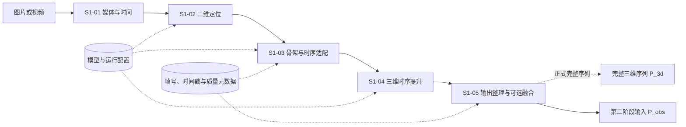
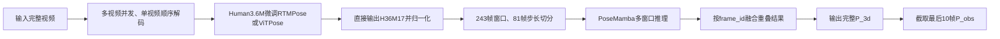
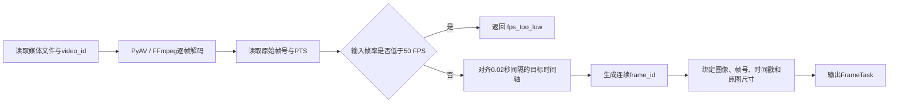
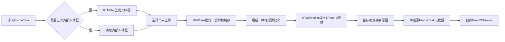
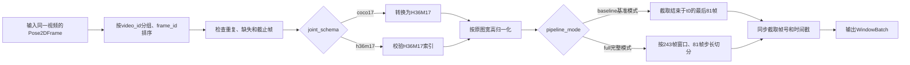
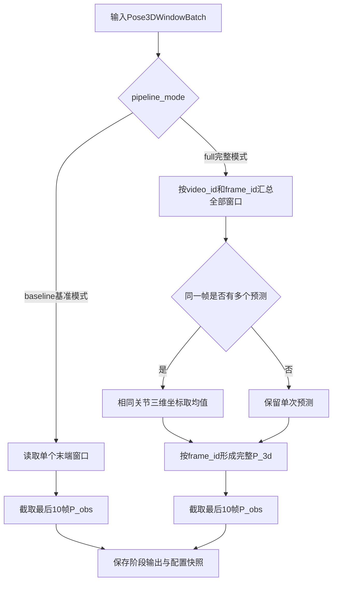
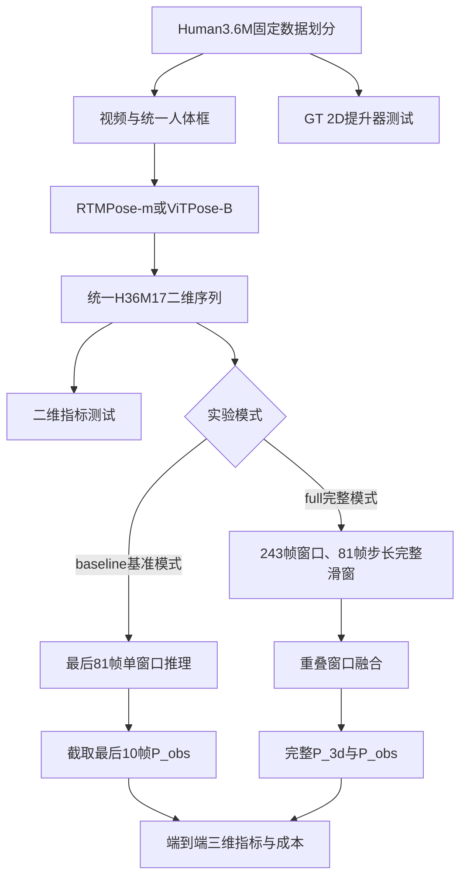

# 阶段一：三维人体姿态估计方案设计

## 版本历史

| 版本/状态 | 日期 | 说明 |
| --- | --- | --- |
| V3.12/设计稿 | 2026-09-30 | 合并实验级别与输出模式，统一为baseline/full两种pipeline_mode |
| V3.11/设计稿 | 2026-09-29 | 基准模式改为81/81末端单窗口；完整模式采用243/81完整序列融合 |
| V3.10/设计稿 | 2026-09-29 | 将基准模式与完整模式对比移至全部子模块之后 |
| V3.9/设计稿 | 2026-09-29 | 增加单视频顺序解码与多视频并发解码的两级方案 |
| V3.8/设计稿 | 2026-09-29 | 精简术语表并统一P_3d命名 |
| V3.7/设计稿 | 2026-09-29 | 将Pose2D配置迁移到4.2；二维模型默认batch_size统一为27 |

# 1. 概述

## 1.1 背景

阶段一将单人单目图片或视频转换为连续三维人体关节序列，并向第二阶段提供最近10帧观测姿态。方案包含原视频解码、人体定位、二维姿态估计、关节协议适配、二维到三维提升和结果导出。

## 1.2 方案范围

本阶段处理：

1. 单人单目图片或视频；
2. 视频帧、帧号和时间戳生成；
3. 人体检测、裁剪与二维关节估计；
4. COCO 17点到Human3.6M 17点适配；
5. 连续二维关节到三维关节提升；
6. 完整三维序列和最近10帧观测输出。

本阶段不处理遮挡姿态补全、短期未来预测和长期条件运动生成。上述任务分别由第二、第三阶段处理。

## 1.3 术语说明

| 术语/符号 | 含义 | 本方案定义 |
|---|---|---|
| RTMPose | 实时二维人体姿态估计模型 | 阶段一二维关节定位的默认模型 |
| ViTPose | 基于Vision Transformer的二维人体姿态估计模型 | 阶段一二维关节定位的对照模型 |
| PoseMamba | 基于状态空间模型的二维到三维姿态提升模型 | 将连续二维关节序列转换为三维关节序列 |
| MMPose | OpenMMLab人体姿态估计工具箱 | 负责加载、切换和运行RTMPose与ViTPose，并统一二维输出接口 |
| `P_3d` | 完整三维人体姿态序列 | `float32[L,17,3]` |
| `P_obs` | 提供给第二阶段的观测姿态序列 | 截止时刻前最后10帧，`float32[10,17,3]` |

# 2. 需求分析

## 2.1 整体功能

阶段一接收图片或视频，完成二维关节估计、Human3.6M关节适配和二维到三维提升。基准模式采用81帧窗口和81帧训练步长；推理时只取结束于截止时刻`t0`的最后81帧，PoseMamba单次输出81帧三维姿态，再截取最后10帧形成`P_obs`，不执行滑窗融合。完整模式采用PoseMamba官方243帧窗口和81帧步长；需要完整历史时对长视频滑窗推理，融合重复帧并导出完整`P_3d`，同时保留最后10帧`P_obs`。

## 2.2 功能边界

1. 当前只处理一个目标人物；
2. 输入窗口不得跨越视频、人物、动作或摄像机边界；
3. 用于第二阶段时，PoseMamba窗口必须结束于当前时刻`t0`；
4. 置信度只保存为中间结果，不输入基准模式PoseMamba；
5. 普通单目视频输出骨盆相对三维姿态，不承诺世界坐标和严格毫米尺度；
6. 长时间缺失、人物身份不确定和短于当前`clip_len`的视频返回明确状态，不静默拼接或补造数据。

## 2.3 技术要求

| 类别 | 要求 |
| --- | --- |
| 时间一致性 | 保存`video_id`、`frame_id`、`timestamp`，组窗前检查重复、缺失和乱序 |
| 关节一致性 | 内部统一为H36M17，保存`joint_schema` |
| 坐标一致性 | MMPose输出先恢复至原图像素坐标，再进行归一化 |
| 模型切换 | RTMPose与ViTPose通过配置文件切换，后续接口不变 |
| 窗口切换 | 81帧与243帧通过配置切换，代码不得写死时间维 |
| 可复现性 | 保存模型名称、权重版本、配置版本、FPS和图像尺寸 |
| 环境隔离 | MMPose与PoseMamba分别运行在Docker容器中，通过标准中间文件连接 |

## 2.4 子模块、技术栈与数据流

| 子模块 | 技术栈 | 作用 | 输入 | 输出 |
| --- | --- | --- | --- | --- |
| S1-01 媒体与时间 | PyAV、FFmpeg、NumPy | 解码、PTS读取、50 FPS采样、生成帧任务 | 图片或视频 | BGR帧、`video_id`、`frame_id`、`timestamp` |
| S1-02 二维定位 | RTMDet、MMPose、RTMPose-m；ViTPose-B可切换 | 人体框、裁剪、二维关节估计、恢复原图坐标 | 帧任务、人体框 | 基准模式为COCO17、完整模式为H36M17，并附置信度和帧元数据 |
| S1-03 骨架与时序适配 | NumPy、PyTorch | 排序、按`joint_schema`转换或校验H36M17、归一化、切分时间窗口 | 单帧二维结果 | `float32[B,T,17,2]`及同步元数据 |
| S1-04 三维时序提升 | PoseMamba-L | 二维关节序列提升为三维关节序列 | `T`帧H36M17二维窗口 | `float32[B,T,17,3]` |
| S1-05 阶段输出整理与可选重叠窗口融合 | NumPy、NPZ、JSON | 基准模式截取`P_obs`；完整模式融合重叠窗口并形成完整序列 | 单个末端窗口或全部三维窗口 | 基准模式输出`P_obs`；完整模式输出`P_3d`和`P_obs` |


# 3. 整体方案

## 3.1 软件框架



阶段一采用两个运行环境：

```text
MMPose Docker容器
    ↓ 输出标准二维中间文件
共享outputs目录
    ↓ 读取标准二维中间文件
PoseMamba Docker容器
```

## 3.2 基本流程

### 基准模式流程


### 完整模式流程



### 两种模式差异

| 对比项 | 基准模式`baseline` | 完整模式`full` |
|---|---|---|
| 主要目标 | 低成本打通第一阶段并向第二阶段提供观测姿态 | 生成完整三维历史并完成正式评价 |
| 视频解码 | 单视频顺序解码 | 多视频并发解码，每个视频内部保持顺序 |
| 二维模型 | COCO预训练RTMPose或ViTPose | Human3.6M微调后的RTMPose或ViTPose |
| 关节协议 | COCO17经MMPose转换为H36M17 | 模型直接输出H36M17，只校验索引 |
| 置信度 | 保存原始分数，不输入PoseMamba | 主对照仍不输入；校准后的置信度作为独立消融实验 |
| PoseMamba窗口 | 81帧 | 243帧 |
| 训练步长 | 81帧 | 81帧 |
| 推理方式 | 只处理结束于`t0`的一个末端窗口 | 以81帧步长处理完整视频，并执行尾部对齐 |
| 重叠融合 | 不需要 | 按`frame_id`融合多个窗口的重复预测 |
| 阶段输出 | `P_obs[10,17,3]` | `P_3d[L,17,3]`和`P_obs[10,17,3]` |
| 计算成本 | 较低 | 较高 |

## 3.3 软件并发

基准模式采用“单视频顺序解码＋任务队列＋单模型GPU批量推理”：

```text
单个视频顺序解码 ──> 帧任务队列 ──> GPU批量推理 ──> 结果聚合器
```

完整模式改为多视频并发解码。每个解码任务只负责一个视频，并保持该视频内部的帧顺序；不同视频的帧可以并发进入共享任务队列，结果聚合器再依据`video_id + frame_id`分别恢复各视频序列：

```text
视频A顺序解码 ─┐
视频B顺序解码 ─┼─> 共享帧任务队列 ─> GPU批量推理 ─> 按video_id分别聚合
视频C顺序解码 ─┘
```


| 并发对象 | 访问数据 | 处理方式 |
| --- | --- | --- |
| 解码任务 | 视频帧、帧元数据 | 基准模式启动1个；完整模式按视频并发启动，每个视频内部顺序解码 |
| GPU推理模块 | 图像和人体框 | 一个GPU加载一个二维模型实例 |
| 结果聚合器 | `PoseDataSample`和帧元数据 | 以`video_id+frame_id`为唯一键 |
| PoseMamba推理 | 有序`T`帧窗口 | 基准模式`T=81`，完整模式`T=243`；仅在连续性检查通过后执行 |

帧任务队列不再固定为162帧。该队列服务于二维模型的微批次推理，与PoseMamba的时间窗口长度没有直接关系。配置采用`queue_capacity = 2 × batch_size`的双批次预取。两个模型默认`batch_size=27`，因此队列容量均为54帧；一个批次在GPU推理时，解码端可以准备下一个批次。结果返回顺序不作为时间顺序；聚合时先按`video_id`分组，再由组内`frame_id`确定时间顺序。

## 3.4 异常处理

| 异常情况 | 处理方法 | 输出状态 |
| --- | --- | --- |
| 视频无法解码 | 终止当前视频并记录错误 | `decode_failed` |
| PTS缺失 | 使用FPS计算时间戳并记录来源 | `timestamp_fallback` |
| 输入帧率低于50 FPS | 不使用重复帧伪造运动信息，终止当前视频 | `fps_too_low` |
| 未检测到人物 | 保留帧槽位并标记无效 | `person_missing` |
| 检测到多个人且目标不明确 | 不自动拼接人物轨迹 | `identity_ambiguous` |
| 重复`frame_id` | 停止组窗并记录重复任务 | `duplicate_frame` |
| 缺失帧 | 保留时间槽位和`valid_mask=false` | `frame_missing` |
| 有效序列短于当前`clip_len` | 不进入PoseMamba | `short_sequence` |
| MMPose显存不足 | 将当前模型`batch_size`从27下调为9后重试一次 | `pose2d_oom` |
| PoseMamba推理失败 | 保留二维中间文件，不生成三维结果 | `pose3d_failed` |

# 4. 子模块方案

## 4.1 S1-01 媒体解码与时间基准

### 输入格式

| 字段 | 类型 | 说明 |
|---|---|---|
| `media_path` | `string` | MP4、AVI 等视频文件路径，或图像序列目录 |
| `video_id` | `string` | 当前样本的唯一标识 |
| `target_fps` | `int` | 固定为 `50` |
| `cutoff_time` | `float64`或`null` | 可选观察截止时间，单位为秒 |

### 处理方式



`FrameTask`是一条帧任务记录，用于让图像与其时间信息始终成对传递；检测模型实际读取的是其中的`image`字段。

### 输出格式

```python
FrameTask = {
    "image": np.ndarray,       # uint8，[H, W, 3]，BGR
    "video_id": str,           # 视频唯一标识
    "frame_id": int,           # 50 FPS 时间轴上的连续帧号
    "source_frame_id": int,    # 原视频解码帧号
    "timestamp": float,        # 秒，frame_id / 50
    "image_size": [W, H],      # 原图宽、高
    "fps": 50
}
```

### 示例

输入为 `S1_Walking.mp4`，分辨率 `1000×1000`、帧率 50 FPS、时长 4 秒。模块输出 200 个 `FrameTask`；其中第 81 个任务的 `frame_id=80`、`timestamp=1.60`，图像张量形状为 `[1000,1000,3]`。

## 4.2 S1-02 单人检测与二维关节定位

### 输入格式

| 数据 | 类型与形状 | 说明 |
|---|---|---|
| 帧任务 | `FrameTask` | S1-01 的输出 |
| 外部检测框 | `float32[4]`，可选 | 原图坐标 `[x1,y1,x2,y2]` |
| 二维模型配置 | `string` | `rtmpose-m` 或 `vitpose-b` |

### 处理方式



RTMPose-m和ViTPose-B默认均使用`batch_size=27`。基准模式的81帧可组成3个完整批次，完整模式的243帧可组成9个完整批次。若ViTPose-B在目标GPU上显存不足，则将其批次下调为9，仍可完整划分81帧和243帧窗口。

### MMPose模型切换配置

```yaml
pose2d:
  active_model: rtmpose_m              # 切换为vitpose_b即可更换二维模型

  models:
    rtmpose_m:
      config:
        baseline: configs/body_2d_keypoint/rtmpose/coco/rtmpose-m_8xb256-420e_aic-coco-256x192.py
        full: configs/project/h36m17/rtmpose-m_256x192.py
      checkpoint:
        baseline: checkpoints/rtmpose-m_256x192.pth
        full: checkpoints/rtmpose-m_h36m17.pth
      batch_size: 27
      joint_schema:
        baseline: coco17
        full: h36m17
      score_source: rtmpose_simcc

    vitpose_b:
      config:
        baseline: configs/body_2d_keypoint/topdown_heatmap/coco/td-hm_ViTPose-base-simple_8xb64-210e_coco-256x192.py
        full: configs/project/h36m17/vitpose-b_256x192.py
      checkpoint:
        baseline: checkpoints/vitpose-b_256x192.pth
        full: checkpoints/vitpose-b_h36m17.pth
      batch_size: 27
      joint_schema:
        baseline: coco17
        full: h36m17
      score_source: vitpose_heatmap

  runtime:
    device: cuda:0                      # 使用第 1 张可见 GPU；CPU 回退时需显式改为 cpu
    bbox_format: xyxy                   # 人体框为 [x_min, y_min, x_max, y_max]，单位为原始图像像素
    prefetch_batches: 2                 # CPU 端最多提前准备 2 个二维姿态推理批次，以重叠解码/传输与 GPU 推理
    queue_capacity: 54                  # 帧任务队列上限 = batch_size(27) × prefetch_batches(2)；仅限流，不是时间窗口长度
    expected_num_joints: 17             # 对解码后结果做关节数校验；还须由 joint_schema 确认其语义与顺序
```

全局`pipeline_mode`是唯一运行模式入口，4.2不再重复定义；二维模型只由`active_model`决定。加载器先按`active_model`取得对应模型，再按`pipeline_mode`选择配置、权重和关节协议，通过MMPose初始化模型并执行推理。RTMPose的SimCC输出和ViTPose的Heatmap输出都由MMPose解码为`keypoints[17,2]`和`keypoint_scores[17]`，后续模块不读取两种模型的内部特征。

### 输出格式

```python
Pose2DFrame = {
    "keypoints": np.ndarray,            # float32，[17, 2]，原图像素坐标
    "keypoint_scores_raw": np.ndarray,  # float32，[17]，当前模型原始置信度
    "joint_schema": str,                 # baseline=coco17，full=h36m17
    "score_source": str,                 # rtmpose_simcc或vitpose_heatmap
    "bbox": np.ndarray,                 # float32，[4]，xyxy 原图坐标
    "video_id": str,
    "frame_id": int,
    "source_frame_id": int,
    "timestamp": float,
    "image_size": [W, H],
    "model": str
}
```

### 示例

某帧的检测框为 `[210.4, 96.8, 734.2, 978.6]`。RTMPose-m 输出 Nose 坐标 `[486.3, 151.7]`、置信度 `0.97`。MMPose将全部17个点恢复到`1000×1000`原图坐标，并保留该帧的`frame_id=80`和`timestamp=1.60`。基准模式输出`joint_schema=coco17`；正式微调模型输出`joint_schema=h36m17`。

## 4.3 S1-03 骨架与时序适配

### 输入格式

| 数据 | 类型与形状 | 说明 |
|---|---|---|
| 二维帧结果 | `List[Pose2DFrame]` | 同一视频的帧级结果，可乱序到达 |
| 关节协议配置 | `dict` | 根据`joint_schema`选择COCO17转换或H36M17索引校验 |
| 时间配置 | 基准模式`81/81`，完整模式`243/81` | PoseMamba窗口长度与训练步长 |

### 处理方式



### 关节协议处理

基准模式使用COCO预训练二维模型，并按以下规则通过MMPose转换为Human3.6M17：

| Human3.6M目标关节 | 目标序号 | COCO来源 | 处理方式 |
|---|---:|---|---|
| root，骨盆中心 | 0 | 左髋、右髋 | 取左右髋坐标平均值 |
| spine，脊柱中点 | 7 | root、thorax | 取骨盆中心与胸腔中心平均值 |
| thorax，胸腔中心 | 8 | 左肩、右肩 | 取左右肩坐标平均值 |
| neck/nose兼容位 | 9 | nose | 直接使用COCO鼻部坐标 |
| head，头部点 | 10 | 左眼、右眼 | 取左右眼坐标平均值 |
| COCO左耳、右耳 | — | 左耳、右耳 | 不进入Human3.6M17结果 |

肩、肘、腕、髋、膝和足部端点等共有部位只调整索引顺序。完整模式使用在Human3.6M上微调的二维模型直接输出Human3.6M17，只校验索引，不再执行COCO转换。程序依据`joint_schema`选择处理分支，禁止对H36M17结果重复转换。

### 置信度处理

| 实施级别 | 处理方式 |
|---|---|
| 基准模式 | 保存RTMPose的SimCC响应分数或ViTPose的热图最大响应，并记录`score_source`；PoseMamba设置`no_conf=true`。 |
| 正式主对照 | 继续只输入二维坐标，避免两种模型分布不同的原始置信度影响公平比较。 |
| 正式置信度消融 | 分别在Human3.6M验证集上校准两种模型的置信度，将输入改为`[x_norm,y_norm,score]`，并重新训练三通道PoseMamba；结果单独报告。 |

### 坐标归一化

二维关键点先恢复至原图像素坐标，再以原始图像中心为原点，横纵坐标统一除以原图宽度的一半：

```text
x_norm = (x_pixel - W / 2) / (W / 2)
y_norm = (y_pixel - H / 2) / (W / 2)
```

### 时间窗口

训练阶段固定使用81帧绝对步长，以便基准模式与PoseMamba官方配置采用相同的窗口起点间隔。基准模式使用81帧窗口，因此训练窗口不重叠；完整模式使用243帧窗口，相邻训练窗口重叠162帧。

| 配置 | `clip_len` | `data_stride_train` | 推理模式 | `data_stride_test` | 是否融合 |
|---|---:|---:|---|---:|---|
| 基准模式`baseline` | 81 | 81 | 末端单窗口 | 不适用 | 否 |
| 完整模式`full` | 243 | 81 | 完整序列滑窗 | 81 | 是 |

基准模式只构造一个结束于`t0`的末端窗口；完整模式为完整视频生成滑动窗口，并在尾部不足一个步长时增加与末帧对齐的243帧窗口。所有窗口均不得使用`t0`之后的帧。
### 输出格式

```python
Pose2DSequence = {
    "keypoints_pixel": np.ndarray,       # float32，[L, 17, 2]，H36M17 像素坐标
    "keypoints_norm": np.ndarray,        # float32，[L, 17, 2]，H36M17 归一化坐标
    "keypoint_scores_raw": np.ndarray,   # float32，[L, 17]，二维模型原始置信度，仅诊断
    "valid_mask": np.ndarray,            # bool，[L, 17]
    "frame_ids": np.ndarray,             # int64，[L]
    "timestamps": np.ndarray,            # float64，[L]
    "image_size": [W, H]
}

WindowBatch = {
    "pose_inputs": np.ndarray,  # float32，[B, T, 17, 2]
    "frame_ids": np.ndarray,    # int64，[B, T]
    "timestamps": np.ndarray    # float64，[B, T]
}
```

### 示例

**模式一：基准模式`baseline`。** 输入162帧二维结果，设`t0=161`。排序后只截取`frame_id=81…161`，形成`pose_inputs.shape=[1,81,17,2]`。PoseMamba只执行一次，不生成其他窗口。

**模式二：完整模式`full`。** 输入500帧二维结果，窗口长度243、步长81。常规窗口起点为`0、81、162、243`；由于最后一个常规窗口只覆盖到485帧，再增加起点为257的末帧对齐窗口。最终形成5个窗口，`pose_inputs.shape=[5,243,17,2]`，供后续完整序列推理与融合。

## 4.4 S1-04 三维时序提升

### 输入格式

| 数据 | 类型与形状 | 说明 |
|---|---|---|
| `pose_inputs` | `float32[B,T,17,2]` | Human3.6M17归一化二维窗口；快速`T=81`，正式`T=243` |
| `frame_ids` | `int64[B,T]` | 每个位置对应的连续帧号 |
| `timestamps` | `float64[B,T]` | 每个位置对应的时间戳 |
| 模型配置 | `PoseMamba-L / T frames` | `T`必须与训练权重匹配 |

### 处理方式


PoseMamba只接收`pose_inputs`作为模型特征；帧号和时间戳在适配层中旁路保存，用于把三维结果映射回原视频。
### 输出格式

```python
Pose3DWindowBatch = {
    "pose_3d": np.ndarray,     # float32，[B, T, 17, 3]
    "frame_ids": np.ndarray,   # int64，[B, T]
    "timestamps": np.ndarray,  # float64，[B, T]
    "coord_system": "root_relative",
    "joint_schema": "h36m17"
}
```

### 示例

基准模式接收`pose_inputs.shape=[1,81,17,2]`，一次输出`pose_3d.shape=[1,81,17,3]`。正式完整序列示例接收5个243帧窗口，输出`pose_3d.shape=[5,243,17,3]`。两种模式都保持时间位置与`frame_id`逐帧对应。

## 4.5 S1-05 阶段输出整理与可选重叠窗口融合

### 输入格式

| 数据 | 类型与形状 | 说明 |
|---|---|---|
| 三维窗口结果 | `Pose3DWindowBatch` | `baseline`为一个窗口，`full`为全部窗口 |
| 运行模式 | `string` | `pipeline_mode=baseline`或`pipeline_mode=full` |
| 观察截止帧 | `t0: int` | 第一阶段允许使用的最后一帧 |
| 观察长度 | `obs_len=10` | 传给第二阶段的帧数 |

### 处理方式



基准模式不执行融合，只从81帧三维输出中截取最后10帧。完整模式需要完整历史时，才融合多个243帧窗口的重复预测并生成`P_3d`。

### 输出格式

```python
Stage1Output = {
    "P_3d": np.ndarray | None,    # full模式为[L,17,3]；baseline模式为空
    "P_obs": np.ndarray,          # float32，[10,17,3]，两种模式都必须输出
    "frame_ids": np.ndarray,      # 与P_3d对应；baseline模式可为空
    "timestamps": np.ndarray,     # 与P_3d对应；baseline模式可为空
    "obs_frame_ids": np.ndarray,  # int64，[10]
    "obs_timestamps": np.ndarray, # float64，[10]
    "pipeline_mode": str,
    "joint_schema": "h36m17",
    "fps": 50,
    "units": str,
    "config_snapshot": dict
}
```

### 示例

基准模式输入`frame_id=81…161`的81帧三维结果，直接输出`P_obs=frame_id 152…161`，不生成完整`P_3d`。完整模式输入500帧视频的5个窗口结果，按`frame_id`融合后生成`P_3d.shape=[500,17,3]`，再输出`P_obs=frame_id 490…499`。


# 5. 关键数据对象与接口

## 5.1 二维中间数据

| 字段 | 类型与形状 | 说明 |
|---|---|---|
| `keypoints_pixel` | `float32[L,17,2]` | H36M17原图像素坐标 |
| `keypoints_norm` | `float32[L,17,2]` | H36M17归一化坐标 |
| `keypoint_scores_raw` | `float32[L,17]` | 二维模型原始置信度，仅保存和诊断 |
| `score_source` | `string` | `rtmpose_simcc`或`vitpose_heatmap` |
| `frame_ids` | `int64[L]` | 50 FPS目标时间轴上的连续帧号 |
| `source_frame_ids` | `int64[L]` | 原视频解码帧号 |
| `timestamps` | `float64[L]` | 与每帧对应的时间戳 |
| `valid_mask` | `bool[L,17]` | 二维关节有效性 |
| `image_size` | `int32[2]` | 原始图像宽、高 |
| `video_id` | `string` | 视频唯一标识 |
| `joint_schema` | `string` | 适配后固定为`h36m17` |
| `pipeline_mode` | `string` | `baseline`或`full`，统一决定整条处理链 |
| `source_model` | `string` | 二维模型、规格和权重版本 |
## 5.2 PoseMamba窗口接口

```text
pose_inputs      float32[B,T,17,2]  # 输入模型
frame_ids        int64[B,T]         # 旁路保存
timestamps       float64[B,T]       # 旁路保存
valid_mask       bool[B,T,17]       # 旁路保存
keypoint_scores_raw float32[B,T,17] # 二维模型原始置信度，旁路保存
video_ids        string[B]          # 防止跨视频组窗
```

## 5.3 阶段输出接口

```text
Stage1Output
├── P_3d                float32[L,17,3]或null  # 正式完整序列模式输出
├── frame_ids           int64[L]或null
├── timestamps          float64[L]或null
├── P_obs               float32[10,17,3]       # 两种模式都输出
├── obs_frame_ids       int64[10]
├── pipeline_mode        "baseline"或"full"
├── joint_schema        "h36m17"
├── coordinate_system   "camera_axes_pelvis_relative"
├── unit                "relative"
└── source_models       string[]
```

# 6. 部署方案

## 6.1 阶段级运行配置

二维模型的具体路径与MMPose切换配置见4.2。系统只暴露一个模式入口`pipeline_mode`，由它同时决定二维权重、关节协议、时间窗口、推理方式、融合策略和阶段输出。

```yaml
pipeline_mode: baseline                 # baseline或full

profiles:
  baseline:
    pose2d_level: coco_pretrained       # 使用COCO预训练二维模型
    apply_coco_to_h36m: true
    no_conf: true
    clip_len: 81
    data_stride_train: 81
    inference: last_window_only         # 只取结束于t0的末端窗口
    data_stride_test: null
    overlap_merge: none
    export_P_3d: false
    obs_len: 10
    sample_stride: 1

  full:
    pose2d_level: h36m_finetuned        # 使用Human3.6M微调二维模型
    apply_coco_to_h36m: false
    no_conf: true                       # 置信度输入另做消融实验
    clip_len: 243
    data_stride_train: 81
    inference: sliding_windows
    data_stride_test: 81
    overlap_merge: mean
    tail_policy: align_end
    export_P_3d: true
    obs_len: 10
    sample_stride: 1
```

## 6.2 容器划分

阶段一使用两个GPU容器，共享输入、权重和输出目录：

```text
pose2d容器：PyAV、MMPose、MMCV、MMEngine、MMPreTrain
pose3d容器：PoseMamba、PyTorch、selective_scan
```

```yaml
services:
  pose2d:
    build:
      context: .
      dockerfile: docker/mmpose.Dockerfile
    gpus: all
    volumes:
      - ./data:/workspace/data
      - ./checkpoints:/workspace/checkpoints
      - ./outputs:/workspace/outputs

  pose3d:
    build:
      context: .
      dockerfile: docker/posemamba.Dockerfile
    gpus: all
    volumes:
      - ./data:/workspace/data
      - ./checkpoints:/workspace/checkpoints
      - ./outputs:/workspace/outputs
```

执行顺序：

```text
pose2d容器生成标准二维文件
        ↓
pose3d容器读取二维文件并生成三维结果
```

# 7. 测试与验收

## 7.1 测试关注指标

阶段一首先评价完整链路的三维结果，再用二维指标定位误差来源，并用工程指标判断方案是否能够稳定运行。

| 优先级 | 指标 | 评价对象 | 主要作用 |
|---:|---|---|---|
| 1 | 端到端3D MPJPE | 检测二维输入经过PoseMamba后的三维结果 | 阶段一主要选型指标，越低越好 |
| 2 | 3D-MPJVE | 完整三维姿态序列 | 衡量运动速度误差和时间连续性，越低越好 |
| 3 | 2D-NME（2D-NMPJPE） | 统一H36M17后的二维结果 | 衡量二维关节位置误差，解释三维误差来源 |
| 4 | 2D-MPJVE | 连续二维关节序列 | 衡量帧间跳动和二维轨迹稳定性 |
| 5 | PCK@0.05/0.1 | 二维姿态结果 | 统计不同容差下的正确关节比例，越高越好 |
| 6 | p95延迟、吞吐率和峰值显存 | 完整阶段一链路 | 三维精度接近时作为工程选型依据 |

辅助报告P-MPJPE、三维加速度误差和关节缺失率。COCO OKS-AP只用于核对公开模型能力，不能代替本项目的H36M17二维指标和端到端三维指标。

## 7.2 测试拓扑



所有二维模型使用相同Human3.6M数据划分、相同人体框和`256×192`输入尺寸。比较二维模型时固定PoseMamba-L；比较三维提升器时先使用相同GT 2D，避免二维检测误差掩盖提升器差异。训练和阈值选择只使用训练集、验证集，测试集仅用于最终结果。

## 7.3 测试方案

| 测试组 | 基准模式 | 完整模式 | 主要输出 |
|---|---|---|---|
| T0 数据流与接口 | 验证最后81帧单窗口、81帧三维输出和最后10帧截取 | 验证长视频243帧滑窗、尾部对齐、重叠融合和完整序列导出 | 接口通过率、失败日志 |
| T1 二维模型对照 | COCO预训练RTMPose-m与ViTPose-B，转换后计算H36M17二维指标 | 两种模型在Human3.6M上微调并直接输出H36M17 | 2D-NME、PCK、2D-MPJVE |
| T2 三维提升器测试 | 使用GT 2D和81帧窗口、81帧训练步长打通PoseMamba链路 | 使用GT 2D恢复官方243帧窗口、81帧步长并测试完整序列 | MPJPE、P-MPJPE、3D-MPJVE |
| T3 端到端模型对照 | `pipeline_mode=baseline`生成`P_obs` | `pipeline_mode=full`生成`P_3d`和`P_obs` | 端到端3D MPJPE、3D-MPJVE、边界连续性 |
| T4 置信度消融 | `no_conf=true`，只保存原始分数 | 分模型校准置信度，重新训练三通道PoseMamba，并与无置信度方案分表比较 | 置信度是否改善3D指标 |
| T5 工程成本 | 验证批次、队列和容器可以稳定运行 | 在同一GPU和精度模式下测试完整数据集 | p95延迟、吞吐率、峰值显存、失败率 |

## 7.4 选型与验收规则

1. 首先检查H36M17二维精度和2D-MPJVE，确认二维输入质量及时间稳定性；
2. 二维架构对照固定使用同一个PoseMamba-L，以端到端3D MPJPE作为首要选择依据；
3. 三维位置误差接近时，比较3D-MPJVE、p95延迟、峰值显存和接入成本；
4. 基准模式只用于确认链路可行，不能替代Human3.6M微调后的正式结论；
5. 正式报告必须注明二维权重、关节协议、置信度配置、窗口长度、输入尺寸和测试硬件；
6. `P_obs[10,17,3]`必须与`pose_obs_frame_ids[10]`逐帧对应，且任何输入窗口不得使用`t0`之后的帧。

V3阶段一的基准模式采用RTMPose-m 256×192、PoseMamba-L 81帧窗口、81帧训练步长、`baseline`和`no_conf=true`，只生成`P_obs`；完整模式采用PoseMamba官方243帧窗口、81帧步长和`full`，融合后生成完整`P_3d`及`P_obs`。ViTPose-B和置信度输入通过独立配置及实验组切换，不改变阶段输出接口。


