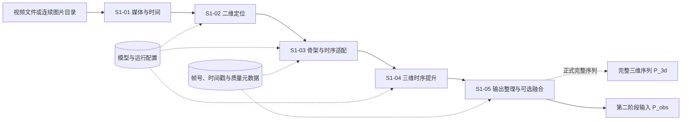
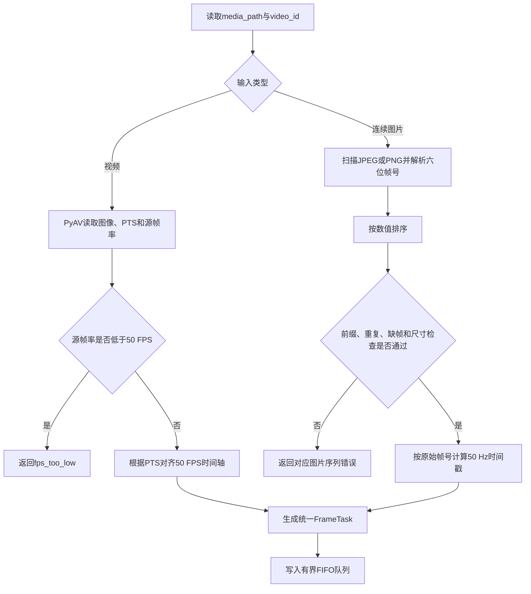
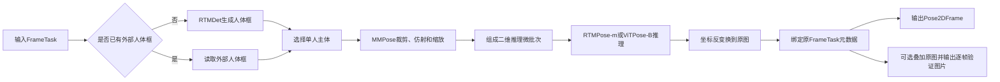
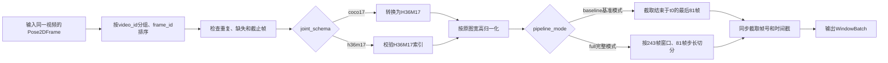
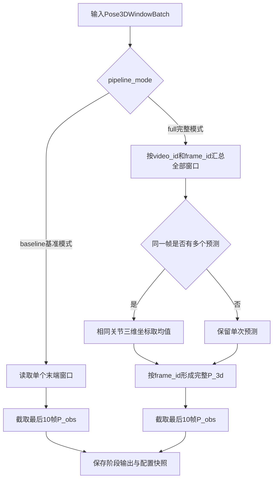
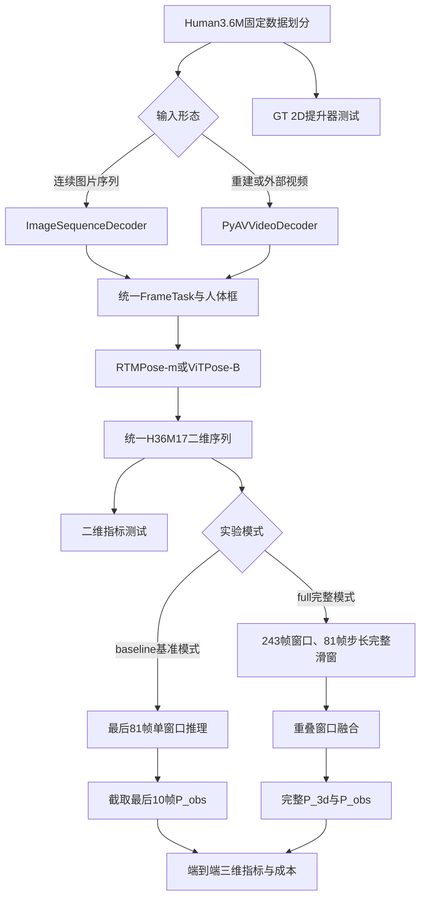

# 阶段一：三维人体姿态估计方案设计

## 版本历史

| 版本/状态 | 日期 | 说明 |
| --- | --- | --- |
| V3.16/设计稿 | 2026-10-08 | 新增实验简易汇总CSV与共同10关节误差口径；本地图片启动脚本接入独立归档、完整与简易累计表自动更新及重建 |
| V3.15/设计稿 | 2026-10-08 | 在S1-02输出格式中定义模型＋时间实验编号、独立输出目录、单次与累计CSV汇总，以及中文字段释义和统计口径 |
| V3.14/设计稿 | 2026-10-04 | 统一FrameTask的frame_id与source_frame_id从1开始，首帧与Human3.6M文件名帧号对齐 |
| V3.13/设计稿 | 2026-10-04 | S1-01正式支持视频与连续图片序列双输入，并统一FrameTask接口 |
| V3.12/设计稿 | 2026-09-30 | 合并实验级别与输出模式，统一为baseline/full两种pipeline_mode |
| V3.11/设计稿 | 2026-09-29 | 基准模式改为81/81末端单窗口；完整模式采用243/81完整序列融合 |
| V3.10/设计稿 | 2026-09-29 | 将基准模式与完整模式对比移至全部子模块之后 |
| V3.9/设计稿 | 2026-09-29 | 增加单视频顺序解码与多视频并发解码的两级方案 |
| V3.8/设计稿 | 2026-09-29 | 精简术语表并统一P_3d命名 |
| V3.7/设计稿 | 2026-09-29 | 将Pose2D配置迁移到4.2；二维模型默认batch_size统一为27 |

# 1. 概述

## 1.1 背景

阶段一将单人单目视频或连续图片序列转换为连续三维人体关节序列，并向第二阶段提供最近10帧观测姿态。方案包含媒体输入适配、人体定位、二维姿态估计、关节协议适配、二维到三维提升和结果导出。

## 1.2 方案范围

本阶段处理：

1. 单人单目视频或单个摄像机的连续图片序列；
2. 视频PTS或图片文件名帧号解析，以及统一50 FPS时间戳生成；
3. 人体检测、裁剪与二维关节估计；
4. COCO 17点到Human3.6M 17点适配；
5. 连续二维关节到三维关节提升；
6. 完整三维序列和最近10帧观测输出。

本阶段不处理遮挡姿态补全、短期未来预测和长期条件运动生成。上述任务分别由第二、第三阶段处理。

## 1.3 术语说明

| 术语/符号 | 含义 | 本方案定义 |
|---|---|---|
| RTMPose | 实时二维人体姿态估计模型 | 阶段一二维关节定位的默认模型 |
| ViTPose | 基于Vision Transformer的二维人体姿态估计模型 | 阶段一二维关节定位的对照模型 |
| PoseMamba | 基于状态空间模型的二维到三维姿态提升模型 | 将连续二维关节序列转换为三维关节序列 |
| MMPose | OpenMMLab人体姿态估计工具箱 | 负责加载、切换和运行RTMPose与ViTPose，并统一二维输出接口 |
| `P_3d` | 完整三维人体姿态序列 | `float32[L,17,3]` |
| `P_obs` | 提供给第二阶段的观测姿态序列 | 截止时刻前最后10帧，`float32[10,17,3]` |

# 2. 需求分析

## 2.1 整体功能

阶段一接收视频文件或连续图片序列，统一生成50 FPS `FrameTask`，再完成二维关节估计、Human3.6M关节适配和二维到三维提升。基准模式采用81帧窗口和81帧训练步长；推理时只取结束于截止时刻`t0`的最后81帧，PoseMamba单次输出81帧三维姿态，再截取最后10帧形成`P_obs`，不执行滑窗融合。完整模式采用PoseMamba官方243帧窗口和81帧步长；需要完整历史时对长视频滑窗推理，融合重复帧并导出完整`P_3d`，同时保留最后10帧`P_obs`。

## 2.2 功能边界

1. 当前只处理一个目标人物；
2. 输入窗口不得跨越视频或图片序列，也不得跨越人物、动作或摄像机边界；
3. 用于第二阶段时，PoseMamba窗口必须结束于当前时刻`t0`；
4. 置信度只保存为中间结果，不输入基准模式PoseMamba；
5. 普通单目视频输出骨盆相对三维姿态，不承诺世界坐标和严格毫米尺度；
6. 长时间缺失、人物身份不确定和短于当前`clip_len`的视频返回明确状态，不静默拼接或补造数据。

## 2.3 技术要求

| 类别 | 要求 |
| --- | --- |
| 时间一致性 | 视频保存PTS来源，图片保存文件名帧号来源；统一输出`video_id`、`frame_id`、`timestamp`，组窗前检查重复、缺失和乱序 |
| 关节一致性 | 内部统一为H36M17，保存`joint_schema` |
| 坐标一致性 | MMPose输出先恢复至原图像素坐标，再进行归一化 |
| 模型切换 | RTMPose与ViTPose通过配置文件切换，后续接口不变 |
| 窗口切换 | 81帧与243帧通过配置切换，代码不得写死时间维 |
| 可复现性 | 保存模型名称、权重版本、配置版本、FPS和图像尺寸 |
| 环境隔离 | MMPose与PoseMamba分别运行在Docker容器中，通过标准中间文件连接 |

## 2.4 子模块、技术栈与数据流

| 子模块 | 技术栈 | 作用 | 输入 | 输出 |
| --- | --- | --- | --- | --- |
| [S1-01 媒体与时间](S1-01_视频解码与帧任务队列详细设计.md) | PyAV、NumPy | 解码视频或连续图片、解析PTS或文件名帧号、统一50 FPS并生成帧任务 | 视频文件或单序列图片目录 | BGR帧、`video_id`、`frame_id`、`source_frame_id`、`timestamp` |
| [S1-02 二维定位](S1-02_单人检测与二维关节定位详细设计.md) | RTMDet、MMPose、RTMPose-m；ViTPose-B可切换 | 人体框、裁剪、二维关节估计、恢复原图坐标 | 帧任务、人体框 | 基准模式为COCO17、完整模式为H36M17，并附置信度和帧元数据 |
| S1-03 骨架与时序适配 | NumPy、PyTorch | 排序、按`joint_schema`转换或校验H36M17、归一化、切分时间窗口 | 单帧二维结果 | `float32[B,T,17,2]`及同步元数据 |
| S1-04 三维时序提升 | PoseMamba-L | 二维关节序列提升为三维关节序列 | `T`帧H36M17二维窗口 | `float32[B,T,17,3]` |
| S1-05 阶段输出整理与可选重叠窗口融合 | NumPy、NPZ、JSON | 基准模式截取`P_obs`；完整模式融合重叠窗口并形成完整序列 | 单个末端窗口或全部三维窗口 | 基准模式输出`P_obs`；完整模式输出`P_3d`和`P_obs` |


# 3. 整体方案

## 3.1 软件框架



阶段一采用两个运行环境：

```text
MMPose Docker容器
    ↓ 输出标准二维中间文件
共享outputs目录
    ↓ 读取标准二维中间文件
PoseMamba Docker容器
```

## 3.2 基本流程

### 基准模式流程


### 完整模式流程


### 两种模式差异

| 对比项 | 基准模式`baseline` | 完整模式`full` |
|---|---|---|
| 主要目标 | 低成本打通第一阶段并向第二阶段提供观测姿态 | 生成完整三维历史并完成正式评价 |
| 媒体输入 | 单个视频或一个连续图片序列顺序读取 | 多个视频或图片序列并发读取，每个输入源内部保持顺序 |
| 二维模型 | COCO预训练RTMPose或ViTPose | Human3.6M微调后的RTMPose或ViTPose |
| 关节协议 | COCO17经MMPose转换为H36M17 | 模型直接输出H36M17，只校验索引 |
| 置信度 | 保存原始分数，不输入PoseMamba | 主对照仍不输入；校准后的置信度作为独立消融实验 |
| PoseMamba窗口 | 81帧 | 243帧 |
| 训练步长 | 81帧 | 81帧 |
| 推理方式 | 只处理结束于`t0`的一个末端窗口 | 以81帧步长处理完整序列，并执行尾部对齐 |
| 重叠融合 | 不需要 | 按`frame_id`融合多个窗口的重复预测 |
| 阶段输出 | `P_obs[10,17,3]` | `P_3d[L,17,3]`和`P_obs[10,17,3]` |
| 计算成本 | 较低 | 较高 |

## 3.3 软件并发

基准模式目标架构采用“单输入源顺序读取＋任务队列＋单模型GPU批量推理”。任务队列是容量108的有界FIFO缓冲区：108限制的是同一时刻尚未消费的驻留任务数，不限制一次运行的总帧数；队列满时生产者阻塞，消费者取走任务后继续生产。S1-02二维推理消费者已经实现；单独验证S1-01时仍使用内置诊断接收循环排空队列并导出元数据。输入源可以是视频文件，也可以是一个连续图片目录：

```text
视频顺序解码或图片按帧号顺序读取 ──> 帧任务队列 ──> GPU批量推理 ──> 结果聚合器
```

完整模式允许多个输入源并发生产任务。每个任务只负责一个视频或一个图片序列，并保持该输入源内部顺序；不同输入源的帧可以进入共享队列，结果聚合器再依据`video_id + frame_id`分别恢复序列：

```text
视频A或图片序列A顺序读取 ─┐
视频B或图片序列B顺序读取 ─┼─> 共享帧任务队列 ─> GPU批量推理 ─> 按video_id分别聚合
视频C或图片序列C顺序读取 ─┘
```

| 并发对象 | 访问数据 | 处理方式 |
| --- | --- | --- |
| 输入读取任务 | 视频帧与PTS，或图片与文件名帧号 | 基准模式启动1个；完整模式按输入源并发，每个输入源内部保持顺序 |
| GPU推理模块 | BGR图像和人体框 | 一个GPU加载一个二维模型实例 |
| 结果聚合器 | `PoseDataSample`和帧元数据 | 以`video_id+frame_id`为唯一键 |
| PoseMamba推理 | 有序`T`帧窗口 | 基准模式`T=81`，完整模式`T=243`；仅在连续性检查通过后执行 |

帧任务队列服务于二维模型的微批次推理，与PoseMamba时间窗口长度没有直接关系。配置采用`queue_capacity = 4 × batch_size`的四批次预取。二维模型默认`batch_size=27`，输入与输出队列容量统一为108帧；GPU处理当前批次时，输入端可以继续准备后续批次。结果返回顺序不作为时间顺序，聚合时先按`video_id`分组，再由组内`frame_id`恢复时间顺序。

## 3.4 异常处理

| 异常情况 | 处理方法 | 输出状态 |
| --- | --- | --- |
| 视频无法解码 | 终止当前视频并记录错误 | `decode_failed` |
| 视频PTS缺失 | 使用源帧号和FPS计算时间戳并记录来源 | `timestamp_fallback` |
| 视频输入帧率低于50 FPS | 不使用重复帧伪造运动信息，终止当前视频 | `fps_too_low` |
| 图片目录不存在或为空 | 终止当前图片序列 | `image_sequence_not_found`或`image_sequence_empty` |
| 图片文件名不能解析帧号 | 终止当前图片序列 | `invalid_frame_name` |
| 一个目录混入多个序列前缀 | 不自动拼接序列 | `mixed_sequence` |
| 图片原始帧号重复 | 终止当前图片序列 | `duplicate_frame` |
| 连续图片缺帧 | 正式流程不重新编号或补帧，终止当前序列 | `frame_missing` |
| 图片损坏或尺寸发生变化 | 终止当前图片序列 | `image_decode_failed`或`image_size_changed` |
| 未检测到人物或二维关节缺失 | 保留目标时间槽位并标记`valid_mask=false` | `person_missing` |
| 检测到多个人且目标不明确 | 不自动拼接人物轨迹 | `identity_ambiguous` |
| 有效序列短于当前`clip_len` | 不进入PoseMamba | `short_sequence` |
| MMPose显存不足 | 将当前模型`batch_size`从27下调为9后重试一次 | `pose2d_oom` |
| PoseMamba推理失败 | 保留二维中间文件，不生成三维结果 | `pose3d_failed` |

# 4. 子模块方案

## 4.1 S1-01 媒体解码与时间基准

代码结构、队列背压、双输入适配、异常处理和运行方式见：[S1-01 视频与连续图片帧输入详细设计](S1-01_视频解码与帧任务队列详细设计.md)。

S1-01验证命令要求显式提供配置文件、逐帧任务文件和总结文件；终端显示进度，成功完成后输出`SUCCESS`。

### 输入格式

| 字段 | 类型 | 说明 |
|---|---|---|
| `media_path` | `string` | MP4、AVI等视频文件，或只包含一个序列的JPEG/PNG目录 |
| `input_type` | `video`或`images` | 由`decode-video`或`decode-images`入口确定 |
| `video_id` | `string` | 当前视频或图片序列的唯一标识；图片默认使用目录名 |
| `target_fps` | `int` | 固定为50 |
| `cutoff_time` | `float64`或`null` | 可选观察截止时间，单位为秒 |

### 处理方式



`frame_id`和`source_frame_id`统一从1开始。视频的`source_frame_id`为从1开始的解码顺序；连续图片要求文件名从`000001`开始，并直接使用文件名帧号。视频使用PTS建立源时间轴；PTS缺失时按`(source_frame_id-1)/source_fps`降级。连续图片按`source_timestamp=(source_frame_id-1)/50`计算。两种输入最终都生成相同的`FrameTask`，S1-02无需区分来源。

### 输出格式

```python
FrameTask = {
    "image": np.ndarray,          # uint8，[H,W,3]，BGR
    "video_id": str,              # 视频或图片序列唯一标识
    "frame_id": int,              # 50 FPS目标时间轴连续帧号，首帧为1
    "source_frame_id": int,       # 从1开始的视频解码序号或图片文件名原始帧号
    "timestamp": float,           # 秒，(frame_id - 1) / 50
    "source_timestamp": float,    # 输入源时间戳
    "timestamp_source": str,      # pts、fps_fallback或filename
    "image_size": [W,H],
    "fps": 50
}
```

### 示例

**视频输入。** 输入`S1_Walking.mp4`，分辨率`1000×1000`、帧率50 FPS、时长4秒，输出200个`FrameTask`。第81个任务为`frame_id=81`、`timestamp=1.60`。

**连续图片输入。** 输入Human3.6M目录`s_01_act_02_subact_01_ca_01`，包含`000001～001384`共1384张连续图片，分辨率`1000×1002`。模块输出1384个`FrameTask`，其中首帧`frame_id=1、source_frame_id=1、timestamp=0.00`，末帧`frame_id=1384、source_frame_id=1384、timestamp=27.66`。

## 4.2 S1-02 单人检测与二维关节定位

代码结构、设备选择、CPU/GPU分级验证、队列消费、批处理、错误码和运行方式见：[S1-02 单人检测与二维关节定位详细设计](S1-02_单人检测与二维关节定位详细设计.md)。

### 输入格式

| 数据 | 类型与形状 | 说明 |
|---|---|---|
| 帧任务 | `FrameTask` | S1-01 的输出 |
| 外部检测框 | `float32[4]`，可选 | 原图坐标 `[x1,y1,x2,y2]` |
| 二维模型配置 | `string` | 当前同分辨率对比为`rtmpose_m`、`rtmpose_l`与`rtmpose_l_h36m`；ViTPose-B属于后续规划 |

### 处理方式



RTMPose-m和ViTPose-B默认均使用`batch_size=27`。基准模式的81帧可组成3个完整批次，完整模式的243帧可组成9个完整批次。若ViTPose-B在目标GPU上显存不足，则将其批次下调为9，仍可完整划分81帧和243帧窗口。

### MMPose模型切换配置

当前对比保留`rtmpose_m`、`rtmpose_l`和`rtmpose_l_h36m`三个模型键，网络输入均为高384、宽288（代码中宽、高顺序为`input_size=(288, 384)`），并关闭翻转测试。通用M、L使用官方AIC+COCO权重，H36M版使用已下载的微调权重。三者都作为`baseline`运行，关节协议随所选权重变化；使用同一完整1384帧序列和RTMDet检测设置，优先比较`common10_mean_error_px`。最后一帧没有标注，保留预测输出并从误差统计中排除。网络输入分辨率不改变原图或原尺寸叠加图。以前的256×192 M、开启翻转测试的100帧实验保留，完整汇总中的配置路径与权重SHA区分新旧M版本。

当前配置项示例，所有相对路径均以`configs/pose2d.yaml`所在目录为基准；ViTPose-B条目保留为后续规划：

```yaml
pose2d:
  active_model: rtmpose_l_h36m         # 下载通用L权重后切换为rtmpose_l

  models:
    rtmpose_m:
      config:
        baseline: models/mmpose/body_2d_keypoint/rtmpose/coco/rtmpose-m_8xb256-420e_aic-coco-384x288.py
      checkpoint:
        baseline: ../checkpoints/rtmpose-m_simcc-aic-coco_pt-aic-coco_420e-384x288-a62a0b32_20230228.pth
      joint_schema:
        baseline: coco17
      score_source: rtmpose_simcc
    rtmpose_l:
      config:
        baseline: models/mmpose/body_2d_keypoint/rtmpose/coco/rtmpose-l_8xb256-420e_aic-coco-384x288.py
      checkpoint:
        baseline: ../checkpoints/rtmpose-l_simcc-aic-coco_pt-aic-coco_420e-384x288-97d6cb0f_20230228.pth
      batch_size: 27
      joint_schema:
        baseline: coco17
      score_source: rtmpose_simcc

    rtmpose_l_h36m:
      config:
        baseline: project/h36m17/rtmpose-l_8xb256-420e_h36m-384x288.py
      checkpoint:
        baseline: ../checkpoints/rtmpose_h36m.pth
      joint_schema:
        baseline: h36m17
      score_source: rtmpose_simcc

    vitpose_b:
      config:
        baseline: configs/body_2d_keypoint/topdown_heatmap/coco/td-hm_ViTPose-base-simple_8xb64-210e_coco-256x192.py
        full: configs/project/h36m17/vitpose-b_256x192.py
      checkpoint:
        baseline: checkpoints/vitpose-b_256x192.pth
        full: checkpoints/vitpose-b_h36m17.pth
      batch_size: 27
      joint_schema:
        baseline: coco17
        full: h36m17
      score_source: vitpose_heatmap

  runtime:
    amp: false                          # 首次链路验收关闭混合精度，稳定后再单独评估
    bbox_format: xyxy                   # 人体框为 [x_min, y_min, x_max, y_max]，单位为原始图像像素
    prefetch_batches: 4                 # CPU 端最多提前准备 4 个二维姿态推理批次，以重叠解码/传输与 GPU 推理
    queue_capacity: 108                 # 队列上限 = batch_size(27) × prefetch_batches(4)；仅限流，不是时间窗口长度
    expected_num_joints: 17             # 对解码后结果做关节数校验；还须由 joint_schema 确认其语义与顺序
```

全局`pipeline_mode`是唯一运行模式入口，4.2不再重复定义；二维模型只由`active_model`决定。加载器先按`active_model`取得对应模型，再按`pipeline_mode`选择配置、权重和关节协议，通过MMPose初始化模型并执行推理。RTMPose的SimCC输出和ViTPose的Heatmap输出都由MMPose解码为`keypoints[17,2]`和`keypoint_scores[17]`，后续模块不读取两种模型的内部特征。

S1-02不提供CPU回退或设备配置。AutoDL负责选择可见显卡，进程内部固定使用第一张可见GPU；CUDA不可用时启动失败。

### 输出格式

```python
Pose2DFrame = {
    "keypoints": np.ndarray,            # float32，[17, 2]，原图像素坐标
    "keypoint_scores_raw": np.ndarray,  # float32，[17]，当前模型原始置信度
    "joint_schema": str,                 # 随所选模型为coco17或h36m17；full要求h36m17
    "score_source": str,                 # rtmpose_simcc或vitpose_heatmap
    "bbox": np.ndarray,                 # float32，[4]，xyxy 原图坐标
    "video_id": str,
    "frame_id": int,
    "source_frame_id": int,
    "timestamp": float,
    "image_size": [W, H],
    "model": str
}
```

#### 主输出与实验归档

运行时通过队列向下游传递`Pose2DFrame`；逐帧结果仍可保存为JSONL，用于S1-03离线读取和重新做标注对比。实验总结改为CSV，关节明细和逐关节统计也使用CSV。表头解释、计算方式和输出用途统一在本节维护，不生成Excel多sheet，也不为每次实验生成一份单独的字段说明文档。

**实现状态：本地图片启动脚本`tools/run_pose2d_h36m.ps1`已接入实验编号、独立归档、完整与简易CSV累计表及报告重建。底层`estimate-pose2d-images`、`estimate-pose2d-video`保留显式输出路径和JSON总结接口；独立归档当前通过图片实验入口实现。**

每次启动只生成一次`experiment_id`，格式为`<active_model>_<YYYY-MM-DD-HH-mm-ss>`。例如`rtmpose_m_2026-10-08-10-05-02`：模型取实际选中的`pose2d.active_model`，时间取`Asia/Shanghai`时区的实验启动时间，月、日、时、分、秒均补足两位。全部输出使用同一个编号，不能在写不同文件时重新取时间。同一秒产生重名时追加序号，如`_02`；创建目录必须检查冲突，禁止覆盖已有实验。

目标布局如下，相对路径均以项目根目录为基准：

```text
results/
├── experiment_summary.csv                       # 所有实验，每个experiment_id仅一行
├── experiment_summary_simple.csv                # 六列核心指标，同样每次实验一行
└── rtmpose_m_2026-10-08-10-05-02/
    ├── rtmpose_m_2026-10-08-10-05-02_summary.csv  # 本次实验，仅一行
    ├── rtmpose_m_2026-10-08-10-05-02_pose2d_frames.jsonl
    ├── rtmpose_m_2026-10-08-10-05-02_joint_comparison.csv
    ├── rtmpose_m_2026-10-08-10-05-02_joint_summary.csv
    ├── rtmpose_m_2026-10-08-10-05-02_effective_config.yaml
    ├── rtmpose_m_2026-10-08-10-05-02_run.log
    ├── rtmpose_m_2026-10-08-10-05-02_media_config.yaml
    ├── pose_overlays/<video_id>/frame_000001.jpg
    ├── pose_overlays/<video_id>/manifest.jsonl
    └── comparison_overlays/<video_id>/frame_000001.jpg
```

独立目录必须覆盖所有输出，包括目前由`visualization.output_root`指定的预测叠加图。不能只给汇总改名，却继续把不同实验的图片写进同一个`<video_id>`目录。目录内的逐帧图片保留六位`frame_id`，图片清单仅记录本次实验。没有启用标注对比时，不生成关节对比表和标注对照图，对应汇总列留空。

单次汇总文件使用实验编号命名；累计总表使用固定名称，便于持续比较。启动时登记一行`status=running`，结束时按`experiment_id`更新该行为`completed`、`failed`或`cancelled`，不能为同一次实验重复追加行。失败、取消和启动检查失败也要保留记录。单次汇总保存该实验最新状态，总表保留其他实验；更新总表应使用写入锁和临时文件替换。总表更新失败时，单次汇总必须保留，明确报告保存失败，并支持从独立实验目录重建总表。

配置快照记录实际生效的参数，包括命令行覆盖后的选框方式、帧数限制和输出间隔，不能只复制尚未应用覆盖项的原始YAML。同名模型使用不同权重时，以权重SHA-256区分。当前数据集、权重和实验输出的Git忽略规则继续有效。

#### 实验汇总CSV：字段含义与来源

`experiment_summary_simple.csv`与完整总表并存，仅保留下面六列。启动、结束时按同一实验编号更新；失败、取消、未完成或没有标注对比时保留实验身份，评价指标留空，原因在完整表和运行日志中查看。简易表可以从完整表和已有实验关节明细重建，不需要重新运行GPU推理。

- `experiment_id`：与完整表相同的唯一实验编号。
- `active_model`：实际使用的模型配置键。
- `mean_error_px`：取完整表的`comparison.all_visible_pairs.mean_px`。原图坐标中预测点与标注点的欧氏距离平均值，单位像素；包含低置信度但坐标有效的点。H36M17模型使用17个对应点，COCO17模型使用10个直接对应点及2个踝/足近似对应点，因此跨关节协议比较时优先看下一列。
- `common10_mean_error_px`：取`comparison.common10_pairs.mean_px`；旧实验从其`joint_comparison.csv`重算。固定使用左右肩、肘、腕、髋、膝，共10个关节，H36M索引为1、2、4、5、11、12、13、14、15、16。仅保留直接对应、标注可见、坐标与误差有效的点，包含低置信度点；没有可评价点时留空。同一数据、帧范围和检测设置下，用此列比较COCO17与H36M17模型。
- `confident_mean_error_px`：取`comparison.confident_pairs.mean_px`，仅统计通过`keypoint_score_threshold`且标注可见、坐标有效的关节，其关节范围与`mean_error_px`相同；没有有效点时留空。
- `confidence_coverage`：取`comparison.confidence_coverage`，有效置信度点数除以可见标注对应点数，范围0至1，1表示100%；分母为0时留空。这是有效点覆盖率，不是预测正确率，也不是误差的统计置信区间。

使用`.venv\Scripts\python.exe -m video_to_3d_motion.pose2d.experiments --output-root results --rebuild-reports`重建完整和简易累计表。单次汇总CSV优先用于恢复该实验最新状态；旧实验缺少共同10关节统计时，读取对应关节明细。两张累计表分别通过临时文件替换，使用同一进程间写入锁；若打开的Excel文件阻止替换，单次汇总仍保留，关闭文件后可用上述命令恢复。

只刷新简易表时使用`--rebuild-simple`，只读完整表，不覆盖其已有内容；完整表正由Excel打开时，也可用此方式生成简易视图。

单次汇总和累计总表使用相同表头。已有summary的嵌套字段按完整路径展开成独立列，例如`producer_metrics.decoded_frames`和`comparison.all_visible_pairs.mean_px`；不能把一个字典序列化为JSON放进单元格。CSV使用UTF-8 BOM，数值写数值、布尔值写`true/false`、缺失值留空。少量文本列表可用分号连接；不适用于当前实验的字段也留空。新增表头时升级`summary_schema_version`，保留旧字段名和旧实验数据。

**实验身份、复现信息和时间：**

- `experiment_id`：本次唯一实验编号，来源为实际模型名与启动时间，所有输出共同使用。
- `active_model`：实际选中的二维模型配置键；保留原有`model`列，两者应一致。
- `started_at`、`finished_at`：北京时间的开始和结束时间，包含`+08:00`偏移；启动时记录开始时间，最终状态产生时记录结束时间。
- `elapsed_seconds`：整次实验墙钟耗时，单位秒，使用单调时钟计算；包括标注准备、模型初始化、解码、推理、写图和标注对比，不等同于纯GPU前向耗时。
- `summary_schema_version`：CSV表头及统计口径版本，新实验为`s1-02-experiment-v2`，增加`comparison.common10_pairs`；旧实验保留`s1-02-experiment-v1`。`design_doc_version`记录本说明对应版本，当前为`V3.16`。
- `pipeline_mode`、`joint_schema`：实际运行模式和预测关节协议，来源为生效配置与后端输出。
- `source`、`source_kind`：输入路径和输入类型，类型为`images`或`video`；`annotations`为本次使用的标注文件路径，无标注对比时留空。
- `max_frames`：请求处理的前N张连续图片，由启动脚本的`-MaxFrames N`或图片命令的`--max-frames N`指定。先按源帧号排序，从`000001`开始连续取前N张，不随机抽样，不按输出图间隔跳帧；目录整体仍校验单序列和帧号连续性。N大于图片总数时处理全部可用图片，实际数量以`records_written`为准。脚本中0或省略参数表示不限制；底层图片命令省略参数表示不限制，显式传入时必须为正整数。未限制时该CSV列留空。此参数和实验CSV归档均已实现。
- `media_config`、`pose2d_config`：启动时所用配置文件路径；`config_snapshot`为本次实际生效配置快照路径。
- `model_config`、`checkpoint`、`checkpoint_sha256`：选中二维模型的配置路径、权重路径及权重内容SHA-256；`detector_checkpoint_sha256`记录实际检测器权重的SHA-256。
- `keypoint_score_threshold`：用于生成`valid_mask`的实际阈值；`comparison_every_n_frames`为对照图片输出间隔，仅减少图片，不减少表格统计的帧。
- `gpu_name`、`dependency_versions`：实际GPU型号和本次运行的主要依赖版本。版本列使用明确的`包名=版本`文本；`git_commit`、`git_dirty`记录运行时代码提交和是否存在未提交改动，无法取得时留空。

**完成状态和文件定位：**

- `status`：整个实验的状态；推理成功但对比失败时仍为`failed`。
- `video_id`：本次处理的序列标识，来源为命令行指定值或输入推导值；实验身份另由`experiment_id`区分。
- `error_code`、`message`：失败代码和原因，来源为启动检查、解码、推理、对比或文件保存异常；无错误时留空。
- `producer_status`：S1-01生产者状态；`inference_status`为推理结束状态，最终记录时明确写出，避免将对比失败误解为模型推理失败。
- `records_written`：实际写入逐帧JSONL的二维结果数量，由写入成功计数取得。
- `frames_output`、`visualization_root`：本次逐帧JSONL路径及预测叠加图根目录，必须指向本次实验目录；禁用可视化时后者留空。
- `terminal_message`：推理队列终止消息类型，例如`EndOfPose2D`或`Pose2DFailure`；启动即失败、尚未启动队列时留空。

**解码与队列统计，来自生产者返回的metrics：**

- `producer_metrics.decoded_frames`：解码器成功读取的源帧数量，不等同于最终二维结果数。
- `producer_metrics.emitted_frames`：成功送入帧队列的任务数；失败或取消时可与解码数不同。
- `producer_metrics.pts_fallback_frames`：视频PTS缺失后使用降级时间戳的帧数；图片的文件名时间轴不算PTS降级。
- `producer_metrics.queue_full_count`：生产者因队列已满而等待或重试的次数；不是丢帧数，也不是模型错误数。
- `producer_metrics.producer_block_seconds`：生产者向满队列提交任务时累计等待时间，单位秒，不等同于整次实验耗时。
- `producer_metrics.max_queue_size`：生产者采样观察到的最大队列驻留任务数，单位帧，不代表总处理帧数。

**二维推理统计，来自工作器返回的metrics：**

- `pose2d_metrics.frames_received`：工作器从输入队列收到的帧任务数。
- `pose2d_metrics.frames_succeeded`、`pose2d_metrics.frames_failed`：成功处理帧数与工作器报告的失败帧数；失败批次可能按整批计入，不能把后者直接解释为真实模型逐帧错误率。
- `pose2d_metrics.batches_processed`：工作器成功完成的微批次数，包含尾批次；当前后端可在微批内逐帧调用模型，不能把该字段当作GPU前向次数。
- `pose2d_metrics.visualization_frames_written`：成功写出的预测叠加图数；抽样或禁用可视化时可少于二维结果数。

**人体框来源和选择，来自实际生效配置：**

- `detection.bbox_source`：允许的人体框来源策略，例如`external_or_detector`；逐帧实际来源仍由JSONL/关节表的`bbox_source`记录。
- `detection.person_selection`：实际选框规则，`strict`要求唯一人体候选，`highest_score`选择超过检测阈值的最高分候选；后者用于已知单人序列，不表示多人跟踪。
- `detection.score_threshold`：人体检测置信度过滤阈值。
- `detection.detector_config`、`detection.detector_checkpoint`：本次实际检测模型的配置与权重路径；未使用检测器时留空。

**标注匹配与评估计数，来自逐帧匹配和逐关节对比：**

- `comparison.status`：标注对比状态；未启用时留空，失败时明确记录`failed`。
- `comparison.source`、`comparison.annotations`、`comparison.prediction_file`：对比使用的图片目录、标注文件、预测JSONL路径。
- `comparison.counts.frames`：实际纳入对比过程的预测帧数；`comparison.counts.matched_frames`为有匹配标注的帧数，`comparison.counts.missing_gt_frames`为没有匹配标注的帧数。
- `comparison.counts.eligible_joint_pairs`：有关节对应关系且标注可见的关节对数，用作置信度覆盖率分母；预测无效时仍保留在分母中。
- `comparison.counts.overlays`：成功生成的标注对照图数量；包括无标注但明确显示`NO GT`的预测图。
- `comparison.counts.ok`：标注可见、预测有限且`valid_mask=true`的关节对数；`comparison.counts.low_confidence`为同样可计算误差但`valid_mask=false`的关节对数。
- `comparison.counts.gt_invisible`：对应关节的标注不可见数量；`comparison.counts.unmapped_joint`为有帧标注但预测关节没有对应标注的数量。
- `comparison.counts.missing_gt`：整帧缺失标注所产生的关节明细行数，不是缺失帧数；`comparison.counts.invalid_prediction`为标注可见但预测坐标或分数非有限的对应点数量。
- `comparison.bbox_selection_policies`：本次预测文件中实际记录的选框规则集合，多个值用分号连接。
- `comparison.unused_annotation_frames`：已匹配到输入目录、但本次预测未覆盖的标注帧数，例如使用`max_frames`时的剩余帧；不是整个PKL内所有未使用帧数。

**误差统计与分析方式：**

每个可评价关节对的像素误差为`error_px = sqrt((pred_x - gt_x)^2 + (pred_y - gt_y)^2)`，预测和标注必须处于同一原图像素坐标系。无标注、标注不可见、无对应关节和非有限预测不产生误差；缺失误差留空，不能填0。

以下四组各自展开为`count`、`mean_px`、`median_px`、`p95_px`四列：

- `comparison.all_visible_pairs.*`：所有标注可见且预测有限的对应点，包含低置信度点。
- `comparison.confident_pairs.*`：上述点中`valid_mask=true`的子集。
- `comparison.direct_pairs.*`：直接对应关节的统计，包含低置信度点；当前COCO17与H36M17间为肩、肘、腕、髋、膝共10个点。
- `comparison.ankle_foot_proxy_pairs.*`：COCO踝与H36M足的近似对应点统计，包含低置信度点，单独报告。

其中`count`为实际计算出的关节误差数量；`mean_px`为这些误差的算术平均；`median_px`为中位数；`p95_px`使用NumPy百分位数的线性插值方式计算第95百分位。单位均为原图像素，按关节对统计，不是先按帧平均后再平均。没有可评价点时`count=0`，三个误差列留空。

- `comparison.confidence_coverage`：有效置信度关节对数除以`eligible_joint_pairs`，范围0到1；分母为0时留空，必须与误差一起查看，避免只筛选易识别点后夸大精度。
- `comparison.coordinate_space`：评估坐标系，当前为`original_image_pixels`；`comparison.gt_joint_schema`为标注协议，当前为`h36m17_standard`。
- `comparison.annotation_joint_order_assumption`：标注关节顺序的假定及核对要求；其他来源PKL必须先核对生成工具或叠加图。
- `comparison.accuracy_pass`：是否达到明确指定的准确度门槛；未指定门槛时留空，不由平均误差自动推断“通过”。
- `comparison.notes`：本次统计条件和局限，用分号连接的文本记录；需区分训练集效果检查与独立验证集评价。
- `comparison.overlay_legend.green`、`comparison.overlay_legend.red`、`comparison.overlay_legend.yellow`、`comparison.overlay_legend.gray`：叠加图颜色说明，依次为有效置信度预测、低置信度预测、H36M标注和对应点偏差线。
- `comparison.joint_comparison`、`comparison.joint_summary`、`comparison.overlays`：本次逐关节明细表、逐关节汇总表和标注对照图目录。

不同模型实验应对齐输入帧、标注文件、图像尺寸、关节集合和统计口径。特别是COCO17的12个四肢对应点与H36M17的17点统计不能直接横向比较；直接对应点与踝/足近似对应点也不能混成同一口径。模型原始置信度不等同于跨模型可比较的概率。

#### 关节明细、逐关节汇总与图片用途

`<experiment_id>_joint_comparison.csv`每帧每个预测关节一行。`image`用于定位原图；`frame_id`为处理帧号，`source_frame_id`为源图片或视频帧号；`joint_schema`、`joint_index`、`joint_name`、`joint_name_zh`说明预测关节协议、索引及中英文名称；`gt_joint_index`、`gt_joint_name`说明标注对应关节。`mapping`为`direct`、`ankle_foot_proxy`或`unmapped`；`pred_x/pred_y`与`gt_x/gt_y`为原图像素坐标；`error_px`按上式计算。`confidence`保存模型原始分数，`prediction_valid`表示有效置信度且预测有限，`gt_visible`表示标注可见；`status`按上述计数类别标记。`bbox_source`、`bbox_selection`分别记录实际框来源和选框规则。无标注行保留预测，标注坐标、可见性和误差留空；不插值或借用相邻帧标注。

`<experiment_id>_joint_summary.csv`按`joint_schema`与`joint_name`分组，保留`joint_name_zh`和`mapping`。`eligible_pairs`是该关节的可见标注对应点数，`evaluated_pairs`是实际计算误差的点数，`confident_pairs`是有效置信度点数；`confidence_coverage=confident_pairs/eligible_pairs`。`mean_px`、`median_px`、`p95_px`按该关节所有可评价点统计，包含低置信度点；`confident_mean_px`只按有效置信度点计算。没有对应关系或没有可评价点时误差留空。

`pose_overlays/`展示人体框、预测点与匹配协议的骨架；`comparison_overlays/`同时展示预测、标注和对应点偏差线。两类图都保持原图尺寸。MMPose已恢复原图坐标时不再重复逆变换。无标注帧的对照图注明`NO GT`，仍保留预测展示。

### 示例

某帧的检测框为 `[210.4, 96.8, 734.2, 978.6]`。RTMPose-m 输出 Nose 坐标 `[486.3, 151.7]`、置信度 `0.97`。MMPose将全部17个点恢复到`1000×1000`原图坐标，并保留该帧的`frame_id=81`和`timestamp=1.60`。基准模式输出`joint_schema=coco17`；正式微调模型输出`joint_schema=h36m17`。

## 4.3 S1-03 骨架与时序适配

### 输入格式

| 数据 | 类型与形状 | 说明 |
|---|---|---|
| 二维帧结果 | `List[Pose2DFrame]` | 同一视频的帧级结果，可乱序到达 |
| 关节协议配置 | `dict` | 根据`joint_schema`选择COCO17转换或H36M17索引校验 |
| 时间配置 | 基准模式`81/81`，完整模式`243/81` | PoseMamba窗口长度与训练步长 |

### 处理方式



### 关节协议处理

基准模式使用COCO预训练二维模型，并按以下规则通过MMPose转换为Human3.6M17：

| Human3.6M目标关节 | 目标序号 | COCO来源 | 处理方式 |
|---|---:|---|---|
| root，骨盆中心 | 0 | 左髋、右髋 | 取左右髋坐标平均值 |
| spine，脊柱中点 | 7 | root、thorax | 取骨盆中心与胸腔中心平均值 |
| thorax，胸腔中心 | 8 | 左肩、右肩 | 取左右肩坐标平均值 |
| neck/nose兼容位 | 9 | nose | 直接使用COCO鼻部坐标 |
| head，头部点 | 10 | 左眼、右眼 | 取左右眼坐标平均值 |
| COCO左耳、右耳 | — | 左耳、右耳 | 不进入Human3.6M17结果 |

肩、肘、腕、髋、膝和足部端点等共有部位只调整索引顺序。完整模式使用在Human3.6M上微调的二维模型直接输出Human3.6M17，只校验索引，不再执行COCO转换。程序依据`joint_schema`选择处理分支，禁止对H36M17结果重复转换。

### 置信度处理

| 实施级别 | 处理方式 |
|---|---|
| 基准模式 | 保存RTMPose的SimCC响应分数或ViTPose的热图最大响应，并记录`score_source`；PoseMamba设置`no_conf=true`。 |
| 正式主对照 | 继续只输入二维坐标，避免两种模型分布不同的原始置信度影响公平比较。 |
| 正式置信度消融 | 分别在Human3.6M验证集上校准两种模型的置信度，将输入改为`[x_norm,y_norm,score]`，并重新训练三通道PoseMamba；结果单独报告。 |

### 坐标归一化

二维关键点先恢复至原图像素坐标，再以原始图像中心为原点，横纵坐标统一除以原图宽度的一半：

```text
x_norm = (x_pixel - W / 2) / (W / 2)
y_norm = (y_pixel - H / 2) / (W / 2)
```

### 时间窗口

训练阶段固定使用81帧绝对步长，以便基准模式与PoseMamba官方配置采用相同的窗口起点间隔。基准模式使用81帧窗口，因此训练窗口不重叠；完整模式使用243帧窗口，相邻训练窗口重叠162帧。

| 配置 | `clip_len` | `data_stride_train` | 推理模式 | `data_stride_test` | 是否融合 |
|---|---:|---:|---|---:|---|
| 基准模式`baseline` | 81 | 81 | 末端单窗口 | 不适用 | 否 |
| 完整模式`full` | 243 | 81 | 完整序列滑窗 | 81 | 是 |

基准模式只构造一个结束于`t0`的末端窗口；完整模式为完整视频生成滑动窗口，并在尾部不足一个步长时增加与末帧对齐的243帧窗口。所有窗口均不得使用`t0`之后的帧。
### 输出格式

```python
Pose2DSequence = {
    "keypoints_pixel": np.ndarray,       # float32，[L, 17, 2]，H36M17 像素坐标
    "keypoints_norm": np.ndarray,        # float32，[L, 17, 2]，H36M17 归一化坐标
    "keypoint_scores_raw": np.ndarray,   # float32，[L, 17]，二维模型原始置信度，仅诊断
    "valid_mask": np.ndarray,            # bool，[L, 17]
    "frame_ids": np.ndarray,             # int64，[L]
    "timestamps": np.ndarray,            # float64，[L]
    "image_size": [W, H]
}

WindowBatch = {
    "pose_inputs": np.ndarray,  # float32，[B, T, 17, 2]
    "frame_ids": np.ndarray,    # int64，[B, T]
    "timestamps": np.ndarray    # float64，[B, T]
}
```

### 示例

**模式一：基准模式`baseline`。** 输入162帧二维结果，设`t0=162`。排序后只截取`frame_id=82…162`，形成`pose_inputs.shape=[1,81,17,2]`。PoseMamba只执行一次，不生成其他窗口。

**模式二：完整模式`full`。** 输入500帧二维结果，窗口长度243、步长81。常规窗口起始`frame_id`为`1、82、163、244`；由于最后一个常规窗口只覆盖到486帧，再增加起始`frame_id=258`的末帧对齐窗口。最终形成5个窗口，`pose_inputs.shape=[5,243,17,2]`，供后续完整序列推理与融合。

## 4.4 S1-04 三维时序提升

### 输入格式

| 数据 | 类型与形状 | 说明 |
|---|---|---|
| `pose_inputs` | `float32[B,T,17,2]` | Human3.6M17归一化二维窗口；快速`T=81`，正式`T=243` |
| `frame_ids` | `int64[B,T]` | 每个位置对应的连续帧号 |
| `timestamps` | `float64[B,T]` | 每个位置对应的时间戳 |
| 模型配置 | `PoseMamba-L / T frames` | `T`必须与训练权重匹配 |

### 处理方式


PoseMamba只接收`pose_inputs`作为模型特征；帧号和时间戳在适配层中旁路保存，用于把三维结果映射回原视频。
### 输出格式

```python
Pose3DWindowBatch = {
    "pose_3d": np.ndarray,     # float32，[B, T, 17, 3]
    "frame_ids": np.ndarray,   # int64，[B, T]
    "timestamps": np.ndarray,  # float64，[B, T]
    "coord_system": "root_relative",
    "joint_schema": "h36m17"
}
```

### 示例

基准模式接收`pose_inputs.shape=[1,81,17,2]`，一次输出`pose_3d.shape=[1,81,17,3]`。正式完整序列示例接收5个243帧窗口，输出`pose_3d.shape=[5,243,17,3]`。两种模式都保持时间位置与`frame_id`逐帧对应。

## 4.5 S1-05 阶段输出整理与可选重叠窗口融合

### 输入格式

| 数据 | 类型与形状 | 说明 |
|---|---|---|
| 三维窗口结果 | `Pose3DWindowBatch` | `baseline`为一个窗口，`full`为全部窗口 |
| 运行模式 | `string` | `pipeline_mode=baseline`或`pipeline_mode=full` |
| 观察截止帧 | `t0: int` | 第一阶段允许使用的最后一帧 |
| 观察长度 | `obs_len=10` | 传给第二阶段的帧数 |

### 处理方式



基准模式不执行融合，只从81帧三维输出中截取最后10帧。完整模式需要完整历史时，才融合多个243帧窗口的重复预测并生成`P_3d`。

### 输出格式

```python
Stage1Output = {
    "P_3d": np.ndarray | None,    # full模式为[L,17,3]；baseline模式为空
    "P_obs": np.ndarray,          # float32，[10,17,3]，两种模式都必须输出
    "frame_ids": np.ndarray,      # 与P_3d对应；baseline模式可为空
    "timestamps": np.ndarray,     # 与P_3d对应；baseline模式可为空
    "obs_frame_ids": np.ndarray,  # int64，[10]
    "obs_timestamps": np.ndarray, # float64，[10]
    "pipeline_mode": str,
    "joint_schema": "h36m17",
    "fps": 50,
    "units": str,
    "config_snapshot": dict
}
```

### 示例

基准模式输入`frame_id=82…162`的81帧三维结果，直接输出`P_obs=frame_id 153…162`，不生成完整`P_3d`。完整模式输入500帧视频的5个窗口结果，按`frame_id`融合后生成`P_3d.shape=[500,17,3]`，再输出`P_obs=frame_id 491…500`。


# 5. 关键数据对象与接口

## 5.1 二维中间数据

| 字段 | 类型与形状 | 说明 |
|---|---|---|
| `keypoints_pixel` | `float32[L,17,2]` | H36M17原图像素坐标 |
| `keypoints_norm` | `float32[L,17,2]` | H36M17归一化坐标 |
| `keypoint_scores_raw` | `float32[L,17]` | 二维模型原始置信度，仅保存和诊断 |
| `score_source` | `string` | `rtmpose_simcc`或`vitpose_heatmap` |
| `frame_ids` | `int64[L]` | 50 FPS目标时间轴上的连续帧号 |
| `source_frame_ids` | `int64[L]` | 从1开始的原视频解码序号 |
| `timestamps` | `float64[L]` | 与每帧对应的时间戳 |
| `valid_mask` | `bool[L,17]` | 二维关节有效性 |
| `image_size` | `int32[2]` | 原始图像宽、高 |
| `video_id` | `string` | 视频唯一标识 |
| `joint_schema` | `string` | 适配后固定为`h36m17` |
| `pipeline_mode` | `string` | `baseline`或`full`，统一决定整条处理链 |
| `source_model` | `string` | 二维模型、规格和权重版本 |
## 5.2 PoseMamba窗口接口

```text
pose_inputs      float32[B,T,17,2]  # 输入模型
frame_ids        int64[B,T]         # 旁路保存
timestamps       float64[B,T]       # 旁路保存
valid_mask       bool[B,T,17]       # 旁路保存
keypoint_scores_raw float32[B,T,17] # 二维模型原始置信度，旁路保存
video_ids        string[B]          # 防止跨视频组窗
```

## 5.3 阶段输出接口

```text
Stage1Output
├── P_3d                float32[L,17,3]或null  # 正式完整序列模式输出
├── frame_ids           int64[L]或null
├── timestamps          float64[L]或null
├── P_obs               float32[10,17,3]       # 两种模式都输出
├── obs_frame_ids       int64[10]
├── pipeline_mode        "baseline"或"full"
├── joint_schema        "h36m17"
├── coordinate_system   "camera_axes_pelvis_relative"
├── unit                "relative"
└── source_models       string[]
```

# 6. 部署方案

## 6.1 阶段级运行配置

二维模型的具体路径与MMPose切换配置见4.2。媒体配置统一规定视频与连续图片的50 FPS时间基准；系统只暴露一个实验模式入口`pipeline_mode`，由它决定二维权重、关节协议、时间窗口、推理方式、融合策略和阶段输出。

```yaml
media:
  target_fps: 50
  pixel_format: bgr24
  fps_tolerance: 0.5
  timestamp_tolerance_ms: 10.0
  fail_on_low_fps: true
  fallback_when_pts_missing: true

image_sequence:
  source_fps: 50
  frame_pattern: '_(?P<frame_id>\d{6})\.(?:jpg|jpeg|png)$'
  extensions: [.jpg, .jpeg, .png]
  require_contiguous: true

queue:
  batch_size: 27
  prefetch_batches: 4
  capacity: 108
  put_timeout_seconds: 0.5

pipeline_mode: baseline                 # baseline或full

profiles:
  baseline:
    pose2d_level: coco_pretrained       # 使用COCO预训练二维模型
    apply_coco_to_h36m: true
    no_conf: true
    clip_len: 81
    data_stride_train: 81
    inference: last_window_only         # 只取结束于t0的末端窗口
    data_stride_test: null
    overlap_merge: none
    export_P_3d: false
    obs_len: 10
    sample_stride: 1

  full:
    pose2d_level: h36m_finetuned        # 使用Human3.6M微调二维模型
    apply_coco_to_h36m: false
    no_conf: true                       # 置信度输入另做消融实验
    clip_len: 243
    data_stride_train: 81
    inference: sliding_windows
    data_stride_test: 81
    overlap_merge: mean
    tail_policy: align_end
    export_P_3d: true
    obs_len: 10
    sample_stride: 1
```

## 6.2 容器划分

阶段一使用两个GPU容器，共享输入、权重和输出目录：

```text
pose2d容器：PyAV、NumPy、MMPose、MMCV、MMEngine、MMPreTrain；负责视频和连续图片输入
pose3d容器：PoseMamba、PyTorch、selective_scan
```

```yaml
services:
  pose2d:
    build:
      context: .
      dockerfile: docker/mmpose.Dockerfile
    gpus: all
    volumes:
      - ./data:/workspace/data
      - ./checkpoints:/workspace/checkpoints
      - ./outputs:/workspace/outputs

  pose3d:
    build:
      context: .
      dockerfile: docker/posemamba.Dockerfile
    gpus: all
    volumes:
      - ./data:/workspace/data
      - ./checkpoints:/workspace/checkpoints
      - ./outputs:/workspace/outputs
```

执行顺序：

```text
pose2d容器生成标准二维文件
        ↓
pose3d容器读取二维文件并生成三维结果
```

# 7. 测试与验收

## 7.1 测试关注指标

阶段一首先评价完整链路的三维结果，再用二维指标定位误差来源，并用工程指标判断方案是否能够稳定运行。

| 优先级 | 指标 | 评价对象 | 主要作用 |
|---:|---|---|---|
| 1 | 端到端3D MPJPE | 检测二维输入经过PoseMamba后的三维结果 | 阶段一主要选型指标，越低越好 |
| 2 | 3D-MPJVE | 完整三维姿态序列 | 衡量运动速度误差和时间连续性，越低越好 |
| 3 | 2D-NME（2D-NMPJPE） | 统一H36M17后的二维结果 | 衡量二维关节位置误差，解释三维误差来源 |
| 4 | 2D-MPJVE | 连续二维关节序列 | 衡量帧间跳动和二维轨迹稳定性 |
| 5 | PCK@0.05/0.1 | 二维姿态结果 | 统计不同容差下的正确关节比例，越高越好 |
| 6 | p95延迟、吞吐率和峰值显存 | 完整阶段一链路 | 三维精度接近时作为工程选型依据 |

辅助报告P-MPJPE、三维加速度误差和关节缺失率。COCO OKS-AP只用于核对公开模型能力，不能代替本项目的H36M17二维指标和端到端三维指标。

## 7.2 测试拓扑



数据入口测试先确认视频与连续图片经过各自读取器后形成相同`FrameTask`语义。当前RTMPose二维对照实验使用相同Human3.6M数据划分、相同人体框和`384×288`输入尺寸。比较二维模型时固定PoseMamba-L；比较三维提升器时先使用相同GT 2D，避免二维检测误差掩盖提升器差异。训练和阈值选择只使用训练集、验证集，测试集仅用于最终结果。

## 7.3 测试方案

| 测试组 | 基准模式 | 完整模式 | 主要输出 |
|---|---|---|---|
| T0 数据流与接口 | 验证视频与连续图片统一输出FrameTask，以及最后81帧单窗口和最后10帧截取 | 验证多输入源并发、243帧滑窗、尾部对齐、重叠融合和完整序列导出 | 接口通过率、帧号连续性、失败日志 |
| T1 二维模型对照 | COCO预训练RTMPose-m与ViTPose-B，转换后计算H36M17二维指标 | 两种模型在Human3.6M上微调并直接输出H36M17 | 2D-NME、PCK、2D-MPJVE |
| T2 三维提升器测试 | 使用GT 2D和81帧窗口、81帧训练步长打通PoseMamba链路 | 使用GT 2D恢复官方243帧窗口、81帧步长并测试完整序列 | MPJPE、P-MPJPE、3D-MPJVE |
| T3 端到端模型对照 | `pipeline_mode=baseline`生成`P_obs` | `pipeline_mode=full`生成`P_3d`和`P_obs` | 端到端3D MPJPE、3D-MPJVE、边界连续性 |
| T4 置信度消融 | `no_conf=true`，只保存原始分数 | 分模型校准置信度，重新训练三通道PoseMamba，并与无置信度方案分表比较 | 置信度是否改善3D指标 |
| T5 工程成本 | 验证批次、队列和容器可以稳定运行 | 在同一GPU和精度模式下测试完整数据集 | p95延迟、吞吐率、峰值显存、失败率 |

## 7.4 选型与验收规则

1. 首先检查H36M17二维精度和2D-MPJVE，确认二维输入质量及时间稳定性；
2. 二维架构对照固定使用同一个PoseMamba-L，以端到端3D MPJPE作为首要选择依据；
3. 三维位置误差接近时，比较3D-MPJVE、p95延迟、峰值显存和接入成本；
4. 基准模式只用于确认链路可行，不能替代Human3.6M微调后的正式结论；
5. 正式报告必须注明二维权重、关节协议、置信度配置、窗口长度、输入尺寸和测试硬件；
6. `P_obs[10,17,3]`必须与`pose_obs_frame_ids[10]`逐帧对应，且任何输入窗口不得使用`t0`之后的帧。

V3阶段一的二维实验采用RTMPose-m、RTMPose-l和RTMPose-l H36M，统一使用`384×288`输入；当前正式候选为RTMPose-l H36M。基准三维链路采用PoseMamba-L 81帧窗口、81帧训练步长、`baseline`和`no_conf=true`，只生成`P_obs`；完整模式采用PoseMamba官方243帧窗口、81帧步长和`full`，融合后生成完整`P_3d`及`P_obs`。ViTPose-B和置信度输入通过独立配置及实验组切换，不改变阶段输出接口。
