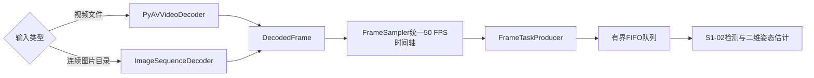
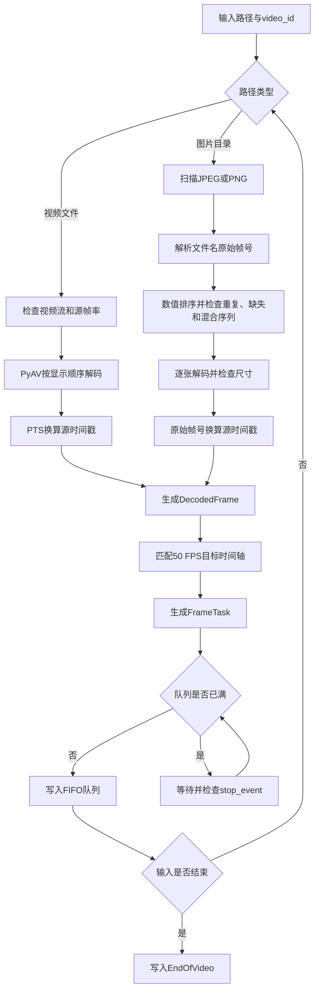

# S1-01 视频与连续图片帧输入详细设计

## 1. 文档目的

本文档说明阶段一S1-01子模块的代码结构、输入适配、时间基准、队列接口和异常处理。模块支持视频文件与连续图片序列两种输入，并统一输出50 FPS时间轴上的`FrameTask`，供S1-02人体检测与二维姿态估计使用。

## 2. 模块边界



S1-01负责：

- 读取视频或连续图片；
- 建立原始帧号和源时间戳；
- 统一到50 FPS目标时间轴；
- 生成`FrameTask`；
- 通过有界队列向S1-02供给帧任务。

S1-01不执行人体检测、二维关节估计、H36M17骨架转换以及81帧或243帧组窗。时间窗口由S1-03生成。

## 3. 输入类型

### 3.1 视频文件

支持PyAV可以打开的视频容器，例如MP4和AVI。输入视频可以等于或高于50 FPS：

- 50 FPS视频逐帧保留；
- 高于50 FPS的视频根据PTS匹配到50 FPS时间轴；
- 低于50 FPS的视频返回`fps_too_low`，不复制帧。

### 3.2 连续图片序列

一个图片目录只能表示一个主体、动作、子动作和摄像机序列，例如：

```text
images/
└── s_01_act_02_subact_01_ca_01/
    ├── s_01_act_02_subact_01_ca_01_000001.jpg
    ├── s_01_act_02_subact_01_ca_01_000002.jpg
    ├── s_01_act_02_subact_01_ca_01_000003.jpg
    └── ...
```

图片序列必须满足：

- 文件名末尾包含六位数字原始帧号；
- 同一目录中的序列前缀一致；
- 原始帧号不能重复；
- 正式流程要求帧号严格连续；
- 图片均可解码为`uint8[H,W,3]`；
- 整个序列的宽度和高度保持一致。

图片无需先编码成视频。直接读取可保留原始帧号，避免二次压缩和视频PTS重建误差。

## 4. 代码结构

```text
video-to-3d-motion/
├── configs/
│   └── media_decode.yaml
├── src/video_to_3d_motion/media/
│   ├── __init__.py
│   ├── cli.py
│   ├── config.py
│   ├── exceptions.py
│   ├── frame_sampler.py
│   ├── image_sequence_decoder.py
│   ├── models.py
│   ├── producer.py
│   └── video_decoder.py
├── tests/
│   ├── test_frame_sampler.py
│   ├── test_image_sequence_decoder.py
│   └── test_queue_producer.py
└── tools/
    ├── run_decode_demo.py
    └── run_decode_images_demo.py
```

| 文件 | 职责 |
| --- | --- |
| `video_decoder.py` | 读取视频流、PTS和图像帧 |
| `image_sequence_decoder.py` | 解析图片文件名、排序、检查连续性并解码图片 |
| `frame_sampler.py` | 将两类源帧映射到50 FPS目标时间轴 |
| `producer.py` | 统一生成`FrameTask`并执行队列背压 |
| `models.py` | 定义中间数据、队列任务和控制消息 |
| `config.py` | 加载视频、图片序列和队列配置 |
| `cli.py` | 提供`decode-video`和`decode-images`命令 |
| `tests/` | 验证采样、图片序列规则和队列行为 |

## 5. 统一处理流程



### 5.1 视频时间信息

视频帧优先使用：

```text
source_timestamp = PTS × time_base - first_pts_offset
```

PTS缺失且允许降级时：

```text
source_timestamp = (source_frame_id - 1) / source_fps
```

内部记录：

```text
timestamp_source = pts          # 正常PTS
timestamp_source = fps_fallback # PTS缺失后的降级值
```

### 5.2 图片时间信息

图片文件名例如：

```text
s_01_act_02_subact_01_ca_01_000001.jpg
```

解析结果为：

```text
source_frame_id = 1
```

以序列首帧为时间原点：

```text
source_timestamp = (source_frame_id - first_source_frame_id) / 50
```

内部记录：

```text
timestamp_source = filename
```

图片帧号按照数字排序，不使用文件系统遍历顺序。为保持`frame_id`和`source_frame_id`统一从1开始，连续图片序列必须从`000001`起始；若起始帧不是`000001`，返回`frame_start_invalid`。若`000001`后直接出现`000003`，立即返回`frame_missing`。

### 5.3 目标时间轴

目标帧`frame_id`从1开始，其时间戳为：

```text
timestamp = (frame_id - 1) / 50
```

`FrameSampler`为目标时间点选择最近的源帧，并禁止一个源帧重复映射到多个目标时间点。图片序列在帧号连续且`source_fps=50`时逐帧通过，不执行降采样。

## 6. 数据接口

### 6.1 DecodedFrame

```python
DecodedFrame = {
    "image": np.ndarray,          # uint8[H,W,3]，BGR
    "source_frame_id": int,       # 从1开始的视频解码序号或图片文件名帧号
    "source_timestamp": float,    # 源时间轴，单位秒
    "pts": int | None,            # 图片输入为None
    "timestamp_source": str       # pts、fps_fallback或filename
}
```

### 6.2 FrameTask

```python
FrameTask = {
    "image": np.ndarray,          # uint8[H,W,3]，BGR连续数组
    "video_id": str,              # 视频或图片序列唯一标识
    "frame_id": int,              # 50 FPS目标时间轴连续帧号，首帧为1
    "source_frame_id": int,       # 原始帧号
    "timestamp": float,           # (frame_id - 1) / 50
    "source_timestamp": float,    # 源输入时间戳
    "timestamp_source": str,      # pts、fps_fallback或filename
    "image_size": [W,H],
    "fps": 50
}
```

`video_id + frame_id`是后续结果聚合的唯一键。`source_frame_id`用于追踪原始视频帧或Human3.6M图片文件名。

## 7. 队列与背压

队列元素为：

```python
QueueItem = FrameTask | EndOfVideo | DecodeFailure
```

默认配置：

```yaml
queue:
  batch_size: 27
  prefetch_batches: 2
  capacity: 54
  put_timeout_seconds: 0.5
```

容量54表示任一时刻最多允许54个尚未被消费者取走的任务驻留在内存中，相当于预取两个27帧二维推理批次；它不是一次运行可处理的总帧数上限。生产者与消费者并发运行，消费者每取走一个任务就释放一个位置。队列满时生产者阻塞等待，不覆盖旧任务，也不丢弃新任务；每0.5秒检查一次`stop_event`，使消费者异常退出时生产者可以结束。

当前尚未实现S1-02正式消费者。decode-video和decode-images验证命令在主线程中内置诊断接收循环：逐项调用output_queue.get()，记录首尾任务、可选写入JSONL，然后调用	ask_done()，因此可以持续释放队列位置。该循环只验证S1-01的数据契约和背压行为，不执行人体检测或二维姿态估计。若既不启动诊断接收循环也不启动S1-02，生产者在累计54个待处理任务后会阻塞。

队列容量与PoseMamba的81帧或243帧时间窗口无直接关系。

## 8. 配置

```yaml
media:
  target_fps: 50
  pixel_format: bgr24
  fps_tolerance: 0.5
  timestamp_tolerance_ms: 10.0
  fail_on_low_fps: true
  fallback_when_pts_missing: true

image_sequence:
  source_fps: 50
  frame_pattern: '_(?P<frame_id>\d{6})\.(?:jpg|jpeg|png)$'
  extensions: [.jpg, .jpeg, .png]
  require_contiguous: true

queue:
  batch_size: 27
  prefetch_batches: 2
  capacity: 54
  put_timeout_seconds: 0.5
```

`require_contiguous=true`是当前项目正式运行要求。关闭该检查只适合数据审计；主流程的50 FPS采样仍可能因时间缺口返回`timestamp_gap`。

## 9. 命令行

视频输入：

```powershell
decode-video path\to\input.mp4 --config configs\media_decode.yaml --tasks-output results\video_frame_tasks.jsonl --summary-output results\decode_video_result.json
```

连续图片输入：

```powershell
decode-images path\to\sequence_directory --config configs\media_decode.yaml --tasks-output results\image_frame_tasks.jsonl --summary-output results\decode_images_result.json
```

图片输入未指定`--video-id`时，默认使用目录名，例如：

```text
s_01_act_02_subact_01_ca_01
```

输入路径、`--config`、`--tasks-output`和`--summary-output`均为必填项，缺失时由命令行直接列出缺少的参数并终止。运行时终端显示处理进度，完成后输出`SUCCESS`以及两个结果文件的位置。两个命令都会排空任务队列，并输出解码帧数、目标帧数、队列阻塞次数、首尾`frame_id`和结束消息。`--summary-output`将UTF-8 JSON运行摘要保存到用户指定的文件名；该目录中的结果文件不纳入版本控制。`--tasks-output`额外把每个实际出队的`FrameTask`元数据写成一行JSONL；为避免文件体积失控，不序列化图像像素，只记录帧号、时间戳、图像形状和数据类型等字段。可使用`Get-Content results\image_frame_tasks.jsonl -TotalCount 5`查看前5项。

## 10. 异常处理

| 错误码 | 触发条件 |
| --- | --- |
| `video_not_found` | 视频路径不存在 |
| `video_stream_missing` | 文件中没有视频流 |
| `fps_unavailable` | 无法获得视频源帧率 |
| `fps_too_low` | 视频低于50 FPS |
| `pts_missing` | PTS缺失且禁止降级 |
| `non_monotonic_pts` | 视频时间戳没有严格递增 |
| `image_sequence_not_found` | 图片序列目录不存在 |
| `image_sequence_empty` | 目录中没有支持的图片 |
| `invalid_frame_name` | 文件名不能解析出六位帧号 |
| `mixed_sequence` | 一个目录中出现不同序列前缀 |
| `duplicate_frame` | 原始帧号重复 |
| `frame_missing` | 图片原始帧号不连续 |
| `image_decode_failed` | JPEG或PNG无法解码 |
| `invalid_image_format` | 图片不是`uint8[H,W,3]` |
| `image_size_changed` | 序列内图片尺寸变化 |
| `timestamp_gap` | 源帧与50 FPS目标时间轴不兼容 |
| `cancelled` | 收到停止信号 |

## 11. 测试

```powershell
.\.venv\Scripts\python.exe -m unittest discover -s tests -v
```

当前10项单元测试覆盖：

- 50 FPS视频时间轴逐帧保留；
- 60 FPS降采样到50 FPS；
- 时间戳间隔异常；
- 图片数值排序和50 Hz时间戳；
- 图片缺帧、重复帧和尺寸变化；
- 图片读取器与`FrameTaskProducer`兼容；
- 满队列背压不丢帧；
- 停止信号解除生产者阻塞。

真实Human3.6M冒烟测试使用：

```text
s_01_act_02_subact_01_ca_01
```

验证结果：1384张`1000×1002`图片全部解码成功，输出`frame_id=1～1384`、`source_frame_id=1～1384`，最终消息为`EndOfVideo`。
