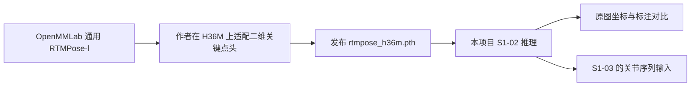

# S1-02：RTMPose H36M 微调模型的来源与原理

核查日期：2026-10-09（北京时间）。本文件是后续实验报告的模型背景材料，范围包括来源、训练机制和当前评估的解释边界；实验拓扑、完整结果分析和工作计划留到后续报告。

文中“作者声明”指发布者描述；“源码事实”指公开代码明确实现；“本地核验”指检查本项目实际文件；“解释性推断”指根据这些证据作出的判断。

## 1. 这个模型是谁提供的

当前项目的 `rtmpose_l_h36m` 使用 `checkpoints/rtmpose_h36m.pth`。公开发布页属于 Hugging Face 用户 **charlesjvt**，发布者将它描述为 Kineo 在 Human3.6M 基准中使用的 RTMPose-l 微调权重。它是第三方在 OpenMMLab 模型上的适配，不能标为“OpenMMLab 官方 H36M 微调权重”。[发布者模型卡](https://huggingface.co/charlesjvt/rtmpose-l-h36m-384x288/blob/7f780e44ba0c6af75c6470642ca87a7e5f90bc98/README.md)

**本地文件与公开来源已经闭环核对：**本地文件大小为 225,380,248 字节，SHA-256 为 `3c0b3796b0405a8a105e2a379db4a6552b0a4270f9acb6626c8163d694bd67dc`，与发布仓库此版本的文件大小、Git LFS `oid` 完全相同。核查是比较本地文件与发布元信息，没有重复下载权重。[发布仓库固定版本文件元信息 API](https://huggingface.co/api/models/charlesjvt/rtmpose-l-h36m-384x288/tree/7f780e44ba0c6af75c6470642ca87a7e5f90bc98?recursive=true)

Kineo 的论文作者是 Charles Javerliat、Pierre Raimbaud、Guillaume Lavoué；论文描述的是利用多个 RGB 摄像机进行相机标定和三维动作重建的系统，RTMPose 是其中可选择的二维关键点模块。论文的系统精度与我们当前单相机二维像素误差属于不同层级的结果。[Kineo 论文 v1](https://arxiv.org/html/2510.24464v1)

模型卡中的 Kineo 链接指向 `github.com/cjaverliat/kineo`，公开检索还指向组织仓库 `github.com/liris-xr/kineo`。**本次直接访问这两个仓库及 GitHub API 都返回 404**，因此只记录它们作为发布链路，不能承诺 Kineo 主仓库目前仍能公开访问。可以访问的作者源码是 **cjaverliat/mmpose**，包含 H36M 专用 Dataset、训练配置和数据转换脚本。[作者 MMPose 仓库](https://github.com/cjaverliat/mmpose/tree/111d9b3a1e15d417925e5bf66211fe1b4517ae6c)

证据链可以理解为：

初始化来源是官方 AIC+COCO、384×288 的 RTMPose-l：`rtmpose-l_simcc-aic-coco_pt-aic-coco_420e-384x288-97d6cb0f_20230228.pth`。作者发布配置的 `load_from` 明确指向这一权重；本项目普通 `rtmpose_l` 也使用这一文件。[作者发布配置](https://huggingface.co/charlesjvt/rtmpose-l-h36m-384x288/blob/7f780e44ba0c6af75c6470642ca87a7e5f90bc98/rtmpose-l_8xb256-420e_h36m-384x288.py)

## 2. 微调到底改了什么

“微调”就是先拿一个已经训练好的模型，再用目标数据继续训练。可以把网络分成两部分：**骨干 backbone 负责提取人体图像特征，关键点头 head 负责把特征解释成关节位置**。这个微调版保留 CSPNeXt-l 和 RTMCCHead 的结构，使用 H36M 的二维坐标监督，让输出通道适应 H36M 的关节定义。[RTMPose 原论文 v2](https://arxiv.org/abs/2303.07399v2)、[作者训练配置](https://github.com/cjaverliat/mmpose/blob/111d9b3a1e15d417925e5bf66211fe1b4517ae6c/configs/body_2d_keypoint/rtmpose/h36m/rtmpose-l_8xb256-420e_h36m-384x288.py)

### 2.1 输入与坐标预测

这是 top-down 模型：先获得人体框，再把框内人体通过仿射变换调整到网络输入尺寸。配置中的 `input_size=(288, 384)` 是 **宽 288、高 384**；模型名称的 `384x288` 通常按高×宽书写，二者一致。[发布配置](https://huggingface.co/charlesjvt/rtmpose-l-h36m-384x288/blob/7f780e44ba0c6af75c6470642ca87a7e5f90bc98/rtmpose-l_8xb256-420e_h36m-384x288.py)

RTMCCHead 用卷积、全连接层和门控注意力单元（GAU）处理骨干输出，最后分别预测横向、纵向坐标的分类分数。[MMPose v1.3.2 RTMCCHead 源码](https://github.com/open-mmlab/mmpose/blob/v1.3.2/mmpose/models/heads/coord_cls_heads/rtmcc_head.py)

SimCC 可以理解成：对每个关节，分别判断“横坐标落在哪个位置”和“纵坐标落在哪个位置”。当前 `simcc_split_ratio=2`，因此每个关节有 576 个横向位置、768 个纵向位置，分类步长对应网络输入中的半个像素。**半像素是表示粒度，不能理解成预测误差只有半像素**；原图误差还受人体框尺度、姿态难度和模型预测影响。[SimCC 原论文 v3](https://arxiv.org/abs/2107.03332v3)、[MMPose SimCCLabel 源码](https://github.com/open-mmlab/mmpose/blob/v1.3.2/mmpose/codecs/simcc_label.py)

训练时，标注坐标变成横向和纵向的高斯目标分布；`KLDiscretLoss` 让预测分布接近这些目标分布，同时按可见性等目标权重计算损失。它比较的是分布，当前实验 CSV 的欧氏像素距离是训练之后另算的评价指标。[MMPose KLDiscretLoss 源码](https://github.com/open-mmlab/mmpose/blob/v1.3.2/mmpose/models/losses/classification_loss.py)

推理时从分类分数解码坐标，再由 MMPose 将坐标还原到原图。工程读取的 `pred_instances.keypoints` 已在原图坐标系，无须再做一次逆变换。[MMPose TopdownPoseEstimator 源码](https://github.com/open-mmlab/mmpose/blob/v1.3.2/mmpose/models/pose_estimators/topdown.py)

### 2.2 骨干被冻结，实际适配的是 head

作者配置写了 `arch='P5'` 和 `frozen_stages=4`。按 MMDetection v3.3.0 的实际实现，P5 的 `layers` 是 `stem, stage1, stage2, stage3, stage4`；冻结循环使用 `range(frozen_stages + 1)`，会对 **stem 和全部四个 stage** 设置 `eval()` 与 `requires_grad=False`。这表示骨干参数不进行梯度更新，骨干内 BatchNorm 也保持评估状态。[CSPNeXt 冻结源码](https://github.com/open-mmlab/mmdetection/blob/v3.3.0/mmdet/models/backbones/cspnext.py)

本地权重对比进一步支持这一结论：

- 将官方普通 L 的 `state_dict` 与微调文件中未平滑的训练参数比较，**458/458 个骨干张量逐元素相等**，包括 BatchNorm 缓冲。
- **12/12 个 head 张量发生变化**，形状全部保持一致；最大绝对差约 3.0701。
- 微调版部署参数的骨干有 75/458 个张量严格相等，其余有小幅差异，最大绝对差约 0.0023193。结合 EMA 保存规则，这不能解释为骨干经过梯度训练；浮点平均迭代可能引入数值差异，具体累积过程尚未重放验证。

因此更准确的表述是：**沿用通用 RTMPose-l 的图像特征提取能力，主要训练关键点头，让它识别 H36M 定义的关节位置**。这比笼统地说“整个 L 网络重新训练了一遍”更符合现有证据。

### 2.3 为什么同为 17 点，输出含义仍然变了

COCO 的 17 点包含鼻子、眼睛和耳朵；H36M 的 17 点包含骨盆、脊柱、胸部、颈部和头部。两者数量相同，但语义不同。作者 Dataset 和 H36M 元信息采用：0 为 root；1–3 为右髋、右膝、右脚；4–6 为左髋、左膝、左脚；7–10 为 spine、thorax、neck_base、head；11–13 为左肩肘腕；14–16 为右肩肘腕。[作者 Human36mCocoDataset](https://github.com/cjaverliat/mmpose/blob/111d9b3a1e15d417925e5bf66211fe1b4517ae6c/mmpose/datasets/datasets/body/h36m_coco_dataset.py)、[作者 H36M 元信息](https://github.com/cjaverliat/mmpose/blob/111d9b3a1e15d417925e5bf66211fe1b4517ae6c/configs/_base_/datasets/h36m.py)

**目前公开材料存在标签冲突：**模型卡写“17 COCO layout”，但 Dataset 与本地 checkpoint 的 `dataset_meta.keypoint_id2name` 是 H36M17；转换脚本 `categories.keypoints` 则把左腿写在 1–3、右腿写在 4–6，与 Dataset 相反，本地 `meta.dataset_meta.CLASSES[0].keypoints` 中也保留了这个冲突。转换脚本对数值坐标只执行原顺序展开，没有按这些类别名称重新排列。[作者转换源码](https://github.com/cjaverliat/mmpose/blob/111d9b3a1e15d417925e5bf66211fe1b4517ae6c/tools/dataset_converters/h36m_to_coco.py)

当前工程按 checkpoint 主元信息使用 H36M17，与本项目标准 H36M 标注同索引比较。MMPose 初始化时优先采用 checkpoint 的 Dataset 元信息，这与模型卡文字相比更能说明本次运行的解释方式。标签冲突仍应保留在报告中，后续增加明显可区分左右腿的逐帧人工检查；不能只因为名称里有“COCO”就套用 COCO 骨架。[MMPose init_model 元信息优先级](https://github.com/open-mmlab/mmpose/blob/v1.3.2/mmpose/apis/inference.py)

## 3. 作者怎样准备 H36M 数据

`Human36mCocoDataset` 继承 `BaseCocoStyleDataset`。这里的 “Coco” 表示 **JSON 文件的组织形式**，包含 `images`、`annotations`、`categories` 等字段，不表示关节必须是 COCO 定义。转换脚本从 NPZ 读取二维坐标 `part`、三维坐标 `S`、人体中心和尺度，写出二维关键点、人体框和面积等字段。二维网络训练仍使用二维标签，JSON 中附带三维字段不会自动使 RTMPose 输出三维坐标。[Dataset 源码](https://github.com/cjaverliat/mmpose/blob/111d9b3a1e15d417925e5bf66211fe1b4517ae6c/mmpose/datasets/datasets/body/h36m_coco_dataset.py)、[转换脚本](https://github.com/cjaverliat/mmpose/blob/111d9b3a1e15d417925e5bf66211fe1b4517ae6c/tools/dataset_converters/h36m_to_coco.py)

作者公开预处理代码的被试划分是：

- 训练：**S1、S5、S6、S7、S8**。
- 测试：**S9、S11**。

该脚本从 H36M 的 `D2_Positions` CDF 读取二维坐标，选出 17 个关节；默认 `sample_rate=5`，标签使用 `[::sample_rate]`，视频抽图按 `i % sample_rate == 0`，输出目录按 `50 // sample_rate` 命名。按源码采用的 50 fps 基准，默认就是 **每 5 帧取 1 帧，形成 10 fps 的训练/测试样本**。这与模型推理速度是两回事，也不要求我们只能按 10 fps 推理。[作者预处理源码](https://github.com/cjaverliat/mmpose/blob/111d9b3a1e15d417925e5bf66211fe1b4517ae6c/tools/dataset_converters/preprocess_h36m.py)

作者发布配置分别指向 `h36m_train_coco_10fps.json`、`h36m_test_coco_10fps.json`，但这两个实际 JSON 未随模型发布，本次没有读取训练样本清单。因此，上述内容确认的是**公开脚本协议**，不是已经证明 checkpoint 完整执行了该版本全部步骤，也不能逐帧确认当前序列与其训练样本的重合情况。[发布配置](https://huggingface.co/charlesjvt/rtmpose-l-h36m-384x288/blob/7f780e44ba0c6af75c6470642ca87a7e5f90bc98/rtmpose-l_8xb256-420e_h36m-384x288.py)

## 4. 训练记录应该怎样解读

作者配置使用 AdamW、学习率 0.004、随机种子 21、计划最大 420 个 epoch；前期包含预热，余弦学习率阶段从第 210 轮开始，较弱数据增强阶段从第 390 轮开始。发布的 best checkpoint 记录在 **第 104 轮**，因此不能将后两阶段描述成该权重已经经历的训练过程。[作者发布配置](https://huggingface.co/charlesjvt/rtmpose-l-h36m-384x288/blob/7f780e44ba0c6af75c6470642ca87a7e5f90bc98/rtmpose-l_8xb256-420e_h36m-384x288.py)

模型卡声明第 104 轮的 `coco/AP=0.9667`，这是作者测试 JSON 上的 COCO 风格关键点评价。它既不是 96.67% 的关节逐点预测完全正确，也不是平均像素误差；不能与我们 CSV 中的 4.23 px 直接换算。[模型卡](https://huggingface.co/charlesjvt/rtmpose-l-h36m-384x288/blob/7f780e44ba0c6af75c6470642ca87a7e5f90bc98/README.md)、[MMPose CocoMetric](https://github.com/open-mmlab/mmpose/blob/v1.3.2/mmpose/evaluation/metrics/coco_metric.py)

第 104 轮说明这份 checkpoint 保存到哪个训练位置，不单独证明整个训练运行只进行了 104 轮。模型卡还声明 420 轮计划提前停止，但未获得完整训练日志，本次也没有验证自动早停机制。

本地 checkpoint 核验记录：

- `meta.epoch=104`，`meta.iter=15912`，随机种子 21，EMA `steps=15912`。
- 运行信息中的最佳分数为 **0.966631660230088**，最佳权重文件名为 `best_coco_AP_epoch_104.pth`。该精确值与卡片 0.9667 接近，但按四位小数通常得到 0.9666；两者不完全一致，应分别保留来源，不能宣称逐位一致。
- 顶层 `meta.experiment_name` 末尾为 `20250409_113222`，`meta.time=20250409_232048`；运行信息中的实验名末尾为 `20250409_090631`，后者与模型卡一致。两套时间记录的原因未确认。
- 顶层 `meta.cfg` 中 `load_from=None`，但运行信息保存的配置中 `load_from` 是上文官方 L 权重。初始化来源同时得到公开配置和骨干张量一致性的支持，不能单独拿一个 `None` 判断为随机初始化。
- 原始发布配置与权重记录的 `flip_test=True`；当前本项目三组比较统一关闭。作者 AP 结果与我们的运行条件并不相同。

### EMA 与文件中两份参数

作者使用 EMA（指数滑动平均）平滑训练参数。按 MMEngine 保存规则，保存前会交换参数：**checkpoint 的 `state_dict` 保存供部署使用的 EMA 参数，`ema_state_dict` 中的 `module.*` 保存未平滑的训练模型参数**。字段名字容易使人误以为正好相反。[MMEngine v0.10.7 EMAHook](https://github.com/open-mmlab/mmengine/blob/v0.10.7/mmengine/hooks/ema_hook.py)

MMPose 的 `ExpMomentumEMA` 使用随训练步数变化的动量更新张量。本项目按 `init_model` 的标准加载流程读取 `state_dict`，已经使用部署的 EMA 参数，无须为了“使用 EMA”手动改成另一字段；两份参数也不表示推理时执行两个模型。[MMPose v1.3.2 ExpMomentumEMA](https://github.com/open-mmlab/mmpose/blob/v1.3.2/mmpose/engine/hooks/ema_hook.py)、[MMEngine checkpoint 加载](https://github.com/open-mmlab/mmengine/blob/v0.10.7/mmengine/runner/checkpoint.py)

## 5. 这对我们当前实验意味着什么

**解释性推断：**微调版在 H36M 上像素误差更小，有两个合理机制：其关键点头见过 H36M 场景数据；输出定义也更贴近 H36M 的标注位置。这与参数量变化无关，因为普通 L 和微调 L 的网络结构、参数形状相同。

当前测试序列名为 `s_01_act_02_subact_01_ca_01`，属于 S1。S1 在作者公开脚本的训练划分中。因此当前结果适合说明**这一训练被试场景上的适配效果和工程流程是否正常**，不能写成已证明对未见被试或新场景的泛化优势。具体训练帧重合仍需作者实际 JSON 核实。

置信度覆盖率表示多少点通过工程设置的分数阈值。SimCC 预测分数不是已经校准的“预测正确概率”，覆盖率 100% 也不等于准确率 100%；位置是否准确仍需与标注计算距离。[SimCC 解码源码](https://github.com/open-mmlab/mmpose/blob/v1.3.2/mmpose/codecs/simcc_label.py)

跨模型比较应继续使用共同 10 个肩、肘、腕、髋、膝关节；普通 COCO 模型的脚踝与 H36M 的 foot 是近似对应，头面部和躯干定义也不同。微调 L 的全 17 点平均值与普通模型的部分点平均值不是同一统计口径。相关映射和统计实现位于本项目 `src/video_to_3d_motion/pose2d/comparison.py`。

后续报告可以先写“统一网络输入、翻转设置、人体检测器和共同关节口径后，微调模型在当前 S1 序列误差较低”，再说明训练被试重合与标签定义差异。若要进一步归因，优先补充 S9/S11 的保留集序列、逐关节误差与左右腿人工核对，之后再讨论是否自行微调。

## 6. 可追溯版本与复现边界

本次记录以下来源版本，减少链接未来变更造成的歧义：

- Hugging Face 模型仓库 commit：`7f780e44ba0c6af75c6470642ca87a7e5f90bc98`，API 记录最后修改时间为 2026-10-01。
- 作者 MMPose fork commit：`111d9b3a1e15d417925e5bf66211fe1b4517ae6c`。这是本次可读取的源码版本，**尚未证明是 2025 年训练时的精确 commit**。
- 本项目实际权重 `checkpoints/rtmpose_h36m.pth` SHA-256：`3c0b3796b0405a8a105e2a379db4a6552b0a4270f9acb6626c8163d694bd67dc`。
- 源码解释使用 MMPose v1.3.2、MMDetection v3.3.0、MMEngine v0.10.7，与本项目依赖版本对应；这不等于作者原始训练环境已完整复原。

目前足以解释和运行已有 checkpoint，但尚不足以声称完整复现作者训练：实际训练 JSON、完整训练日志、原训练环境锁定、数据转换命令及全部采样参数未核实；标签与时间记录存在上述不一致。训练文件名中的 `8xb256` 也不能单独证明作者实际用了 8 张 GPU。

发布者对该权重声明研究与评估用途，商业使用或再分发需要另行获得同意；Human3.6M 还有独立的数据使用条件。这是模型来源信息，应在后续涉及对外部署、分享权重或数据时核对。[模型卡许可说明](https://huggingface.co/charlesjvt/rtmpose-l-h36m-384x288/blob/7f780e44ba0c6af75c6470642ca87a7e5f90bc98/README.md)

## 7. 向导师介绍：采用依据与微调机制

建议介绍时先给出采用理由，再解释机制，最后交代验证范围。当前能支持的定位是：**来源与训练改动可以核验、在当前 H36M 序列上误差较低的候选二维姿态模型，适合继续用于流程验证与后续对照实验。** 三维重建效果还需 S1-03 实验验证。

### 7.1 实验依据：相同条件下的原图像素误差

这里使用三次全序列实验，不混用先前 100 帧实验中不同的 M 配置。三组均处理同一序列的 1,384 张图片，1,383 帧匹配到标注；最后一帧缺少标注，未计入误差。人体检测器一致，网络输入均为宽 288、高 384，均关闭翻转测试。关键点先恢复到原图坐标，再与标注计算欧氏距离。

跨模型主指标使用共同 10 个肩、肘、腕、髋、膝关节，每组有 13,830 个有效点对：

- 通用 RTMPose-m：平均 **8.47 px**，P95 **18.94 px**；实验 `rtmpose_m_2026-10-08-22-50-42`。
- 通用 RTMPose-l：平均 **9.61 px**，P95 **23.69 px**；实验 `rtmpose_l_2026-10-08-22-56-38`。
- H36M 微调 RTMPose-l：平均 **4.23 px**，P95 **13.20 px**；实验 `rtmpose_l_h36m_2026-10-08-23-02-41`。

微调版的平均误差相对 M 降低 **50.1%**，相对普通 L 降低 **56.0%**；计算方式为 `(基线误差 − 微调误差) / 基线误差`。这是误差的相对降幅，不是“准确率提高了 56%”。P95 表示约 95% 的有效点对误差不超过该数值，用于补充平均值对较大误差的描述；它不是置信度或统计置信区间。

数据来源为项目 `results/experiment_summary_simple.csv` 的 `common10_mean_error_px`，以及各实验 `_summary.csv` 的 `comparison.common10_pairs.mean_px/p95_px/count`。不要把微调模型全 17 点的 3.76 px 与通用模型部分关节的平均值直接比较。

这些结果支持“在当前序列上降低二维位置误差”。1,383 帧来自一个连续序列，不能视为 1,383 个独立场景；S1 又属于作者公开脚本的训练被试，因此不能据此宣称已证明跨被试泛化。后续用 S9/S11 的多动作序列复核，能补强采用依据。

展示时可以配两三张同帧、同尺度的预测与标注叠加图，并包含一张误差较大的帧，使导师能看到数字对应的视觉偏差。高置信度覆盖率只说明预测分数通过阈值，不能替代位置误差。

### 7.2 微调机制：保留图像特征，学习目标关节定义

可以按以下训练过程解释：

1. **加载已有能力。** 以官方 AIC/COCO 预训练 RTMPose-l 的参数初始化，包括骨干和形状兼容的预测头。
2. **准备目标监督。** 从 H36M 提取人体图片及其二维关节标注，统一到宽 288、高 384 的人体裁剪图坐标；输出通道按 H36M17 定义。
3. **冻结骨干。** 骨干继续提取图像特征，但不进行梯度更新；可训练的关节预测头利用这些特征重新学习关节位置。
4. **用标注纠正预测。** SimCC 将每个标注关节编码为横轴、纵轴的高斯目标分布；预测头输出对应分数，KL 损失衡量分布差异，反向传播与 AdamW 更新预测头。重复这一过程，使输出适应 H36M 数据和关节定义。
5. **保存并推理。** 作者保存第 104 轮的最佳权重，并使用 EMA 平滑。我们的实验只加载该权重做推理，标注用于之后的误差计算，没有在测试过程中训练模型。

其中 SimCC、KL 损失、EMA 是沿用的训练组件；H36M 版本的关键适配是目标数据、关节语义和冻结骨干后的头部训练，不宜包装成发布者发明了一套新的姿态算法。[作者训练配置](https://github.com/cjaverliat/mmpose/blob/111d9b3a1e15d417925e5bf66211fe1b4517ae6c/configs/body_2d_keypoint/rtmpose/h36m/rtmpose-l_8xb256-420e_h36m-384x288.py)、[SimCC 实现](https://github.com/open-mmlab/mmpose/blob/v1.3.2/mmpose/codecs/simcc_label.py)

这一解释有实际文件支持：本地权重与公开文件哈希一致；扣除 EMA 保存交换的影响后，未平滑模型的 458 个骨干张量与官方 L 逐元素相同，而 12 个预测头张量均有变化。张量数量不是神经网络层数。详细核验和限制见第 2、4 节。

误差降低与“在目标数据上训练、对齐关节定义”这一机制相符，但目前没有消融实验把两者贡献分别量化。普通 L 与微调 L 的结构、参数形状相同，不能将此次改善归因于模型参数量增加。

### 7.3 可以直接用于口头汇报的表述

> 我们选用了第三方公开的 H36M 适配版 RTMPose-l，已核实它基于官方预训练模型，主要训练关键点预测头，保留原有图像特征提取骨干。训练使用 H36M 的二维标注，使预测头适应目标数据和关节定义。本地权重与公开文件的哈希一致，参数对比也支持作者的冻结与微调设置。
>
> 在统一检测器、输入尺寸和翻转设置后，我们对同一序列进行了对照测试。按共同 10 个关节的原图欧氏距离统计，通用 M、通用 L 和微调 L 的平均误差分别为 8.47、9.61 和 4.23 像素，微调版相对普通 L 的误差降低约 56%。因此我们将其作为当前 H36M 流程的候选二维模型，继续验证后续三维重建效果。当前测试来自 S1，被试属于作者公开脚本的训练划分；后续需要补充 S9/S11 等保留被试测试，检验这一优势能否保持。

## 8. S5 补充对照实验（2026-10-09）

为检查误差优势是否在非 S1 序列上保持，补测了 `datasets/s_05_act_06_subact_02_ca_01` 中的全部 **50 张现有图片**。其原始帧号从 15 到 2,066，并不连续；50 张均匹配到 `h36m_train.pkl` 标注，每张的 17 个标注点都可见。网络输入、RTMDet 人体检测器、翻转设置、阈值和共同 10 点的评价口径沿用 S1 全序列实验。

三组均成功处理 50 张、失败 0 张、缺失标注 0 张。每组共同 10 点的统计样本为 500 个点对：

- RTMPose-m：平均误差 **11.33 px**，中位数 **7.84 px**，P95 **26.79 px**；实验 `rtmpose_m_2026-10-09-08-31-46`。
- RTMPose-l：平均误差 **11.68 px**，中位数 **7.95 px**，P95 **26.59 px**；实验 `rtmpose_l_2026-10-09-08-32-21`。
- H36M 微调 RTMPose-l：平均误差 **5.83 px**，中位数 **3.19 px**，P95 **15.19 px**；实验 `rtmpose_l_h36m_2026-10-09-08-32-52`。

微调版平均误差相对 M 降低 **48.6%**，相对普通 L 降低 **50.1%**。与 S1 的对应降幅 50.1% / 56.0% 相比，**“微调版误差更低”的趋势在这组非 S1 数据上保持**；P95 也更低，但仍存在较大误差点，不能认为每个关节都落在约 6 像素之内。

这是另一序列上的补充证据，尚不能解释为纯粹的“只改变被试”的控制实验：S1 使用 act_02/subact_01 的 1,383 个连续标注帧，S5 使用 act_06/subact_02 的 50 个间隔取样帧；被试、动作和取样方式同时变化。两组绝对误差的差异不能单独归因于被试。S5 也属于作者公开脚本的训练被试划分，具体训练帧重合未核实，因此保留被试泛化验证仍需要 S9/S11。[作者公开预处理划分](https://github.com/cjaverliat/mmpose/blob/111d9b3a1e15d417925e5bf66211fe1b4517ae6c/tools/dataset_converters/preprocess_h36m.py)

输出位于 `results/s5_2026-10-09-08-31-44/`，三组各自保存关节 JSONL、逐关节对比 CSV、50 张原图预测叠加图、50 张标注对比叠加图和配置快照。批次有独立的详细/简易汇总，三个成功实验也已追加到项目原总表。原总表另记录了一次因文件被占用而未启动推理的失败尝试，其误差指标为空，不参与结果比较。

为运行间隔取样图片，补充了 `image_sequence.require_contiguous=false` 的生产队列行为：每张图片只发布一次，输出记录保留文件名中的原始帧号及时间间隔，避免固定帧率采样器将其视为缺帧或补造帧。默认连续图片和视频仍使用原采样行为。S5 使用独立媒体配置，项目默认 active-model 仍为 `rtmpose_l_h36m`。这组稀疏记录用于单帧二维定位评价，不构成对连续时序或 S1-03 三维重建效果的验证。

相关图片解码、生产队列和固定帧率采样的 13 项测试通过；输出核对确认三组使用相同的 500 个原图标注点对，平均值与逐关节 CSV 重算结果一致，图片输出均为原尺寸 1000×1002。

## 9. 共同关节不代表标注协议完全一致

共同 10 点按左右肩、肘、腕、髋、膝建立解剖部位对应，统一了比较点的集合，但**没有证明 COCO 与 H36M 的目标坐标逐点等价**。代码的 `mapping=direct` 表示直接进行索引对应，不表示已经验证两套数据集的关节中心、标注流程和位置标准完全一致。

COCO 采用人工二维关键点标注，其官方评价说明利用重复标注估计了标注人员之间的位置差异，并说明肩、膝、髋等身体关节具有一定标注不确定性。[COCO 官方关键点评价说明](https://github.com/cocodataset/cocodataset.github.io/blob/master/dataset/keypoints-eval.htm)

Human3.6M 官方数据以运动捕捉和拟合的人体骨架确定三维关节位置，再用相机参数投影为二维坐标。这与人工根据图像估计关节位置的生成过程不同。[Human3.6M 官方数据说明](https://vision.imar.ro/human3.6m/description.php)

因此，同名关节仍可能有位置标准或标注流程造成的系统偏差，例如肩、髋在衣物遮挡下的人工估计点与拟合骨架关节中心的投影未必一致。**这是根据两种标注流程作出的可能性判断，不是已经测出本项目的具体偏移量。** 用户提供的 PKL 的完整生成过程仍未取得，不能据官方协议宣称这份转换标注的每个步骤都已核实；`foot`/`ankle` 等名字也不能单凭名称判断是否为不同的解剖点，需追查原始关节选取索引。

当前误差可能同时包含模型定位偏差、目标数据分布差异、标注目标不一致及标注转换误差。已有对照实验没有把这些贡献分别量化；平均欧氏距离也不能直接拆成各项误差的标量和。微调后的预测更接近 H36M 标签，可以作为采用该模型进行 H36M 流程验证的依据，但不能将误差降幅直接解释成与标注定义无关的通用定位能力提升。

报告宜表述为：“在共同解剖关节映射下，H36M 微调模型对 H36M 二维标注的误差更低；结果同时受到目标数据适配和标注协议一致性的影响。”进一步可分别检查肩/髋与肘/腕/膝的误差及叠加图；若要定量分离标注协议偏差，需要在同一批图片上取得按两套标准确定的目标点。仅凭模型输出的方向性偏移，尚不能证明偏差来自关节定义，也不应在测试集上直接拟合并扣除偏移来改善最终分数。
