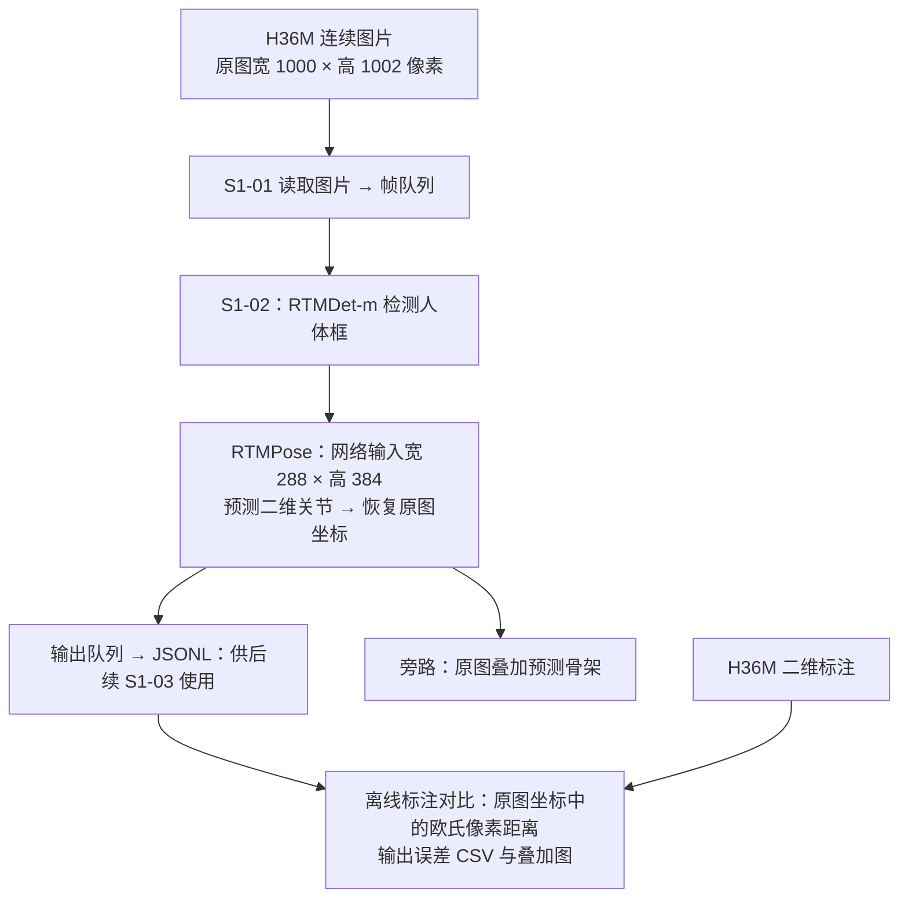

# S1-02 二维姿态估计对照实验报告

编写日期：2026-10-09；版本：V1.4（简版）。

本次比较通用 RTMPose-m、通用 RTMPose-l 和 H36M 微调 RTMPose-l，验证二维估计流程是否可用，以及三种模型与标注的像素误差。

## 1. 测试拓扑

测试在本地 RTX 3060 Laptop GPU 上运行。检测和姿态估计使用 GPU，图片读取、结果保存和标注对比使用 CPU。标注只用于推理后的评价，不参与预测。

本报告中的像素误差均在**宽 1000、高 1002 的原图坐标系**下计算：先将预测关节恢复至原图，再与原图标注求距离。宽 288、高 384 是姿态网络的输入尺寸，不是报告误差所用的图像尺寸。

## 2. 测试流程

1. **读取数据。** 使用 S1 序列 `s_01_act_02_subact_01_ca_01`，共 1,384 张图片；从 `h36m_train.pkl` 匹配到 1,383 帧标注，最后一帧缺少标注，不计入误差。
2. **统一条件。** 三组使用同一个 RTMDet-m 检测器，姿态输入均为宽 288 × 高 384，关闭翻转测试，分别切换模型执行全序列推理。
3. **保存与展示。** 预测坐标恢复到原图后保存为 JSONL，同时输出原图骨架叠加图。每次实验使用独立的“模型名＋时间”目录，保留结果与配置。
4. **计算误差。** 在原图坐标系计算预测点与标注点的欧氏距离，主比较采用左右肩、肘、腕、髋、膝共 10 个对应关节，每组共 13,830 个有效点对。

采用共同 10 点，是因为 COCO17 与 H36M17 的关节定义不同，不能把两套完整骨架的平均值直接混作排名。此前 100 帧测试用于验证流程，本次主要结论使用统一设置的全序列结果。

## 3. 实验结论

三组均成功处理全部 1,384 帧，失败帧为 0。以下误差均在宽 1000、高 1002 的原图坐标系下计算，单位为像素（px），数值越低表示与标注越接近。

**共同 10 点整体结果：**

| 模型 | 平均误差（px） | P95 误差（px） |
| --- | ---: | ---: |
| RTMPose-m | 8.47 | 18.94 |
| RTMPose-l | 9.61 | 23.69 |
| RTMPose-l H36M | **4.23** | **13.20** |

H36M 微调版相对普通 L 的平均误差降低 **56.0%**，相对 M 降低 **50.1%**。其 P95 误差也低于其他两组；P95 描述较大误差水平，不是置信区间。

数据来自各次实验摘要与本地生成的 `results/experiment_summary_simple.csv`。实验原始输出不随代码仓库发布。

**分部位平均误差：**

| 部位 | RTMPose-m（px） | RTMPose-l（px） | RTMPose-l H36M（px） |
| --- | ---: | ---: | ---: |
| 上肢 6 点（左右肩、肘、腕） | 6.32 | 6.23 | **5.38** |
| 髋膝 4 点（左右髋、膝） | 11.71 | 14.67 | **2.49** |

每个关节均有 1,383 个有效点对，两组分别汇总 8,298 和 5,532 个点对，数据来自各次实验的 `_joint_summary.csv`。相对普通 L，微调版上肢误差降低约 **13.6%**；髋膝贡献了共同 10 点总误差降幅的约 **90.6%**。贡献比例按未四舍五入的部位均值差乘各组关节数计算。

**左右髋、膝关节平均误差：**

| 关节 | RTMPose-m（px） | RTMPose-l（px） | RTMPose-l H36M（px） |
| --- | ---: | ---: | ---: |
| 左髋 | 11.95 | 17.25 | **2.99** |
| 右髋 | 16.49 | 22.44 | **3.55** |
| 左膝 | 6.97 | 7.29 | **1.77** |
| 右膝 | 11.42 | 11.71 | **1.63** |

髋部是本轮误差改善的主要来源之一，左右膝的误差也明显下降。

这说明改善主要集中在髋膝，但尚不能判定其原因。即使关节名称相同，不同数据集的具体标注位置也可能存在差异；当前较低误差可能同时包含目标数据适配和关节定义适配的作用。

**当前结论：H36M 微调版在本次 S1 序列上的二维位置误差更低，可作为后续流程验证的候选二维模型。** 尚未设定统一验收阈值，不能据此认定所有场景都足够准确，也不能直接推断三维误差同步降低。

## 4. 结果分析

**模型来源。** 在 Hugging Face 的 [charlesjvt/rtmpose-l-h36m-384x288 模型仓库](https://huggingface.co/charlesjvt/rtmpose-l-h36m-384x288)找到该权重。发布者说明它是 Kineo 在 Human3.6M 实验中使用的 RTMPose-l 微调模型，仓库提供 `rtmpose_h36m.pth` 权重及配套 MMPose 配置。它属于第三方发布的 H36M 适配版。

**微调方式与原理。** 作者以官方 AIC/COCO 预训练 RTMPose-l 为起点，冻结负责提取图像特征的骨干，用 H36M 二维标注继续训练关节预测头。预测头通过 SimCC 分别预测横、纵位置，训练时将标注坐标编码为高斯目标分布，以 KL 损失衡量预测分布与目标分布的差异，并更新预测头参数。这使模型保留已有图像特征，同时适应 H36M 的场景和关节定义，与本次误差降低的现象相符。[作者配套配置](https://huggingface.co/charlesjvt/rtmpose-l-h36m-384x288/blob/7f780e44ba0c6af75c6470642ca87a7e5f90bc98/rtmpose-l_8xb256-420e_h36m-384x288.py)

本地核验也支持这一解释：权重文件与公开文件的哈希一致；取出未平滑的训练参数后，骨干张量与官方 L 完全相同，预测头张量发生了变化。当前使用的是发布权重做推理，尚未完整复现作者训练。

**普通 L 为何没有优于 M。** 本序列中，普通 L 的髋部误差较高；虽然腕部表现有所改善，整体平均值仍高于 M。更大的模型容量不保证在每个具体序列和关节定义下都更准确。微调版的改善在髋、膝较明显，右肘、右腕仍存在较大偏差，不能只用均值概括所有关节。

**关节定义与标注位置的影响。** H36M 微调版与 H36M 标注的一致性更高，但髋部误差下降可能包含 COCO 与 H36M 关节定义对齐的贡献，膝部下降则可能包含对 H36M 骨架拟合位置的适配贡献（[定义差异研究](https://arxiv.org/html/2408.10805v1)、[骨架拟合偏移案例：图 2](https://www.researchgate.net/publication/382112419_Anatomical-Marker-Driven_3D_Markerless_Human_Motion_Capture)）。现有结果尚不能区分这些因素与模型定位能力提升各占多少，因此不能仅凭像素误差降低认定其对真实解剖关节的定位更准确。

**结论的范围。** 本次测试来自一个连续序列，S1 属于作者公开脚本的训练被试，具体训练帧重合尚未确认。因此，当前结果说明该序列上的适配效果，未证明未见被试上的泛化优势。

## 5. 后续测试工作

1. **补测 S9 或 S11，检查优势是否保持。** 选择作者公开划分中的测试被试，匹配二维标注，对三种模型分别运行。固定检测器、输入尺寸和翻转设置，在原图坐标系下同时报告共同 10 点、上肢 6 点、髋膝 4 点的均值与 P95。该测试检验未见被试上的效果；各模型仍按同一份 H36M 标注评价，不能单独排除关节定义的影响。
2. **确定二维到三维的处理链路。** 比较两条候选路线：一是采用 H36M 微调 RTMPose 得到 H36M 定义的二维关节，再输入 PoseMamba 转为三维；二是二维及中间处理阶段统一采用 COCO 关节定义，最终三维阶段再采用 H36M 标注进行训练或评价。先核对 PoseMamba 配套权重的输入、输出关节定义及第二条路线所需的适配方式，再结合三维误差和实际效果确定最终链路。

S5 可作为另一被试序列的补充对照，但也属于公开协议中的训练被试，不能替代 S9/S11。完成二维验证后，再通过下游三维实验检查二维误差降低是否带来三维结果改善。
