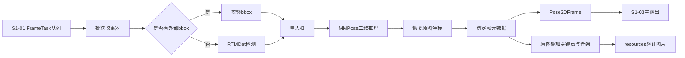
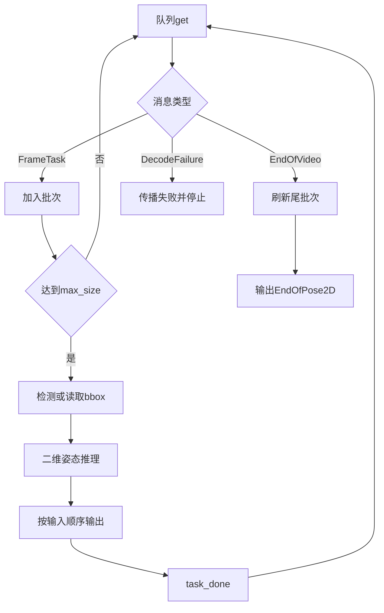

# S1-02 单人检测与二维关节定位详细设计

> 状态：已实现，并已在本地RTX 3060 Laptop GPU完成三种RTMPose模型的1,384帧全序列验证；AutoDL仅用于后续统一硬件性能与成本测试
> 上游：S1-01 视频与连续图片帧输入
> 下游：S1-03 骨架与时序适配

## 1. 文档目的

本文档说明阶段一S1-02的代码结构、设备选择、人体框来源、二维姿态推理、批处理、队列接口、异常处理和分级验收。

S1-02接收S1-01输出的`FrameTask`，取得单人人体框，调用MMPose中的RTMPose系列模型，将17个二维关键点恢复到原图坐标，并输出带完整帧元数据的`Pose2DFrame`。当前已实现并验证RTMPose-m、RTMPose-l和RTMPose-l H36M；ViTPose-B保留为后续对照。

模块采用同一套代码完成CPU侧接口测试和NVIDIA GPU真实推理。本地RTX 3060 Laptop GPU已经完成CUDA兼容性、三模型全序列推理和结果归档；后续AutoDL只用于统一硬件下的吞吐、显存、延迟与成本对照。

## 2. 模块边界



S1-02负责：

- 消费`FrameTask`、`EndOfVideo`和`DecodeFailure`；
- 使用外部框，或用RTMDet生成人体框；
- 校验bbox格式、范围、面积和单人约束；
- 组建二维推理微批次；
- 调用RTMPose-m或ViTPose-B；
- 输出17个原图坐标关键点和原始置信度；
- 传递视频ID、帧号、时间戳和图像尺寸；
- 记录实际设备、模型配置和权重身份；
- 将结果发送给S1-03或诊断文件。
- 将同一份二维结果叠加到原图并输出可人工核对的验证图片。

S1-02不执行COCO17到H36M17转换、坐标归一化、时间组窗、三维提升、多人跟踪、遮挡补全和未来预测。当前只接受单人输入；无法唯一确定目标时必须报错，不能把逐帧最高分人体冒充稳定跟踪结果。

## 3. 分级目标

### 3.1 本地单元测试

本地环境只执行数据对象、配置、队列、批次、尾批次、外部人体框和可视化等单元测试。测试替身仅定义在`tests/`中，不作为生产后端，也不代表真实推理链路已跑通。

### 3.2 NVIDIA GPU真实链路

S1-02真实链路在NVIDIA GPU环境运行，使用RTMDet自动框和RTMPose CUDA推理。启动时若CUDA不可用立即失败，不提供CPU回退。本地RTX 3060 Laptop GPU已完成1,384帧全序列验证；后续在AutoDL统一硬件上补充峰值显存、吞吐、p50、p95延迟和成本对照。

### 3.3 完整模式

完整模式增加Human3.6M微调权重、`joint_schema=h36m17`直接输出、ViTPose-B同框对照和完整二维指标评价。

## 4. 代码结构

```text
video-to-3d-motion/
├── configs/pose2d.yaml
├── src/video_to_3d_motion/pose2d/
│   ├── adapters.py
│   ├── cli.py
│   ├── config.py
│   ├── exceptions.py
│   ├── factory.py
│   ├── models.py
│   ├── visualization.py
│   ├── worker.py
│   └── backends/
│       ├── protocols.py
│       ├── mmdet_backend.py
│       └── mmpose_backend.py
├── tests/
│   ├── test_pose2d_config.py
│   ├── test_pose2d_models.py
│   ├── test_pose2d_worker.py
│   └── test_pose2d_pipeline.py
└── tools/run_pose2d_smoke.py
```

| 文件 | 职责 |
| --- | --- |
| `models.py` | 定义人体框、二维结果和控制消息 |
| `config.py` | 校验模型、检测、批次和可视化配置 |
| `factory.py` | 检查CUDA环境并创建真实RTMDet、RTMPose工作器 |
| `protocols.py` | 定义检测器与姿态后端接口 |
| `mmdet_backend.py` | 初始化RTMDet并输出候选框 |
| `mmpose_backend.py` | 初始化模型并统一17点输出 |
| `adapters.py` | 校验bbox、转换结果和绑定元数据 |
| `visualization.py` | 在原图副本上绘制bbox、骨架、关节和帧信息 |
| `worker.py` | 消费队列、组批、推理和错误传播 |

业务层只依赖后端协议，不散落OpenMMLab私有API。生产代码只装配真实RTMDet和RTMPose；单元测试替身放在测试文件内部。

## 5. 环境与依赖

S1-02引入PyTorch、MMPose、MMEngine、MMCV和MMDetection。OpenMMLab组件对PyTorch、CUDA和MMCV版本匹配严格，兼容矩阵冻结前不把重依赖直接并入S1-01基础依赖。

本地`.venv`负责单元测试，本地NVIDIA环境已经用于真实模型推理。后续AutoDL标准化测试推荐PyTorch 2.1.2、Python 3.10、CUDA 11.8基础镜像，并安装与之匹配的MMCV、MMDetection和MMPose。

先确定PyTorch的CPU/CUDA构建，再安装匹配的MMCV、MMDetection和MMPose。若`mmcv.ops`或`mmcv._ext`失败，应修复二进制版本，不在业务代码中规避。

模型配置和权重使用当前运行环境中的显式路径。摘要记录模型、配置路径、checkpoint及SHA-256和依赖版本。正式推理不得静默下载模型。

## 6. GPU运行约束

配置中不提供`device`或`require_gpu`。运行环境通过`CUDA_VISIBLE_DEVICES`决定当前进程可见的显卡，S1-02内部固定使用第一张可见卡`cuda:0`。启动时依次检查CUDA可用性和可见GPU数量；检查失败返回`cuda_unavailable`或`cuda_device_not_found`并停止，不回退CPU。

| 步骤 | CPU | GPU | 代码变化 |
| --- | --- | --- | --- |
| S1-01图像 | CPU NumPy | CPU NumPy | 无 |
| 初始化模型 | `device=cpu` | `device=cuda:0` | 仅参数 |
| 图像预处理 | CPU | 主要CPU | 无 |
| 模型前向 | CPU | GPU | 接口相同 |
| 模型输出 | CPU张量 | GPU张量 | 后端转回CPU |
| JSONL与后处理 | CPU | CPU | 无 |

`worker.py`不散落`.cuda()`调用；设备迁移集中在真实后端，业务层始终输入输出CPU NumPy数组。

## 7. 输入接口

```python
Pose2DInputItem = FrameTask | EndOfVideo | DecodeFailure

FrameTask = {
    "image": np.ndarray,          # uint8[H,W,3]，BGR连续数组
    "video_id": str,
    "frame_id": int,
    "source_frame_id": int,
    "timestamp": float,
    "source_timestamp": float,
    "timestamp_source": str,
    "image_size": [W, H],
    "fps": 50
}
```

S1-02校验图像dtype、形状、连续性、`image_size`，并检查同一视频的`frame_id`严格递增。

外部人体框按`video_id + frame_id`关联：

```python
ExternalBBox = {
    "video_id": str,
    "frame_id": int,
    "bbox": np.ndarray,        # float32[4]，xyxy原图坐标
    "score": float | None,
    "source": str
}
```

必须满足`0 <= x1 < x2 <= W`、`0 <= y1 < y2 <= H`、面积不小于配置阈值，且所有数值有限。Human3.6M链路验证优先使用确定性外部框，先隔离二维关键点模型；自动检测单独测试。

## 8. 人体检测与单人策略

| `bbox_source` | 行为 |
| --- | --- |
| `external_only` | 必须存在外部框，否则失败 |
| `detector_only` | 始终运行RTMDet |
| `external_or_detector` | 有外部框则使用，否则运行RTMDet |

RTMDet候选依次执行：保留`person`类别、分数过滤、NMS、裁剪至图像边界、删除过小框、检查单人约束。

默认`strict_single_person=true`：0人返回`person_not_found`，1人正常输出，多于1人返回`multiple_persons`。未来增加目标ID或跟踪器时必须新增协议，不改变当前单人语义。

## 9. 二维姿态推理

| 模式 | 模型 | 输出协议 | 用途 |
| --- | --- | --- | --- |
| `baseline` | COCO预训练RTMPose-m | `coco17` | 低成本打通阶段一 |
| `baseline`对照 | COCO预训练ViTPose-B | `coco17` | 二维架构对照 |
| `full` | H36M微调RTMPose-l | `h36m17` | 正式模式 |
| `full`对照 | H36M微调ViTPose-B | `h36m17` | 正式对照 |

全局`pipeline_mode`决定运行模式，`active_model`从当前已实现的RTMPose-m、RTMPose-l和RTMPose-l H36M中选择二维模型；ViTPose-B作为后续对照配置。

```python
class PersonDetector(Protocol):
    def detect_batch(self, images: list[np.ndarray]) \
            -> list[list[PersonBBox]]: ...

class PoseEstimator(Protocol):
    def infer_batch(self, images: list[np.ndarray],
                    bboxes: list[np.ndarray]) \
            -> list[PosePrediction]: ...

PosePrediction = {
    "keypoints": np.ndarray,            # float32[17,2]，原图坐标
    "keypoint_scores_raw": np.ndarray  # float32[17]
}
```

MMPose适配器隐藏SimCC与Heatmap差异。若公开API已返回原图坐标，适配器只校验和转类型，不重复逆仿射。原始置信度仅用于诊断和`valid_mask`；不同模型分数不能直接当作可比较概率，基准模式不把分数输入PoseMamba。

## 10. 批处理与队列

```yaml
batch:
  max_size: 27
  prefetch_batches: 4
  input_queue_capacity: 108
  output_queue_capacity: 108
```

81帧组成3个批次，243帧组成9个批次；容量108表示输入与输出队列最多各缓存四个批次，不限制一次实验的总帧数。CPU真实冒烟允许`max_size=1`。



结果输出或明确失败后才调用对应输入的`task_done()`；启用严格可视化时，还必须在对应叠加图成功写出后调用`task_done()`。推理异常设置共享`stop_event`；第一版只启动一个工作器。`infer_batch()`是稳定接口；首轮真实链路允许适配器按帧调用OpenMMLab推理API，链路跑通后再独立优化为真正批量前向，并记录请求/实际批量、前向次数和处理帧数。

## 11. 输出接口

```python
Pose2DFrame = {
    "keypoints": np.ndarray,             # float32[17,2]
    "keypoint_scores_raw": np.ndarray,   # float32[17]
    "valid_mask": np.ndarray,            # bool[17]
    "joint_schema": str,                 # coco17或h36m17
    "score_source": str,
    "bbox": np.ndarray,                  # float32[4]，xyxy
    "bbox_score": float | None,
    "bbox_source": str,
    "video_id": str,
    "frame_id": int,
    "source_frame_id": int,
    "timestamp": float,
    "source_timestamp": float,
    "timestamp_source": str,
    "image_size": [W, H],
    "fps": 50,
    "model": str,
    "model_config": str,
    "checkpoint_sha256": str
}

Pose2DOutputItem = Pose2DFrame | EndOfPose2D | Pose2DFailure
```

主输出不保存原图、SimCC全分布或热图，逐帧关节仍可保存为JSONL。实验总结目标格式改为单次与累计CSV；模型＋时间命名、中文表头释义、统计来源和计算方式统一见[阶段一方案设计4.2的“输出格式”](01_阶段一_三维人体姿态估计方案设计.md#输出格式-1)。不另生成Excel多sheet或每次实验的独立字段说明文档。

本地图片启动脚本已实现独立实验归档、完整与简易CSV累计表及重建。底层图片、视频CLI保留显式路径和JSON总结接口；第13.2节的统一命令仍是旧规划接口。

### 11.1 原图叠加验证分支

主输出`Pose2DFrame`继续原样交给S1-03；验证分支读取同一个`Pose2DFrame`和对应`FrameTask.image`，在图像副本上绘制：

- 人体框及bbox来源；
- 17个二维关节点；
- 与`joint_schema`匹配的骨架连线；
- `video_id`、`frame_id`、模型和实际设备；
- 低于`keypoint_score_threshold`的关节使用不同颜色，但不从验证图中静默删除。

禁止直接修改`FrameTask.image`，必须先复制：

```python
canvas = frame_task.image.copy()
draw_pose2d(canvas, pose2d_frame)
```

COCO17与H36M17使用两套显式骨架边定义；不得用COCO连线解释H36M17输出。叠加图保持原图宽高，不执行二次缩放，以便直接检查预测坐标和人体是否对齐。

### 11.2 文件布局与清单

```text
results/
├── experiment_summary.csv
├── experiment_summary_simple.csv
└── <active_model>_<北京时间启动时间>/
    ├── <experiment_id>_summary.csv
    ├── <experiment_id>_pose2d_frames.jsonl
    ├── <experiment_id>_joint_comparison.csv
    ├── <experiment_id>_joint_summary.csv
    ├── <experiment_id>_effective_config.yaml
    ├── <experiment_id>_run.log
    ├── pose_overlays/<video_id>/
    │   ├── frame_000001.jpg
    │   └── manifest.jsonl
    └── comparison_overlays/<video_id>/frame_000001.jpg
```

图片文件名使用六位`frame_id`，不使用文件系统遍历序号。`manifest.jsonl`每行记录`video_id`、`frame_id`、`source_frame_id`、原图尺寸、图片相对路径、bbox、`joint_schema`、模型和实际设备。

实验编号只在启动时生成一次，所有路径、CSV行和图片清单共同使用该编号。同一秒重名时追加序号并检查目录冲突；不得复用已有实验目录，不得继续向其他实验的图片清单追加。`visualization.output_root`需要归入该次实验目录，不能只更改主JSONL或总结文件名。累计表按实验编号保持一行，开始状态为`running`，结束时更新为完成、失败或取消状态。已有实验输出保留，启动和运行失败也记录在表中。

第一版采用同步写图，确保每个成功二维结果都有一张对应图片。后续若写图影响GPU吞吐，可改为有界旁路队列，但必须保留结束消息、背压和数量一致性检查。

### 11.3 标注对比与汇总口径

通过源图片名和`source_frame_id`匹配Human3.6M标注，禁止用当前模型的COCO17索引直接减去H36M17同索引。当前COCO17模型比较10个直接对应的肩、肘、腕、髋、膝关节和2个踝/足近似对应点，两组误差分别汇总；不把合成的骨盆、脊柱、胸部或头部作为真实预测评价。

无标注帧保留二维输出，关节明细标记`missing_gt`且误差留空；原尺寸对照图显示`NO GT`。低置信度点仍参与所有可评价点的误差统计，另提供有效置信度点统计和覆盖率。单次实验的汇总CSV与累计CSV使用一致表头，将嵌套summary路径展开成列，缺失指标留空，不写JSON字典单元格。

简易累计表`experiment_summary_simple.csv`只保留`experiment_id`、`active_model`、`mean_error_px`、`common10_mean_error_px`、`confident_mean_error_px`和`confidence_coverage`六列。跨COCO17与H36M17模型比较时，用共同左右肩、肘、腕、髋、膝的10关节平均像素误差。完整表保留对应的`comparison.common10_pairs`统计；旧实验可从关节明细重建此指标。本地图片脚本自动更新两张总表，未完成实验的简易评价指标留空。

每个表头的单位、统计数据源、误差公式和排除规则以[阶段一方案设计4.2“实验汇总CSV：字段含义与来源”](01_阶段一_三维人体姿态估计方案设计.md#实验汇总csv字段含义与来源)为准；新增或调整统计口径时同步升级表头版本并更新该节，避免在两份设计中维护不同解释。

## 12. 配置

```yaml
pipeline_mode: baseline

pose2d:
  active_model: rtmpose_l_h36m
  models:
    rtmpose_m:
      config:
        baseline: models/mmpose/body_2d_keypoint/rtmpose/coco/rtmpose-m_8xb256-420e_aic-coco-384x288.py
      checkpoint:
        baseline: ../checkpoints/rtmpose-m_simcc-aic-coco_pt-aic-coco_420e-384x288-a62a0b32_20230228.pth
      joint_schema:
        baseline: coco17
      score_source: rtmpose_simcc
    rtmpose_l:
      config:
        baseline: models/mmpose/body_2d_keypoint/rtmpose/coco/rtmpose-l_8xb256-420e_aic-coco-384x288.py
      checkpoint:
        baseline: ../checkpoints/rtmpose-l_simcc-aic-coco_pt-aic-coco_420e-384x288-97d6cb0f_20230228.pth
      joint_schema:
        baseline: coco17
      score_source: rtmpose_simcc
    rtmpose_l_h36m:
      config:
        baseline: project/h36m17/rtmpose-l_8xb256-420e_h36m-384x288.py
      checkpoint:
        baseline: ../checkpoints/rtmpose_h36m.pth
      joint_schema:
        baseline: h36m17
      score_source: rtmpose_simcc

detection:
  bbox_source: external_or_detector
  detector_config: models/mmdet/rtmdet/rtmdet_m_8xb32-300e_coco.py
  detector_checkpoint: ../checkpoints/rtmdet_m_8xb32-300e_coco_20220719_112220-229f527c.pth
  person_class_id: 0
  score_threshold: 0.30
  nms_iou_threshold: 0.65
  min_bbox_area: 256
  strict_single_person: true

batch:
  max_size: 27
  prefetch_batches: 4
  input_queue_capacity: 108
  output_queue_capacity: 108

runtime:
  amp: false
  keypoint_score_threshold: 0.20

visualization:
  enabled: true
  output_root: resources/pose2d_visualizations
  image_format: jpg
  jpeg_quality: 95
  draw_bbox: true
  draw_skeleton: true
  draw_joint_index: false
  draw_frame_info: true
  every_n_frames: 1
  strict: true
```

配置加载时检查模式、模型、路径、关节协议、批次、队列容量、阈值和图片格式。创建工作器时额外检查CUDA、配置文件和权重文件。链路验收使用`every_n_frames=1`和`strict=true`；性能测试可关闭可视化，避免JPEG编码和磁盘写入污染模型吞吐指标。

## 13. 运行命令与图片数量限制

### 13.1 当前可用的图片数量参数

连续图片数量限制已经实现，无需每次处理完整序列。启动脚本使用`-MaxFrames N`，例如只处理前100张：

```powershell
powershell -ExecutionPolicy Bypass -File tools\run_pose2d_h36m.ps1 -MaxFrames 100
```

直接调用`estimate-pose2d-images`时，对应参数为`--max-frames 100`，其余输入和输出参数照常指定。

图片按解析出的源帧号排序，从`000001`开始读取前N张连续图片，保持原帧号和时间戳。该限制作用于图片解码与推理，关节JSONL、预测图和标注对比均只覆盖实际处理帧；不是跑完整序列后再截取输出，也不是每隔N张抽样。目录整体仍需通过单序列及帧号连续性校验。数量小于27也可以运行，工作器会处理不足27帧的尾批次；数量超过现有图片数时处理全部可用图片。

脚本省略`-MaxFrames`或设置0表示处理全部图片；直接图片命令省略`--max-frames`表示处理全部，显式指定时必须是正整数。`-ComparisonEveryNFrames`只减少标注对照图的写出数量，不限制推理帧数，两者不能混用。实验汇总的`max_frames`记录请求上限，`records_written`记录实际二维输出数，标注统计只计算该次实际输出帧。

启动脚本已将图片数量参数与模型＋时间独立归档接入；每次运行自动隔离所有输出，并更新完整与简易累计表。底层`estimate-pose2d-images`仍需自行指定输出路径。

### 13.2 旧规划接口与GPU示例

以下命令为实现后的规划接口，不表示当前已经存在。

```powershell
estimate-pose2d --video path\to\input.mp4 --media-config configs\media_decode.yaml --pose2d-config configs\pose2d.yaml --frames-output results\pose2d_frames.jsonl --summary-output results\pose2d_summary.json
```

启用配置中的`visualization.enabled=true`后，命令同时写入`resources\pose2d_visualizations\<video_id>\`。这条旁路不改变`Pose2DFrame`主输出。

```powershell
estimate-pose2d --images path\to\sequence --media-config configs\media_decode.yaml --pose2d-config configs\pose2d.yaml --frames-output results\pose2d_frames.jsonl --summary-output results\pose2d_summary.json
```

AutoDL GPU单图冒烟：

```powershell
estimate-pose2d-images /root/autodl-tmp/smoke_images --media-config configs/media_decode.yaml --pose2d-config configs/pose2d.yaml --frames-output /root/autodl-tmp/results/pose2d.jsonl --summary-output /root/autodl-tmp/results/summary.json
```

成功输出`SUCCESS`；任一帧未处理、元数据不连续或控制消息异常时输出`FAILED`并返回非零退出码。

## 14. 异常处理

| 错误码 | 触发条件 |
| --- | --- |
| `cuda_unavailable` | CUDA版PyTorch或驱动不可用 |
| `cuda_device_not_found` | 没有可见GPU |
| `openmmlab_import_failed` | OpenMMLab组件导入失败 |
| `binary_dependency_mismatch` | MMCV算子或DLL不匹配 |
| `model_config_not_found` | 模型配置不存在 |
| `checkpoint_not_found` | 权重不存在 |
| `checkpoint_load_failed` | 权重无法加载或不匹配 |
| `invalid_frame_task` | 帧数据或元数据非法 |
| `frame_order_invalid` | 帧号重复或逆序 |
| `external_bbox_missing` | 强制外部框但当前帧缺失 |
| `invalid_bbox` | bbox格式、范围或面积非法 |
| `person_not_found` | 没有有效人体框 |
| `multiple_persons` | 严格单人模式出现多人 |
| `detector_inference_failed` | RTMDet推理失败 |
| `pose_inference_failed` | 姿态推理失败 |
| `joint_count_mismatch` | 输出关节数不是17 |
| `joint_schema_mismatch` | 实际协议与配置不一致 |
| `invalid_keypoints` | 坐标含NaN、Inf或形状错误 |
| `metadata_mismatch` | 输出不能与输入一一对应 |
| `visualization_schema_missing` | 当前关节协议没有对应骨架连线定义 |
| `visualization_write_failed` | 叠加图或manifest写入失败 |
| `visualization_count_mismatch` | 严格模式下结果数与叠加图数不一致 |
| `out_of_memory` | CPU内存或GPU显存不足 |
| `cancelled` | 收到停止信号 |

第一版失败即停止：不补造关键点，不用上一帧结果替代。

## 15. 测试与验收

| 测试组 | 内容 | 真实模型 | GPU |
| --- | --- | --- | --- |
| GPU启动检查 | 无CUDA时立即失败 | 否 | 否（mock） |
| 配置校验 | 模式、协议、阈值和路径 | 否 | 否 |
| bbox校验 | 边界、面积、NaN和越界 | 否 | 否 |
| 数据对象 | dtype、shape和元数据 | 否 | 否 |
| 批次收集 | 27帧整批和尾批次 | 否 | 否 |
| 队列行为 | 顺序、背压和结束消息 | 否 | 否 |
| 错误传播 | 解码、模型和停止信号 | 否 | 否 |
| 坐标回环 | 裁剪坐标恢复原图 | 测试内替身 | 否 |
| 可视化旁路 | 图像尺寸、命名、连线协议、数量和manifest | 测试内替身 | 否 |

默认测试：

```powershell
.\.venv\Scripts\python.exe -m unittest discover -s tests -v
```

本地验收已覆盖逻辑单元测试和RTX 3060真实链路：模型驻留GPU，三种RTMPose模型均完成1,384帧推理，输出`float32[17,2]`原图坐标、顺序完整且无失败帧，结果可供S1-03读取，并生成同尺寸叠加图与实验CSV。AutoDL后续只补充统一硬件下的峰值显存、吞吐、p50、p95延迟和成本统计。

## 16. 实施顺序

| 子任务 | 内容 | 执行环境 |
| --- | --- | --- |
| S1-02-01 | 数据对象、错误码和配置 | 本地单元测试 |
| S1-02-02 | CUDA启动检查 | 本地mock＋RTX 3060实机（已完成） |
| S1-02-03 | 后端协议与测试内替身 | 本地单元测试 |
| S1-02-04 | 队列、组批与尾批次 | 本地单元测试 |
| S1-02-05 | 外部bbox与坐标回环 | 本地单元测试 |
| S1-02-06 | 原图叠加、骨架绘制、manifest和目录输出 | 本地单元测试 |
| S1-02-07 | RTMDet＋RTMPose真实推理 | 本地RTX 3060 GPU（已完成） |
| S1-02-08 | CUDA性能、显存和延迟 | 本地GPU已验证；AutoDL统一硬件对照待执行 |
| S1-02-10 | ViTPose-B和H36M17完整模式 | 后续实验 |

S1-02-01至S1-02-08均已完成本地实现和GPU验证，S1-02链路已经跑通。后续工作是使用AutoDL统一硬件补充性能与成本数据，并按独立测试被试继续验证模型泛化能力。

## 17. 参考资料

- [MMPose官方推理文档](https://github.com/open-mmlab/mmpose/blob/main/docs/en/user_guides/inference.md)
- [MMPose官方安装文档](https://github.com/open-mmlab/mmpose/blob/main/docs/en/installation.md)
- [RTMPose官方配置与模型表](https://github.com/open-mmlab/mmpose/tree/main/configs/body_2d_keypoint/rtmpose)
- [MMPose RTMPose项目](https://github.com/open-mmlab/mmpose/tree/main/projects/rtmpose)
- [ViTPose官方实现](https://github.com/ViTAE-Transformer/ViTPose)
