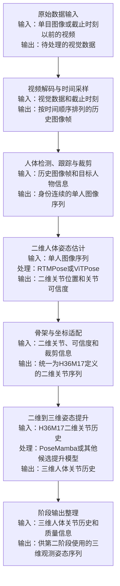

# 陈修杰的科研方案

| 项目 | 内容 |
| --- | --- |
| 方案名称 | 基于单目视频的三维人体姿态估计、预测与条件生成 |
| 研究对象 | 单人三维人体关节序列 |
| 核心数据集 | Human3.6M（H3.6M） |
| 当前状态 | 三阶段方案设计；本版先完成阶段一技术选型 |
| 参考文档 | [img/video to motion](https://jlu-icslab.feishu.cn/docx/AtFSdupWfoUZrpxZMOMcxTwinQd?from=auth_notice&hash=81e320b72eb088df68577b0bb7942b25) |

# 总体研究内容

本项目以单目图像或视频为起点，研究从视觉观测到三维人体运动的估计、预测和生成问题。整体工作分为三个阶段：

| 阶段 | 研究内容 | 阶段输入 | 阶段输出 |
| --- | --- | --- | --- |
| 第一阶段 | 基于单目视频的三维人体姿态估计 | 单目图像或截止时刻以前的视频 | 三维人体观测姿态序列 |
| 第二阶段 | 遮挡补全与短期确定性运动预测 | 第一阶段生成的观测姿态 | 补全后的观测姿态和短期预测姿态 |
| 第三阶段 | 条件约束的长期随机运动生成 | 历史运动、短期预测和附加条件 | 多样化长期人体运动 |

## 导师初始流程图


# 第一阶段：基于单目视频的三维人体姿态估计

## 1. 阶段一流程图



阶段一采用“视频到二维关节、二维关节到三维关节”的两级路线。二维中间结果可以独立评价，也能用于分析前端误差如何传递到三维姿态。RTMPose与ViTPose位于同一个可替换位置，PoseMamba、MotionBERT和MotionAGFormer位于另一个可替换位置。

## 2. 技术选型

### 2.1 候选技术

#### 2.1.1 视频到二维关节候选技术

| 候选技术 | 技术路线 | 优势 | 劣势 | 与当前项目的关系 |
| --- | --- | --- | --- | --- |
| [HRNet](https://openaccess.thecvf.com/content_CVPR_2019/html/Sun_Deep_High-Resolution_Representation_Learning_for_Human_Pose_Estimation_CVPR_2019_paper.html) | 高分辨率卷积特征和热图定位 | 技术成熟、结果稳定、适合作为经典基线 | 计算成本较高，视频部署效率一般 | 可作为传统二维基线 |
| [RTMPose](https://arxiv.org/abs/2303.07399) | CSPNeXt类骨干和SimCC坐标分类 | 精度、速度、模型规模和部署支持较均衡 | 官方身体权重主要采用COCO关节定义，需要适配H36M17 | 当前二维主选 |
| [ViTPose](https://arxiv.org/abs/2204.12484) | Vision Transformer骨干和热图解码 | 全局表征能力强，扩大模型规模后单图精度上限较高 | 参数、显存和训练成本较高 | 当前二维强制精度对照 |
| [RTMO](https://arxiv.org/abs/2312.07526) | 单阶段人体检测和关键点估计 | 多人实时场景效率较高 | 检测与姿态耦合，不方便固定人体框进行模型对照 | 当前单人研究不优先 |
| [DWPose](https://arxiv.org/abs/2307.15880) / [RTMW](https://arxiv.org/abs/2407.08634) | 全身关键点估计 | 可以同时输出身体、手部和面部关键点 | 当前只需要17个身体关节，存在额外计算 | 当前不选 |

#### 2.1.2 二维到三维关节候选技术

| 候选技术 | 技术路线 | 优势 | 劣势 | 与当前项目的关系 |
| --- | --- | --- | --- | --- |
| [VideoPose3D](https://openaccess.thecvf.com/content_CVPR_2019/html/Pavllo_3D_Human_Pose_Estimation_in_Video_With_Temporal_Convolutions_and_CVPR_2019_paper.html) | 时间卷积 | 结构成熟、速度快、复现方便 | 长程全局关系建模能力有限 | 经典轻量基线 |
| [MixSTE](https://openaccess.thecvf.com/content/CVPR2022/papers/Zhang_MixSTE_Seq2seq_Mixed_Spatio-Temporal_Encoder_for_3D_Human_Pose_Estimation_CVPR_2022_paper.pdf) | 混合时空Transformer | 能够同时建模关节关系和时间关系 | 参数量和计算量较大 | 论文对比候选 |
| [MotionBERT](https://openaccess.thecvf.com/content/ICCV2023/papers/Zhu_MotionBERT_A_Unified_Perspective_on_Learning_Human_Motion_Representations_ICCV_2023_paper.pdf) | 双流时空Transformer和大规模预训练 | 对带噪、缺失二维输入进行预训练，迁移能力较强 | 模型较大，训练和推理成本较高 | Transformer强制对照 |
| [MotionAGFormer](https://arxiv.org/abs/2310.16288) | Transformer和GCNFormer联合建模 | 同时利用全局依赖和人体骨架拓扑 | 工程结构和训练配置较复杂 | PoseMamba替代基线 |
| [PoseMamba](https://ojs.aaai.org/index.php/AAAI/article/download/32401/34556) | 双向全局—局部时空状态空间模型 | 参数量较小，长序列建模成本较低 | 依赖CUDA selective_scan，项目短窗口需要重新训练 | 当前三维提升主选 |

### 2.2 公开结果分析

#### 2.2.1 RTMPose与ViTPose公开二维结果

以下结果来自同一个MMPose模型库。测试条件均为COCO val2017、人体检测器AP为56.4、输入尺寸为256×192。ViTPose采用classic decoder。AP、AP50、AP75和AR均为COCO OKS指标，数值越高越好。

| 模型 | AP | AP50 | AP75 | AR | 结果来源 |
| --- | ---: | ---: | ---: | ---: | --- |
| RTMPose-t | 68.2 | 88.3 | 75.9 | 73.6 | [MMPose RTMPose COCO模型表](https://github.com/open-mmlab/mmpose/blob/main/configs/body_2d_keypoint/rtmpose/coco/rtmpose_coco.md) |
| RTMPose-s | 71.6 | 89.2 | 78.9 | 76.8 | 同上 |
| **RTMPose-m** | **74.6** | **89.9** | **81.7** | **79.5** | 同上 |
| RTMPose-l | 75.8 | 90.6 | 82.6 | 80.6 | 同上 |
| ViTPose-S | 73.9 | 90.3 | 81.6 | 79.2 | [MMPose ViTPose COCO模型表](https://github.com/open-mmlab/mmpose/blob/main/configs/body_2d_keypoint/topdown_heatmap/coco/vitpose_coco.md) |
| **ViTPose-B** | **75.7** | **90.5** | **82.9** | **81.0** | 同上 |
| ViTPose-L | 78.2 | 91.4 | 85.0 | 83.4 | 同上 |
| ViTPose-H | 78.8 | 91.7 | 85.5 | 83.9 | 同上 |

公开结果说明：

1. 在当前拟定的主对照规格中，ViTPose-B的AP为75.7，高于RTMPose-m的74.6，说明ViTPose-B具有更高的单图精度潜力。
2. ViTPose-B的AP75和AR也分别高于RTMPose-m，说明差异不仅体现在较宽松的检测阈值。
3. 不能概括为所有ViTPose都优于所有RTMPose。ViTPose-S的AP低于RTMPose-m，RTMPose-l与ViTPose-B基本相当。
4. ViTPose-L和ViTPose-H体现了更高的单图精度上限，但参数量和显存成本显著上升。
5. 这些结果使用COCO17单图协议，没有评价H36M17二维位置误差、视频速度误差和时序抖动，因此不能直接证明ViTPose输入三维提升模型后一定更好。

#### 2.2.2 输入分辨率公开结果

以下结果使用RTMPose的AIC+COCO训练设置，用于说明模型规模和输入分辨率是两个独立变量。

| 模型 | 输入尺寸 | AP | AP75 | AR | 结果来源 |
| --- | ---: | ---: | ---: | ---: | --- |
| RTMPose-m | 256×192 | 75.8 | 82.6 | 80.6 | [MMPose RTMPose COCO模型表](https://github.com/open-mmlab/mmpose/blob/main/configs/body_2d_keypoint/rtmpose/coco/rtmpose_coco.md) |
| RTMPose-m | 384×288 | 77.0 | 83.3 | 81.6 | 同上 |
| RTMPose-l | 256×192 | 76.5 | 83.5 | 81.3 | 同上 |
| RTMPose-l | 384×288 | 77.3 | 83.5 | 81.9 | 同上 |

RTMPose-m提高输入分辨率后AP增加1.2个百分点，RTMPose-l增加0.8个百分点。因此，后续测试必须分别设置“相同分辨率下比较模型”和“各模型采用最佳配置”两类实验，避免把分辨率收益误判为架构收益。

#### 2.2.3 二维到三维公开结果

以下结果来自PoseMamba论文在Human3.6M上的表1。输入长度为243帧；P1表示检测二维输入条件下的MPJPE，P2表示P-MPJPE，GT 2D表示使用二维真值时的MPJPE。误差单位为毫米，越低越好。

| 模型 | 参数量 | MACs | 检测2D MPJPE | P-MPJPE | GT 2D MPJPE | 结果来源 |
| --- | ---: | ---: | ---: | ---: | ---: | --- |
| MixSTE | 33.6M | 139.0G | 40.9 | 32.6 | 21.6 | [PoseMamba论文表1](https://ojs.aaai.org/index.php/AAAI/article/download/32401/34556) |
| MotionBERT | 42.3M | 174.8G | 39.2 | 32.9 | 17.8 | 同上 |
| MotionAGFormer-L | 19.0M | 78.3G | 38.4 | 32.5 | 17.3 | 同上 |
| PoseMamba-B | 3.4M | 13.9G | 40.8 | 34.3 | 16.8 | 同上 |
| **PoseMamba-L** | **6.7M** | **27.9G** | **38.1** | **32.5** | **15.6** | 同上 |
| PoseMamba-X | 26.5M | 109.9G | 37.1 | 31.5 | 14.8 | 同上 |

公开结果说明：

1. PoseMamba-L在该协议下的检测2D MPJPE为38.1毫米，低于MotionBERT的39.2毫米和MixSTE的40.9毫米。
2. PoseMamba-L与MotionAGFormer-L的P-MPJPE相同，检测2D MPJPE低0.3毫米，同时公开参数量和MACs更低。
3. PoseMamba-B的计算成本更低，但检测2D MPJPE为40.8毫米，更适合作为资源对照。
4. PoseMamba-X继续提高精度，但参数量和MACs明显上升。
5. PoseMamba-L从GT 2D输入的15.6毫米变为检测2D输入的38.1毫米，说明二维前端误差会显著影响最终三维结果。
6. 公开结果使用243帧，不能直接作为本项目81帧版本的结果。

### 2.3 选择原因

#### 2.3.1 视频到二维主选RTMPose-m

选择RTMPose-m作为主线的原因如下：

1. **适合连续视频处理。** 第一阶段需要逐帧处理历史视频，单帧计算成本会在整个窗口中累积。
2. **规模处于中间位置。** RTMPose-m能够提供比t/s更高的公开精度，又没有直接承担l/x的额外成本。
3. **MMPose支持完整。** 模型训练、推理、SimCC解码、评价和部署均有公开配置。
4. **方便建立公平对照。** RTMPose-m与ViTPose-B都可以使用256×192输入和相同人体检测框。
5. **方便定位误差。** 二维关节、关节分数和异常跳点可以独立保存和评价。
6. **便于后续切换。** 只要统一输出H36M17二维关节，替换RTMPose-l或ViTPose不需要修改三维提升和后续阶段。

RTMPose-m是当前实施主线，不是预先确定的实验赢家。ViTPose-B作为必须完成的精度对照；如果它在统一H36M17协议下明显降低二维误差和下游三维MPJPE，则将正式模型切换为ViTPose-B。

#### 2.3.2 二维到三维主选PoseMamba-L

选择PoseMamba-L作为主线的原因如下：

1. **任务接口匹配。** 模型直接接收二维关节历史并输出完整三维关节历史。
2. **同时建模空间与时间。** 全局—局部时空建模适合连续人体运动。
3. **阶段一需要优先保证精度。** 姿态估计误差会继续传播到第二、第三阶段，因此选择L规格而不是直接选择最小规格。
4. **公开结果具有精度和成本优势。** 在PoseMamba论文汇总协议中，PoseMamba-L以6.7M参数取得38.1毫米MPJPE。
5. **保留明确对照。** MotionBERT用于验证预训练Transformer路线，MotionAGFormer用于验证Transformer与图结构联合路线。
6. **可以保持后续接口稳定。** 不同三维提升模型统一输出H36M17根相对三维关节后，第二阶段不需要随模型变化。

### 2.4 规格确定

#### 2.4.1 二维模型规模说明

| 模型规格 | 参考参数量 | 参考计算量 | 输入尺寸 | 当前决定 |
| --- | ---: | ---: | --- | --- |
| RTMPose-t | 约3.5M | 约0.37G FLOPs | 256×192 | 不进入首轮正式实验 |
| RTMPose-s | 约5.7M | 约0.70G FLOPs | 256×192 | 可选轻量补充 |
| **RTMPose-m** | **约13.9M** | **约1.95G FLOPs** | **256×192** | **主线模型** |
| RTMPose-l | 约28.1M | 约4.19G FLOPs | 256×192 | RTMPose规模对照 |
| ViTPose-S | 约22M骨干 | 待统一工具实测 | 256×192 | 不作为首轮核心 |
| **ViTPose-B** | **约86M骨干** | **待统一工具实测** | **256×192** | **架构和精度对照** |
| ViTPose-L | 约304M骨干 | 待统一工具实测 | 256×192 | ViTPose规模对照，有算力时执行 |
| ViTPose-H | 约632M骨干 | 待统一工具实测 | 256×192 | 不进入首轮正式实验 |

RTMPose参数和FLOPs来自[MMPose RTMPose模型表](https://github.com/open-mmlab/mmpose/blob/main/configs/body_2d_keypoint/rtmpose/README.md)中的公开配置量级；ViTPose参数为标准ViT骨干量级。修改为H36M17输出头后，以项目实际构建模型统计值为准。

二维首轮模型组合确定为：

| 实验角色 | 模型 | 输入尺寸 | 目的 |
| --- | --- | --- | --- |
| 主线 | RTMPose-m | 256×192 | 建立阶段一完整链路 |
| 架构对照 | ViTPose-B | 256×192 | 比较ViT和RTMPose |
| 规模对照 | RTMPose-l | 256×192 | 判断增大RTMPose规模是否值得 |
| 可选上限 | ViTPose-L | 256×192 | 算力允许时评价ViTPose精度上限 |

所有正式模型都需要适配H36M17。官方COCO17权重用于初始化和快速闭环，不能作为最终H36M17结果。

#### 2.4.2 三维提升模型规格

| 实验角色 | 模型规格 | 历史窗口 | 当前决定 |
| --- | --- | --- | --- |
| 主线 | PoseMamba-L | 项目版本81帧 | 复现官方243帧后重新训练81帧配置 |
| 规模对照 | PoseMamba-B | 项目版本81帧 | 评价降低计算成本后的精度损失 |
| Transformer对照 | MotionBERT | 与主线统一窗口或明确报告原协议 | 评价大规模预训练路线 |
| 图结构对照 | MotionAGFormer | 与主线统一窗口 | 评价Transformer与GCNFormer路线 |

第一阶段内部使用81帧历史，向第二阶段输出窗口末尾10帧。81帧PoseMamba属于项目适配配置，不能直接引用243帧公开checkpoint的测试结果。

### 2.5 成本分析与AutoDL预算

成本控制采用“固定基准环境→测得单位任务耗时→推算完整实验GPU小时→换算AutoDL费用”的方式。模型参数量和FLOPs只用于预判，正式预算以统一环境中的墙钟时间为准。

#### 2.5.1 成本基准环境

| 项目 | 基准配置 |
| --- | --- |
| 云平台 | AutoDL按量计费实例 |
| 基准GPU | 单卡NVIDIA RTX 4090，24GB |
| CPU与内存 | 记录具体实例分配；最低建议8 vCPU、32GB内存 |
| 系统 | Ubuntu 22.04或项目验证通过的Linux镜像 |
| 二维环境 | PyTorch、MMEngine、MMCV、MMPose、MMPreTrain |
| 三维环境 | PoseMamba独立Conda环境及selective_scan CUDA扩展 |
| 计算精度 | 训练和推理优先使用AMP FP16；同时记录必要的FP32测试 |
| 数据位置 | 数据集放在实例本地数据盘，正式计时不包含首次网络下载 |
| 随机性 | 固定数据顺序和随机种子；正式结果运行3个随机种子 |
| 监控内容 | 墙钟时间、GPU利用率、峰值显存、CPU利用率、失败与重启时间 |

选择RTX 4090作为成本基准，是因为24GB显存能够覆盖RTMPose、ViTPose-B以及PoseMamba等首轮模型，并且AutoDL官方公开价格低于数据中心级GPU。ViTPose-L如果在24GB显存下无法以合理batch训练，则采用梯度累积；只有确实无法运行时才单独切换更大显存GPU，并重新建立该机型基准。

AutoDL官方页面在2026-09-28显示的普通用户参考价格如下。平台明确提示实际价格以网站现价为准。[AutoDL官方网站](https://www.autodl.com/)、[AutoDL计费说明](https://api.autodl.com/docs/price/)

| GPU | 显存 | 官方页面参考单价 | 在本方案中的用途 |
| --- | ---: | ---: | --- |
| RTX 3090 | 24GB | 1.32元/小时 | 低预算替代机型，需要重新测速度 |
| **RTX 4090** | **24GB** | **1.88元/小时** | **本方案成本估算基准** |
| RTX 5090 | 32GB | 2.78元/小时 | ViTPose-L或更大batch的候选 |
| A800 | 80GB | 5.59元/小时 | 仅在24/32GB显存无法完成实验时使用 |
| H800 | 80GB | 9.98元/小时 | 当前阶段不建议使用 |

官网同时列出会员价格为普通价格的95折。文档预算使用普通价格，不把临时会员、优惠券、包周和包月折扣计入，以免低估成本。

#### 2.5.2 基准测试任务

基准测试分为六类，每类都需要输出原始日志和汇总表。

| 编号 | 基准任务 | 数据规模 | 计时内容 | 输出指标 |
| --- | --- | --- | --- | --- |
| B1 | 环境与数据准备 | 完成依赖安装、数据挂载和缓存建立 | 从实例启动到第一个样本成功推理 | 准备小时数、失败次数 |
| B2 | 二维单帧推理 | 10,000个相同来源的单人裁剪图像 | 模型前处理、推理、解码和坐标还原 | p50/p95延迟、FPS、峰值显存 |
| B3 | 二维训练速度 | 预热100步后连续计时1,000步 | 前向、反向、优化器更新和数据读取 | 秒/步、样本/秒、峰值显存 |
| B4 | 三维提升推理 | 1,000个历史关节窗口 | 输入归一化、模型推理和输出恢复 | p50/p95窗口延迟、窗口/秒、峰值显存 |
| B5 | 三维提升训练速度 | 预热100步后连续计时1,000步 | 前向、反向、优化器更新和数据读取 | 秒/步、窗口/秒、峰值显存 |
| B6 | 完整阶段一链路 | 100段历史视频窗口 | 解码、检测、二维估计、骨架适配、三维提升 | 每窗口耗时、每视频耗时、失败率 |

B2和B4分别测试batch=1与模型可承受的批量模式。每种配置预热后重复3次，取中位数，同时报告p95；CUDA计时前后执行同步，避免异步执行导致耗时偏小。

B6需要分别报告：

1. 视频解码和重采样时间；
2. 人体检测与跟踪时间；
3. 二维姿态估计时间；
4. 骨架和坐标适配时间；
5. 二维到三维提升时间；
6. 结果保存时间。

这样可以判断成本来自模型本身还是数据处理，不把所有时间都归因于RTMPose、ViTPose或PoseMamba。

#### 2.5.3 由基准测试推算完整训练时间

设某模型基准测试得到平均每个训练步骤耗时为 t_step 秒，训练集每轮包含 N_batch 个batch，正式训练E轮，则单次训练GPU小时估算为：

```text
H_train = t_step × N_batch × E / 3600
```

加入验证、保存checkpoint和日志开销后：

```text
H_run = H_train + H_validation + H_export
```

完整实验GPU小时为：

```text
H_total =
    H_environment
  + Σ(H_run × 随机种子数)
  + H_inference_evaluation
  + H_failure_recovery
```

其中失败与重跑预留系数暂定为15%：

```text
H_budget = H_total × 1.15
```

AutoDL计算费用为：

```text
Cost_GPU = H_budget × GPU单价
```

如果使用多卡，费用按“实例墙钟小时×GPU数量×每卡单价”计算。不同GPU不能只按理论TFLOPs换算时间，必须先在对应机型上运行B2至B5的小基准测试。

#### 2.5.4 首轮模型的成本测量表

正式测试后填写下表，替换所有预估时间。

| 模型 | 任务 | batch | 秒/步或秒/样本 | 计划轮数 | 单次训练/推理小时 | 随机种子 | 预算GPU小时 | 4090费用 |
| --- | --- | ---: | ---: | ---: | ---: | ---: | ---: | ---: |
| RTMPose-m | H36M17微调 | 待测 | 待测 | 待定 | 待测 | 3 | 待算 | 待算 |
| RTMPose-l | H36M17微调 | 待测 | 待测 | 待定 | 待测 | 3 | 待算 | 待算 |
| ViTPose-B | H36M17微调 | 待测 | 待测 | 待定 | 待测 | 3 | 待算 | 待算 |
| ViTPose-L | H36M17微调 | 待测 | 待测 | 待定 | 待测 | 3 | 待算 | 待算 |
| PoseMamba-B | 81帧训练 | 待测 | 待测 | 待定 | 待测 | 3 | 待算 | 待算 |
| PoseMamba-L | 81帧训练 | 待测 | 待测 | 待定 | 待测 | 3 | 待算 | 待算 |
| MotionBERT | 统一协议训练/微调 | 待测 | 待测 | 待定 | 待测 | 3 | 待算 | 待算 |
| MotionAGFormer | 统一协议训练 | 待测 | 待测 | 待定 | 待测 | 3 | 待算 | 待算 |
| 完整链路 | 测试集推理 | 1 | 待测 | — | 待测 | — | 待算 | 待算 |

#### 2.5.5 AutoDL初始预算示例

在基准测试尚未执行前，只能给出资源申请用的规划值。下面时间是假设值，用于展示预算方式，不是模型实测耗时；B1至B6完成后必须用实测结果替换。

| 预算等级 | 包含内容 | 假设原始GPU小时 | 加15%重跑预留 | 按4090 1.88元/小时估算 |
| --- | --- | ---: | ---: | ---: |
| 最小闭环 | 环境、官方权重推理、RTMPose-m、PoseMamba-L和一次完整评价 | 80小时 | 92小时 | 约173元 |
| 核心对照 | RTMPose-m、ViTPose-B、PoseMamba-L、MotionBERT，各1次训练并完成评价 | 116小时 | 133.4小时 | 约251元 |
| 完整单种子 | 二维4个规格、三维4个模型、完整指标和成本测试 | 228小时 | 262.2小时 | 约493元 |
| 完整三种子 | 全部模型运行3个随机种子，并完成每个种子的评价 | 660小时 | 759小时 | 约1,427元 |

示例费用计算：

```text
核心对照费用 = 116 × 1.15 × 1.88 ≈ 250.8元
完整单种子费用 = 228 × 1.15 × 1.88 ≈ 492.9元
完整三种子费用 = 660 × 1.15 × 1.88 ≈ 1426.9元
```

上述金额只包含GPU实例按量运行费，不包含：

- 数据盘和长期存储费用；
- 公网流量或数据迁移费用；
- 因节点库存不足更换更贵GPU的差价；
- 长期保存镜像、模型和日志的费用；
- 人工调试时间。

#### 2.5.6 成本控制规则

1. 先在4090上完成B1至B6，再批准完整训练；
2. 每个模型先运行一个短epoch，确认损失、速度和显存正常后再提交长任务；
3. 首轮只训练RTMPose-m、ViTPose-B和PoseMamba-L，确认主链路有效后再增加l/L和其他三维对照；
4. 验证集没有改善时启用早停，避免仅为了完成预设轮数继续计费；
5. 下载、数据转换和代码调试尽量在无卡模式或本地完成；
6. checkpoint只保留最佳模型、最后模型和必要里程碑；
7. 每次任务记录AutoDL实例ID、GPU型号、开始时间、结束时间和实际费用；
8. 预算表同时保留“预计GPU小时、实际GPU小时、预计费用、实际费用”四列；
9. 如果ViTPose-L需要更大显存GPU，先完成100步基准测试，再单独申请A800或其他大显存实例；
10. 价格在每轮实验开始前重新从AutoDL官网核验，并在报告中记录查询日期。

### 2.6 测试指标

本方案不使用单一公开指标直接决定模型，而是按照“二维输入质量、三维恢复精度、时间稳定性、工程成本”四个层级评价。阶段一最终最关注的是完整链路输出的三维姿态是否准确、稳定；二维指标用于解释误差来源，公开COCO指标用于和现有模型对照，工程指标用于判断方案能否实际运行。

#### 2.6.1 主要关注指标

| 优先级 | 指标 | 评价对象 | 主要作用 | 选型中的地位 |
| --- | --- | --- | --- | --- |
| 1 | 端到端3D MPJPE | 视频经过二维模型和三维提升后的结果 | 衡量最终三维关节位置误差 | **阶段一主要选型指标** |
| 2 | 3D-MPJVE | 完整三维姿态序列 | 衡量三维动作速度和时间连续性 | **阶段一主要时序指标** |
| 3 | 2D-NME | 二维姿态估计器 | 衡量归一化后的二维关节位置误差 | 二维模型主要诊断指标 |
| 4 | 2D-MPJVE | 二维关节序列 | 衡量二维关节速度误差和帧间跳动 | 二维模型主要时序指标 |
| 5 | PCK@0.05/0.1 | 二维姿态估计器 | 衡量不同容差下的正确关节比例 | 二维精度辅助指标 |
| 6 | p95延迟和峰值显存 | 完整阶段一链路 | 衡量稳定运行成本和硬件需求 | 精度接近时的选型依据 |

最终模型首先比较端到端3D MPJPE；当三维位置误差接近时，再比较3D-MPJVE、p95延迟和峰值显存。COCO OKS-AP用于解释公开单图能力，不能代替本项目端到端三维指标。

#### 2.6.2 二维评价指标

| 指标 | 含义 | 使用场景 | 趋势 |
| --- | --- | --- | --- |
| OKS-AP、AP50、AP75、AR | COCO标准关键点检测指标 | 复现公开RTMPose和ViTPose结果 | 越高越好 |
| 2D-NME | 二维关节误差除以人体尺度 | H36M17统一协议下比较模型 | 越低越好 |
| PCK@0.05/0.1 | 误差小于归一化阈值的关节比例 | 观察模型在不同容差下的成功率 | 越高越好 |
| 2D-MPJVE | 预测与真值的二维关节速度差 | 评价视频关节轨迹是否稳定 | 越低越好 |
| 二维加速度误差 | 预测与真值的二阶运动差 | 发现抖动和异常跳点 | 越低越好 |
| 关节缺失率 | 无效或低可信度关节比例 | 评价遮挡和困难姿态 | 越低越好 |
| 遮挡组2D-NME | 仅在遮挡关节上计算位置误差 | 评价遮挡鲁棒性 | 越低越好 |

2D-NME统一使用人体框对角线作为归一化尺度。2D-MPJVE在相同帧率下计算，并继续使用人体尺度归一化，避免分辨率和人物远近影响模型比较。

#### 2.6.3 三维评价指标

| 指标 | 含义 | 使用场景 | 趋势 |
| --- | --- | --- | --- |
| MPJPE / Protocol 1 | 根关节对齐后的平均三维关节位置误差 | 主要三维精度评价 | 越低越好 |
| P-MPJPE / Protocol 2 | Procrustes对齐后的三维关节误差 | 评价去除整体旋转、平移和尺度后的姿态形状 | 越低越好 |
| N-MPJPE | 仅进行尺度对齐后的三维误差 | 分析尺度估计影响 | 越低越好 |
| 3D-MPJVE | 三维关节速度误差 | 评价运动速度和时间连续性 | 越低越好 |
| 三维加速度误差 | 三维关节二阶运动误差 | 评价抖动和快速动作失真 | 越低越好 |
| 骨长变化率 | 同一人物骨骼长度随时间的波动 | 评价骨架结构一致性 | 越低越好 |
| 遮挡组MPJPE | 二维输入被遮挡关节对应的三维误差 | 评价遮挡误差传播 | 越低越好 |

三维提升模型需要分别报告GT 2D输入和检测2D输入的结果。GT 2D结果用于评价提升器本身，检测2D结果用于评价实际完整链路。

#### 2.6.4 工程成本指标

| 指标 | 统一测试要求 | 作用 |
| --- | --- | --- |
| 单帧二维p50/p95延迟 | 相同GPU、batch=1、相同输入尺寸 | 比较二维模型响应时间及尾部波动 |
| 81帧端到端耗时 | 包括二维估计和三维提升，人体检测单独列出 | 衡量阶段一完整处理成本 |
| 吞吐率 | 固定batch、视频数量和精度模式 | 衡量批量数据处理能力 |
| 峰值显存 | 相同框架和精度模式 | 判断模型是否满足硬件限制 |
| checkpoint大小 | 保存实际文件大小 | 判断存储和部署成本 |
| 失败率 | 统计解码、检测、模型推理和CUDA扩展失败 | 判断工程稳定性 |

### 2.7 测试方案

#### 2.7.1 测试原则

1. 所有模型使用相同数据划分；
2. 二维架构对照使用相同人体框和相同输入尺寸；
3. 二维模型统一输出H36M17；
4. 三维模型使用相同二维输入、相同历史窗口和相同坐标归一化；
5. 位置精度、时间稳定性和计算成本分别报告；
6. 公开协议复现结果和项目81帧结果分表报告；
7. 测试集只用于最终报告，模型和阈值选择使用验证集。

#### 2.7.2 第一组：二维架构对照

| 比较对象 | 固定条件 | 主要指标 | 研究问题 |
| --- | --- | --- | --- |
| RTMPose-m vs ViTPose-B | 256×192、同一人体框、同一H36M17标签 | 2D-NME、PCK、2D-MPJVE、加速度误差、缺失率 | ViTPose的单图精度优势能否转化为视频关节优势 |
| RTMPose-m vs RTMPose-l | 相同输入尺寸和训练策略 | 同上，加FPS和显存 | 增大RTMPose规模是否值得 |
| ViTPose-B vs ViTPose-L | 相同输入尺寸和训练策略 | 同上，加FPS和显存 | 增大ViTPose规模是否值得 |

COCO公开结果继续报告OKS-AP；项目H36M17对照以2D-NME、PCK和2D-MPJVE为主。公开资料没有RTMPose与ViTPose在统一视频协议下的2D-MPJVE结果，因此该指标由本项目补测。

#### 2.7.3 第二组：三维提升模型对照

| 比较对象 | 输入条件 | 主要指标 | 研究问题 |
| --- | --- | --- | --- |
| PoseMamba-L vs PoseMamba-B | 相同GT 2D | MPJPE、P-MPJPE、N-MPJPE、3D-MPJVE | 模型规模对三维精度的影响 |
| PoseMamba-L vs MotionBERT | 相同GT 2D和相同窗口 | 同上，加参数量、延迟和显存 | 状态空间模型与预训练Transformer的差异 |
| PoseMamba-L vs MotionAGFormer | 相同GT 2D和相同窗口 | 同上 | 状态空间模型与Transformer+图结构的差异 |

先使用GT 2D评价三维提升器自身能力，避免二维检测误差掩盖模型差异。

#### 2.7.4 第三组：完整二维到三维对照

| 二维模型 | 三维模型 | 目的 |
| --- | --- | --- |
| RTMPose-m | 固定PoseMamba-L | 主线完整结果 |
| RTMPose-l | 固定PoseMamba-L | 评价二维规模升级带来的三维收益 |
| ViTPose-B | 固定PoseMamba-L | 评价更高单图AP能否降低三维误差 |
| ViTPose-L | 固定PoseMamba-L | 可选二维精度上限 |

该组以3D MPJPE作为主要选型指标，以3D-MPJVE、加速度误差、延迟和显存作为辅助指标。二维模型最终选择不能只依据COCO AP。

#### 2.7.5 第四组：二维指标与三维结果相关性

对每个视频片段记录：

- 2D-NME；
- PCK；
- 2D-MPJVE；
- 二维加速度误差；
- 关节缺失率；
- 下游3D MPJPE；
- 下游3D-MPJVE。

计算各二维指标与3D MPJPE、3D-MPJVE之间的Spearman相关系数，用于确定后续是否可以先通过二维指标低成本筛选模型。

#### 2.7.6 第五组：统一成本测试

| 测试项 | 统一条件 |
| --- | --- |
| 单帧二维延迟 | 相同GPU、batch=1、相同输入尺寸、相同精度模式 |
| 81帧窗口耗时 | 包含二维模型和三维提升模型，人体检测单独计时 |
| 吞吐率 | 固定batch和视频数量 |
| 峰值显存 | 相同框架设置，分别记录训练和推理 |
| 模型存储 | 记录checkpoint实际大小 |
| 环境成本 | 记录依赖安装、CUDA扩展和部署失败情况 |

阶段一最终选型顺序为：

1. 首先检查H36M17二维精度和时序稳定性；
2. 然后比较固定PoseMamba条件下的三维MPJPE和3D-MPJVE；
3. 三维结果接近时，优先选择延迟、显存和接入成本较低的方案；
4. 所有结论同时给出模型规格、输入尺寸、训练数据、窗口长度和硬件条件。

## 3. 适配性问题处理

### 3.1 COCO与Human3.6M关节定义适配

#### 3.1.1 适配问题

RTMPose和ViTPose的公开预训练模型通常输出COCO 17关节，PoseMamba则使用Human3.6M 17关节序列。

两者虽然都是17个关节，但关节排列和部分躯干、头部关节定义不同。因此，二维模型输出不能直接输入PoseMamba，需要先统一为PoseMamba采用的Human3.6M 17点协议。

肩、肘、腕、髋、膝和足部端点等共有部位仅需调整索引顺序，不再单独说明。

#### 3.1.2 不同关节的转换关系

| Human3.6M目标关节 | 目标序号 | COCO来源 | MMPose处理方式 |
| --- | ---: | --- | --- |
| root，骨盆中心 | 0 | 左髋、右髋 | 取左右髋坐标平均值 |
| spine，脊柱中点 | 7 | root、thorax | 取骨盆中心与胸腔中心平均值 |
| thorax，胸腔中心 | 8 | 左肩、右肩 | 取左右肩坐标平均值 |
| neck/nose兼容位 | 9 | nose | 直接使用COCO鼻部坐标 |
| head，头部点 | 10 | 左眼、右眼 | 取左右眼坐标平均值 |
| COCO左耳、右耳 | — | 左耳、右耳 | 不进入Human3.6M 17点结果 |

其中，第9号关节统一命名为`neck/nose兼容位`。这是Human3.6M相关二维检测和三维姿态提升方法中使用的兼容定义：经典Human3.6M预处理代码将其命名为`Neck/Nose`，MMPose元数据将其命名为`neck_base`，MotionBERT和PoseMamba相关数据处理则将其简写为`nose`。这里的“兼容位”表示不同数据协议共用同一关节槽位，不表示鼻部与颈部在解剖位置上完全相同。

MMPose的COCO到Human3.6M转换关系与上表一致，可以直接作为本项目的基线转换方法。

相关定义与实现来源：

- [3D Pose Baseline：Human3.6M的Neck/Nose定义](https://github.com/una-dinosauria/3d-pose-baseline/blob/master/src/data_utils.py)
- [MMPose：COCO到Human3.6M的转换实现](https://github.com/open-mmlab/mmpose/blob/main/mmpose/apis/inference_3d.py)
- [MMPose：Human3.6M关节元数据](https://github.com/open-mmlab/mmpose/blob/main/configs/_base_/datasets/h36m.py)
- [MotionBERT：Human3.6M 17点骨架定义](https://github.com/Walter0807/MotionBERT/blob/main/lib/utils/vismo.py)
- [MotionBERT：野外视频关节转换实现](https://github.com/Walter0807/MotionBERT/blob/main/lib/data/dataset_wild.py)

#### 3.1.3 适用性结论

MMPose转换方法与PoseMamba所采用的MotionBERT数据协议一致，可以解决COCO预训练RTMPose、ViTPose与PoseMamba之间的关节排列和数量适配问题，适合用于快速基线和二维模型切换。

其中，`root`、`spine`、`thorax`和`head`属于计算或近似生成的关节，不能视为二维模型直接检测结果。因此，基线实验需要分别统计：

- 可直接对应关节的二维误差；
- 生成关节的二维误差；
- 转换后完整17关节的二维误差。

该转换能够解决接口兼容问题，但不能消除生成关节误差以及COCO模型与Human3.6M之间的数据分布差异。因此，正式方案仍需要在Human3.6M上进行微调。

#### 3.1.4 两级实验方案

第一级为快速基线：直接使用COCO预训练的RTMPose和ViTPose，通过MMPose完成关节转换。

```text
Human3.6M图像
    ↓
COCO预训练RTMPose或ViTPose
    ↓
COCO 17关节
    ↓
MMPose关节转换
    ↓
Human3.6M 17关节
    ↓
PoseMamba
```

该实验用于验证数据流、模型切换和PoseMamba接口，同时获得未经Human3.6M微调的基准结果。

第二级为正式实验：使用COCO预训练权重初始化RTMPose和ViTPose，然后在Human3.6M图像与二维标注上微调，使模型直接输出Human3.6M 17关节。

```text
COCO预训练权重
    ↓
加载主干网络和中间特征层
    ↓
按照Human3.6M 17点协议重新设置预测层
    ↓
Human3.6M微调
    ↓
直接输出Human3.6M 17关节
```

COCO和Human3.6M虽然都包含17个输出通道，但通道含义不同。正式微调时应重新初始化最终关节预测层，避免模型在不报维度错误的情况下错误继承COCO关节语义。

#### 3.1.5 处理结论

1. 统一将第9号位置称为`neck/nose兼容位`；
2. 快速基线使用COCO预训练模型和MMPose官方转换；
3. 正式实验使用COCO预训练主干，并在Human3.6M上微调；
4. 快速基线分别评价直接对应关节、生成关节和完整17关节；
5. 正式微调时重新初始化最终预测层，直接学习Human3.6M关节定义。
### 3.2 二维输出到PoseMamba输入的格式适配

#### 3.2.1 适配背景

RTMPose和ViTPose负责从单帧图像中预测二维人体关节，PoseMamba负责将连续多帧二维关节提升为三维人体姿态。

三个模型虽然都可以在MMPose相关流程中使用，但RTMPose和ViTPose的内部输出表示不同，而PoseMamba要求输入经过统一组织和归一化的二维关节序列。因此，需要在二维姿态模型与PoseMamba之间建立统一数据接口。

本项目当前限定为单人、单目视频，不涉及多人身份关联和人物跟踪。

#### 3.2.2 RTMPose与ViTPose如何通过MMPose输出相同格式

RTMPose和ViTPose采用不同的二维关键点预测方式：

| 模型 | 模型预测头 | 内部输出 | 解码器 |
| --- | --- | --- | --- |
| RTMPose | `RTMCCHead` | 每个关节在x轴和y轴上的SimCC分类分布 | `SimCCLabel` |
| ViTPose | `HeatmapHead` | 每个关节对应的二维热图 | Heatmap Codec，如`MSRAHeatmap` |

虽然两者内部表示不同，但MMPose通过统一的Codec和`PoseDataSample`完成格式统一。

具体流程如下：

```text
原始视频帧与人体框
    ↓
GetBBoxCenterScale
计算人体框中心和尺度
    ↓
TopdownAffine
裁剪并缩放至模型输入尺寸
    ↓
二维模型推理
    ├── RTMPose：输出SimCC横纵分布
    └── ViTPose：输出二维关键点热图
    ↓
各自Codec解码
    ├── SimCCLabel.decode
    └── Heatmap Codec.decode
    ↓
统一生成InstanceData
    ├── keypoints
    └── keypoint_scores
    ↓
TopdownPoseEstimator逆变换
恢复至原始图像坐标
    ↓
统一写入PoseDataSample.pred_instances
```

RTMPose通过SimCC解码得到：

```text
keypoints       [N,17,2]
keypoint_scores [N,17]
```

ViTPose通过Heatmap解码后同样得到：

```text
keypoints       [N,17,2]
keypoint_scores [N,17]
```

MMPose的`BaseHead.decode()`负责将不同预测头的输出统一封装成：

```text
InstanceData(
    keypoints=...,
    keypoint_scores=...
)
```

随后，`TopdownPoseEstimator.add_pred_to_datasample()`根据模型输入时记录的`input_center`、`input_scale`和`input_size`，将关键点从模型裁剪空间恢复到原始图像空间，并统一写入`PoseDataSample.pred_instances`。

相关实现来源：

- [MMPose BaseHead统一解码接口](https://github.com/open-mmlab/mmpose/blob/main/mmpose/models/heads/base_head.py)
- [MMPose TopdownPoseEstimator原图坐标恢复](https://github.com/open-mmlab/mmpose/blob/main/mmpose/models/pose_estimators/topdown.py)
- [RTMPose模型配置与SimCC Codec](https://github.com/open-mmlab/mmpose/blob/main/mmpose/configs/body_2d_keypoint/rtmpose/coco/rtmpose_s_8xb256_420e_aic_coco_256x192.py)
- [MMPose Heatmap模型配置说明](https://github.com/open-mmlab/mmpose/blob/main/docs/en/user_guides/configs.md)

本项目为单人流程，因此每帧从：

```text
keypoints       [1,17,2]
keypoint_scores [1,17]
```

去除单人实例维度后，保存为：

```text
keypoints       [17,2]
keypoint_scores [17]
```

连续处理`T`帧后，按照原视频顺序堆叠为：

```text
keypoints       [T,17,2]
keypoint_scores [T,17]
```

因此，RTMPose和ViTPose的模型切换发生在MMPose内部。后续适配模块只读取统一的`PoseDataSample.pred_instances`，不需要分别处理SimCC分布和二维热图。

#### 3.2.3 二维输出到PoseMamba输入的转换流程

二维结果按照以下流程转换：

```text
RTMPose或ViTPose
    ↓
MMPose并行处理单帧
pred_instances：keypoints [1,17,2]、keypoint_scores [1,17]
metainfo：video_id、frame_id、timestamp
    ↓
按video_id分组、按frame_id升序排列
并检查重复帧、缺失帧和时序连续性
    ↓
沿时间维堆叠
keypoints       [T,17,2]
keypoint_scores [T,17]
frame_ids       [T]
    ↓
按照第3.1节转换为Human3.6M 17点
    ↓
将关节恢复并保持在原始视频帧坐标系
    ↓
以原始图像中心进行坐标归一化
    ↓
增加批次维度
    ↓
PoseMamba输入
float32 [B,T,17,2]
```

其中，`video_id`、`frame_id`和`timestamp`由视频解码模块生成，并作为`PoseDataSample.metainfo`随对应图像进入并行推理。推理完成后，序列组织模块读取`metainfo`恢复原视频顺序，再构建时间数组；`frame_ids`不作为PoseMamba的特征输入，而是与时间维`T`同步保存，用于将三维输出映射回原视频帧。

单个视频片段推理时`B=1`，因此实际输入为：

```text
[1,T,17,2]
```

其中`T`为PoseMamba的时间窗口长度。具体窗口长度由后续时序窗口实验确定，不影响本节定义的数据接口。

#### 3.2.4 置信度处理

##### 1. 两种二维模型都能够输出置信度

RTMPose和ViTPose都会通过MMPose输出`keypoint_scores`，但两种分数的计算方式不同。

| 模型 | 置信度来源 |
| --- | --- |
| RTMPose | 分别取得SimCC的x轴、y轴最大响应，再取二者中的较小值 |
| ViTPose | 取得二维关节热图的最大响应值 |

因此，两者具有相同的数据形状，但原始分数的统计含义和数值分布不同。这意味着：

- RTMPose和ViTPose的原始置信度不能直接比较；
- 不能直接共用同一个低置信度阈值；
- 不能未经校准就作为同一PoseMamba模型的第三输入通道。

相关实现见：

- [MMPose SimCC解码](https://github.com/open-mmlab/mmpose/blob/main/mmpose/codecs/simcc_label.py)
- [MMPose Heatmap解码](https://github.com/open-mmlab/mmpose/blob/main/mmpose/codecs/msra_heatmap.py)
- [MMPose最大响应计算](https://github.com/open-mmlab/mmpose/blob/main/mmpose/codecs/utils/post_processing.py)

##### 2. 快速基准方案的处理结论

快速基准方案参考PoseMamba默认配置：

```yaml
no_conf: true
```

PoseMamba只读取二维坐标：

```text
[B,T,17,2]
```

置信度不进入PoseMamba，只作为中间结果保存：

```text
keypoints       float32 [T,17,2]
keypoint_scores float32 [T,17]
score_source    string
```

其中`score_source`用于记录置信度来源：

```text
rtmpose_simcc
vitpose_heatmap
```

置信度可以用于查看二维模型对各关节的响应情况、辅助定位漏检和遮挡帧、分析二维检测误差，并为后续置信度校准实验保留数据。

**快速基准方案不考虑置信度输入，置信度仅用于中间结果保存。**

如果后续研究置信度对三维提升的作用，需要分别在Human3.6M验证集上校准RTMPose和ViTPose的置信度，并重新训练或微调三通道输入的PoseMamba。该内容不纳入当前快速基准方案。

#### 3.2.5 坐标归一化方案

##### 1. 为什么需要坐标归一化

MMPose统一输出的是原始图像像素坐标，其数值范围通常为数百或上千。PoseMamba在Human3.6M上训练时使用归一化二维坐标。如果直接输入像素坐标，会导致实际输入与训练数据的数值分布不一致。

##### 2. 可选的归一化中心

二维姿态序列可以选择原始图像中心、人体框中心、骨盆中心或相机主点作为归一化中心。

| 中心方案 | 中心定义 | 常用尺度 | 优点 | 对当前流程的问题 | 结论 |
| --- | --- | --- | --- | --- | --- |
| 原始图像中心 | `(W/2,H/2)` | `W/2` | 中心在同一视频中固定；与PoseMamba的Human3.6M预处理一致；不依赖人体框和关节检测结果 | 会保留人物相对图像中心的位置变化，但这与PoseMamba训练输入一致 | 采用 |
| 人体框中心 | 人体框中心`(c_x,c_y)` | 人体框宽度、高度或最大边的一半 | 可以减少人物在画面中平移和尺度变化的影响 | 人体框逐帧变化会使全部关节产生额外位移；不同检测框策略会改变归一化结果 | 不采用 |
| 骨盆中心 | 左右髋中点 | 躯干长度、髋宽或人体尺度 | 强调人体内部的相对姿态 | 骨盆由左右髋计算，髋部误差会传播到全部关节；同时会去除二维整体位置信息 | 不采用 |
| 相机主点 | 相机内参中的`(c_x,c_y)` | 焦距`f_x、f_y` | 具有明确的相机几何意义 | 依赖相机标定参数，普通单目视频通常无法提供；与当前PoseMamba预处理不一致 | 不采用 |

##### 3. 最终选择及归一化公式

本项目选择原始图像中心：

```text
中心点 = 原始图像中心(W/2,H/2)
尺度   = 原始图像宽度W/2
```

归一化公式为：

```text
x_norm = (x_pixel - W/2) / (W/2)
       = 2 × x_pixel / W - 1

y_norm = (y_pixel - H/2) / (W/2)
       = 2 × y_pixel / W - H/W
```

其中，`W`和`H`分别为原始视频帧宽度和高度，`x_pixel`和`y_pixel`为MMPose恢复后的原图坐标。该公式与PoseMamba的Human3.6M数据处理方式一致。[PoseMamba数据归一化实现](https://github.com/nankingjing/PoseMamba/blob/main/lib/data/datareader_h36m.py)

##### 4. 选择原始图像中心的原因

1. **与PoseMamba训练数据一致。** PoseMamba的Human3.6M预处理使用图像宽度和高度进行归一化，采用相同中心和尺度可以减少训练与实际输入之间的数据分布偏移。
2. **不受人体框抖动影响。** 人体框中心会随检测结果逐帧变化，使所有关节产生额外平移，增加二维速度误差和时序抖动；原始图像中心在同一视频中保持不变。
3. **不传播骨盆检测误差。** 骨盆由左右髋计算得到，以骨盆为中心会把髋部误差传播到全部关节。
4. **保证二维模型切换的一致性。** RTMPose和ViTPose可以使用不同的裁剪方式和输入尺寸，但MMPose最终都会恢复到原图坐标，再使用同一原图宽高归一化，因此PoseMamba输入不依赖具体二维模型。
5. **保持横纵坐标比例。** 横纵坐标统一除以`W/2`，可以避免分别按宽、高缩放造成非等比例变形。
6. **不要求额外相机参数。** 该方法只需要原始视频分辨率，可以同时用于Human3.6M和没有相机标定信息的普通单目视频。

综上，原始图像中心既与PoseMamba已有训练协议一致，又能保持跨模型、跨视频输入处理的一致性，因此作为快速基准方案的默认归一化中心。

##### 5. 坐标处理顺序

必须先将模型预测恢复到原始图像坐标，再进行归一化：

```text
RTMPose或ViTPose模型输入空间
    ↓
各自Codec解码
    ↓
MMPose逆仿射变换
    ↓
原始视频帧像素坐标
    ↓
以原始图像中心归一化
    ↓
PoseMamba输入坐标
```

不能直接使用`256×192`等模型输入尺寸进行PoseMamba归一化，否则更换模型规格或输入尺寸时，PoseMamba输入分布也会发生变化。
#### 3.2.6 时间窗口长度与滑动步长设置

##### 1. 官方配置参考

PoseMamba在Human3.6M上的官方配置采用`maxlen=243`、`clip_len=243`、`data_stride=81`和`sample_stride=1`，即相邻窗口的滑动步长为窗口长度的三分之一。[PoseMamba官方配置](https://github.com/nankingjing/PoseMamba/blob/main/configs/pose3d/PoseMamba_train_h36m_L.yaml)

##### 2. 本项目选择81帧窗口的原因

快速基准方案设置：

```text
maxlen  = 81
clip_len = 81
```

选择原因如下：

1. **保留连续运动信息。** 81帧在Human3.6M的50 FPS序列中约为1.62秒，在30 FPS视频中约为2.7秒，可以提供关节运动方向、速度变化和肢体协同信息。
2. **降低训练和推理成本。** 81帧是官方243帧窗口的三分之一，可以降低单个样本的显存占用和计算时间，适合作为AutoDL环境下的快速基准。
3. **保持官方窗口比例。** 官方243帧窗口使用81帧步长；本项目采用81帧窗口和27帧步长，继续保持步长为窗口长度三分之一。
4. **便于消融实验。** 后续可以在不改变其他数据接口的情况下比较`27、81、243`帧窗口。

81帧是本项目的初始工程配置，不预先认定为最优值。最终窗口长度需要结合MPJPE、P-MPJPE、MPJVE、峰值显存和推理时间确定。

##### 3. 训练滑动步长

训练阶段设置：

```text
clip_len          = 81
data_stride_train = 27
sample_stride      = 1
```

窗口划分示例如下：

```text
窗口1：frame 0  ～ frame 80
窗口2：frame 27 ～ frame 107
窗口3：frame 54 ～ frame 134
```

相邻窗口重叠54帧。窗口不得跨越不同受试者、动作、摄像机或视频片段的边界；Human3.6M应先按受试者划分训练集、验证集和测试集，再分别生成窗口，避免数据泄漏。

##### 4. 测试与推理滑动步长

第一阶段需要恢复完整视频的三维姿态序列，因此测试和推理阶段设置：

```text
clip_len         = 81
data_stride_test = 27
```

每个窗口输入`pose_2d [81,17,2]`并输出`pose_3d [81,17,3]`。重叠区域中的同一个`frame_id`会得到多次三维预测，快速基准方案按`frame_id`分组后，对各关节三维坐标取平均值，最终恢复完整序列`[L,17,3]`。视频末尾不足一个新步长时，将最后一个81帧窗口与视频末帧对齐，保证尾部帧被覆盖。

训练和推理窗口中的`keypoints`、三维标签、`frame_ids`、`timestamps`、`valid_mask`和`keypoint_scores`必须使用同一组帧索引同步切分。

##### 5. 与第二阶段10帧输入的关系

推理滑动步长属于第一阶段内部参数；导师流程中的10帧表示第一阶段向第二阶段提供的观测长度，两者不是同一个参数。第一阶段先生成完整三维姿态序列，再按当前时刻截取最近10帧：

```text
P_3d [L,17,3]
    ↓
P_obs = P_3d[t-9:t+1]
P_obs [10,17,3]
```

对应的`frame_ids`也必须同步截取为`P_obs_frame_ids [10]`。

| 参数 | 快速基准值 | 所属环节 | 作用 |
| --- | ---: | --- | --- |
| `clip_len` | 81 | 第一阶段 | PoseMamba单次处理的时间窗口 |
| `data_stride_train` | 27 | 第一阶段训练 | 生成重叠训练样本 |
| `data_stride_test` | 27 | 第一阶段推理 | 覆盖完整视频并融合重叠预测 |
| `obs_len` | 10 | 第一、二阶段接口 | 向短期运动预测提供最近10帧三维姿态 |

##### 6. 81帧与243帧切换

后续切换为243帧时，不改变MMPose输出、关节定义、坐标归一化或阶段间接口，只需要切换时间窗口配置并重新生成窗口：

| 配置项 | 81帧基准 | 243帧对照 |
| --- | ---: | ---: |
| `maxlen` | 81 | 243 |
| `clip_len` | 81 | 243 |
| `data_stride_train` | 27 | 81 |
| `data_stride_test` | 27 | 81 |
| `sample_stride` | 1 | 1 |
| PoseMamba输入 | `[B,81,17,2]` | `[B,243,17,2]` |
| PoseMamba输出 | `[B,81,17,3]` | `[B,243,17,3]` |

完整二维结果应先保存为`[L,17,2]`，81帧和243帧实验从同一份二维结果中生成不同时间窗口，无需重新运行RTMPose或ViTPose。243帧方案可尝试加载形状兼容的官方权重作为初始化，但必须重新训练或微调并单独评测，不能直接沿用81帧模型的实验结果。窗口变长后还需要重新测试批次大小、显存占用和训练时间。

##### 7. 代码配置化要求

为保证81帧和243帧能够直接切换，以下内容必须由统一配置读取，不能在数据处理、`reshape`、循环边界或张量初始化中写死。各配置项的作用直接标注如下：

```yaml
temporal:
  clip_len: 81              # PoseMamba单个时间窗口的帧数，同时决定模型输入的时间维T
  data_stride_train: 27     # 训练阶段相邻窗口起点之间的帧数
  data_stride_test: 27      # 测试与推理阶段相邻窗口起点之间的帧数
  sample_stride: 1          # 原始序列采样间隔；1表示连续读取每一帧
  overlap_merge: mean       # 同一frame_id存在多个三维预测时采用的融合方法
  short_clip_policy: skip   # 视频不足一个完整窗口时的处理策略；基准方案直接跳过
  tail_policy: align_end    # 视频尾部不足一个滑动步长时，将最后窗口与末帧对齐

pose:
  num_joints: 17            # Human3.6M关节数量
  input_dim: 2              # PoseMamba输入的二维坐标通道数，即x和y
  output_dim: 3             # PoseMamba输出的三维坐标通道数，即x、y和z

stage_interface:
  obs_len: 10               # 第一阶段向第二阶段提供的最近三维姿态帧数
```

模型构建、数据集切分和推理代码均读取同一个`clip_len`：

```python
clip_len = cfg.temporal.clip_len

model = PoseMamba(maxlen=clip_len)
windows = build_windows(
    sequence=keypoints_norm,
    frame_ids=frame_ids,
    clip_len=clip_len,
    stride=cfg.temporal.data_stride_test,
)
```

张量变形应使用配置或实际维度：

```python
pose_2d = pose_2d.reshape(
    batch_size,
    clip_len,
    cfg.pose.num_joints,
    cfg.pose.input_dim,
)
```

不得在代码中固定写成`[B,81,17,2]`。切换到243帧时，只修改配置中的`clip_len`和相应步长，窗口生成、元数据同步切片、重叠结果融合及第二阶段10帧截取逻辑保持不变。

PoseMamba的数据读取器通过`n_frames`和`data_stride`调用`split_clips()`生成时间窗口，因此上述参数可以在数据读取层统一传递。[PoseMamba数据读取器](https://github.com/nankingjing/PoseMamba/blob/main/lib/data/datareader_h36m.py)、[时间窗口切分实现](https://github.com/nankingjing/PoseMamba/blob/main/lib/utils/utils_data.py)

#### 3.2.7 标准数据接口

MMPose与PoseMamba之间保存以下中间数据：

| 字段 | 数据类型与形状 | 说明 |
| --- | --- | --- |
| `keypoints_pixel` | `float32[T,17,2]` | Human3.6M顺序的原图像素坐标 |
| `keypoints_norm` | `float32[T,17,2]` | 以原始图像中心归一化后的坐标 |
| `keypoint_scores` | `float32[T,17]` | 二维模型原始置信度，仅保存 |
| `score_source` | `string` | 置信度来自SimCC或Heatmap |
| `image_size` | `int[2]` | 原始图像宽度和高度 |
| `video_id` | `string` | 当前序列所属视频标识 |
| `frame_ids` | `int64[T]` | 与时间维逐帧对应的原始视频帧号 |
| `timestamps` | `float64[T]` | 与时间维逐帧对应的时间戳 |
| `valid_mask` | `bool[T]` | 标识对应时间位置的数据是否有效 |
| `joint_schema` | `string` | 固定为`h36m17` |
| `source_model` | `string` | 二维模型名称、规模和权重版本 |

快速基准方案最终输入PoseMamba的数据为：

```text
数据类型：float32
张量形状：[B,T,17,2]
通道定义：[x_norm,y_norm]
关节顺序：Human3.6M 17
```

#### 3.2.8 处理结论

1. RTMPose通过`RTMCCHead`和SimCC Codec解码二维关节；
2. ViTPose通过`HeatmapHead`和Heatmap Codec解码二维关节；
3. MMPose将两种结果统一封装为`PoseDataSample.pred_instances`，并恢复到原始视频帧坐标；
4. 后续模块只读取统一的`keypoints`和`keypoint_scores`，不处理SimCC或Heatmap原始输出；
5. 快速基准方案参考PoseMamba默认配置，不考虑置信度输入；
6. RTMPose和ViTPose置信度仅作为中间结果保存，并记录具体来源；
7. 坐标归一化采用原始图像中心`(W/2,H/2)`，因为该方案与PoseMamba训练数据一致、不受人体框抖动影响、不传播骨盆误差，并能保证二维模型切换时的输入一致性；
8. 快速基准采用81帧窗口和27帧训练、推理步长，重叠预测按`frame_id`平均融合；
9. 窗口长度、滑动步长、关节数、输入输出维度、融合方式和第二阶段观测长度均通过配置管理，以支持81帧与243帧实验切换；
10. 最终PoseMamba输入统一为`float32[B,T,17,2]`，其中`T`由`clip_len`配置确定。

### 3.3 MMPose中RTMPose与ViTPose的切换实现

#### 3.3.1 统一配置

```yaml
pose2d:
  active_model: rtmpose_m              # 当前使用的二维姿态模型

  models:
    rtmpose_m:
      config: configs/body_2d_keypoint/rtmpose/coco/rtmpose-m_8xb256-420e_aic-coco-256x192.py
      checkpoint: checkpoints/rtmpose-m_256x192.pth
      batch_size: 32                   # 单次送入GPU的图像帧数
      joint_schema: coco17             # 输出COCO 17点
      score_source: rtmpose_simcc      # 置信度来自SimCC

    vitpose_b:
      config: configs/body_2d_keypoint/topdown_heatmap/coco/td-hm_ViTPose-base-simple_8xb64-210e_coco-256x192.py
      checkpoint: checkpoints/vitpose-b_256x192.pth
      batch_size: 16                   # ViTPose显存占用较高，采用较小批次
      joint_schema: coco17
      score_source: vitpose_heatmap    # 置信度来自Heatmap

  runtime:
    device: cuda:0                     # 使用第 1 张可见 GPU；CPU 回退时需显式改为 cpu
    bbox_format: xyxy                  # 人体框为 [x_min, y_min, x_max, y_max]，单位为原始图像像素
    prefetch_batches: 2                # CPU 端最多提前准备 2 个二维姿态推理批次，以重叠解码/传输与 GPU 推理
    queue_capacity: 54                 # 帧任务队列上限 = batch_size(27) × prefetch_batches(2)；仅限流，不是PoseMamba的81帧时间窗口
    num_decode_workers: 1              # 单视频顺序解码；多路视频时按实际 CPU、磁盘吞吐另行压测
    expected_num_joints: 17            # 对解码后结果做关节数校验；还须由 joint_schema 确认其语义与顺序

temporal:
  clip_len: 81                         # PoseMamba时间窗口长度
  data_stride_test: 27                 # PoseMamba推理窗口滑动步长
```

`batch_size`控制MMPose一次处理多少张单帧图像；`clip_len`控制PoseMamba接收多少帧连续二维姿态，两者相互独立。

#### 3.3.2 模型初始化

```python
from mmpose.apis import init_model
from mmpose.utils import register_all_modules


def build_pose_model(cfg):
    register_all_modules()

    model_cfg = cfg.pose2d.models[
        cfg.pose2d.active_model
    ]

    model = init_model(
        config=model_cfg.config,
        checkpoint=model_cfg.checkpoint,
        device=cfg.pose2d.runtime.device,
    )

    return model, model_cfg
```

模型在视频处理开始前初始化一次。切换模型时，只修改：

```yaml
active_model: vitpose_b
```

程序会同时读取ViTPose对应的配置、权重和`batch_size=16`。

#### 3.3.3 帧任务生成

视频按照原始顺序解码，并在进入推理队列前生成帧级元数据：

```python
frame_task = {
    "image": frame,
    "bbox": person_bbox,
    "video_id": video_id,
    "frame_id": frame_id,
    "timestamp": timestamp,
}
```

#### 3.3.4 批量推理

批次大小从当前模型配置中读取：

```python
batch_size = model_cfg.batch_size
pending_tasks = []
results = []

for frame_task in decode_video(video):
    pending_tasks.append(frame_task)

    if len(pending_tasks) == batch_size:
        results.extend(
            infer_batch(model, pending_tasks)
        )
        pending_tasks = []

# 处理视频末尾不足一个批次的帧
if pending_tasks:
    results.extend(
        infer_batch(model, pending_tasks)
    )
```

当前配置下，一个81帧序列的二维推理划分为：

```text
RTMPose-M：32帧＋32帧＋17帧
ViTPose-B：16帧×5＋1帧
```

这些批次只用于GPU并行计算，不表示PoseMamba的时间窗口。

#### 3.3.5 元数据绑定

每个批次推理完成后，将结果与原始帧任务重新绑定：

```python
for sample, task in zip(samples, frame_tasks):
    sample.set_metainfo({
        "video_id": task["video_id"],
        "frame_id": task["frame_id"],
        "timestamp": task["timestamp"],
    })
```

不同批次完成后，统一按照视频和帧号排序：

```python
results.sort(
    key=lambda sample: (
        sample.metainfo["video_id"],
        sample.metainfo["frame_id"],
    )
)
```

#### 3.3.6 时间序列构建

排序后提取二维关节：

```python
keypoints = np.stack([
    sample.pred_instances.keypoints[0]
    for sample in results
])  # [L,17,2]

frame_ids = np.asarray([
    sample.metainfo["frame_id"]
    for sample in results
])  # [L]
```

然后根据PoseMamba配置生成时间窗口：

```python
windows = build_windows(
    sequence=keypoints,
    frame_ids=frame_ids,
    clip_len=cfg.temporal.clip_len,
    stride=cfg.temporal.data_stride_test,
)
```

形成：

```text
PoseMamba输入：[B,81,17,2]
```

#### 3.3.7 切换流程

```text
修改active_model
        ↓
读取对应config、checkpoint和batch_size
        ↓
初始化RTMPose或ViTPose
        ↓
按照模型batch_size执行二维批量推理
        ↓
绑定video_id、frame_id和timestamp
        ↓
按frame_id恢复原视频顺序
        ↓
按照81帧窗口和27帧步长生成PoseMamba输入
```

#### 3.3.8 注意事项

1. `config`、`checkpoint`、`batch_size`和`score_source`随模型一起切换；
2. 输入尺寸、Codec和图像预处理从MMPose模型配置读取；
3. RTMPose和ViTPose必须使用相同的人体框；
4. 两种模型均选择COCO 17点输出；
5. ViTPose运行前需要安装MMPreTrain；
6. `batch_size`仅影响二维推理速度和显存，不改变二维输出结果的时间顺序；
7. 实际运行前分别测试两个模型的显存，显存不足时将对应`batch_size`减半。

## 4. 后续待处理的适配问题

以下问题用于记录阶段一后续仍需实现或通过实验确认的适配事项。前六项优先级较高，应在阶段一正式实验前完成。

| 优先级 | 问题 | 主要影响 | 后续处理建议 | 当前状态 |
| --- | --- | --- | --- | --- |
| 高 | PoseMamba官方243帧配置与项目81帧配置不一致 | 官方公开精度不能直接作为81帧方案结果 | 按第3.2.6节完成81帧基准，并增加243帧对照实验 | 已完成方案设计，待实验 |
| 高 | PoseMamba使用双向时序信息 | 可能在生成`t0`时刻观测姿态时使用`t0`之后的未来帧 | 用于第二阶段的窗口必须结束于`t0`，并检查重叠窗口融合是否引入未来帧 | 待处理 |
| 高 | PoseMamba原始二维检测输入与RTMPose、ViTPose输出分布不同 | 二维误差模式变化可能降低三维姿态精度 | 分别测试冻结PoseMamba和针对新二维输入微调PoseMamba | 待实验 |
| 高 | PoseMamba输出为骨盆相对姿态 | 人物在空间中的整体平移信息丢失 | 如果第二阶段需要全局轨迹，单独保存骨盆轨迹或相机坐标 | 待确认第二阶段需求 |
| 高 | 普通外部视频缺少Human3.6M评价使用的尺度信息 | 无法从单目视频直接恢复严格的毫米尺度 | Human3.6M训练和评测使用其相机参数；普通视频输出定义为相对尺度三维姿态 | 待处理 |
| 高 | Human3.6M原始50 FPS与降采样版本的帧率不同 | 相同的10帧或81帧对应不同真实时长 | 全项目统一目标FPS，并在中间结果中保存原始FPS和`timestamps` | 待确定目标FPS |
| 中 | 视频中人物身份发生变化 | 不同帧可能被错误拼接为同一个人的序列 | 当前单人流程仍需保留`track_id`并执行身份连续性检查 | 待处理 |
| 中 | 低置信度或漏检关节 | PoseMamba输入可能出现跳变或缺失 | 保留`keypoint_scores`和`valid_mask`；短缺失插值，长缺失标记无效 | 已保存字段，插值规则待处理 |
| 中 | 人体框逐帧抖动 | 二维坐标、2D-MPJVE和下游三维速度误差增大 | 固定人体框来源，缓存检测结果，并评估是否需要时序平滑 | 待处理 |
| 中 | COCO生成关节的置信度没有统一定义 | 骨盆、胸腔、脊柱和头部等生成关节的可靠性不明确 | 快速基准不向PoseMamba输入置信度；后续置信度实验固定使用最低分或平均分规则 | 基准已规避，后续实验待处理 |
| 中 | 左右翻转与关节顺序可能不一致 | 数据增强或结果恢复时可能交换左右关节 | 为COCO到Human3.6M转换和左右翻转索引增加测试 | 待处理 |
| 中 | MMPose与PoseMamba依赖环境不同 | MMCV与`selective_scan`等CUDA扩展可能无法在同一环境稳定运行 | 采用两个Docker镜像，通过共享目录中的NPZ标准文件传递二维结果 | 方案已明确，Docker实现待处理 |
| 中 | 各二维模型微调后是否共用同一个PoseMamba | 影响二维模型公平比较与最佳组合比较 | 同时报告固定PoseMamba实验和二维、三维联合适配实验 | 待确定实验分组 |
| 低 | 中间数据缺少模型和处理版本信息 | 后期无法准确复现实验 | 输出中记录模型名称、权重哈希、关节映射版本、FPS、图像尺寸和配置版本 | 部分字段已定义，版本字段待补充 |

上述问题不改变当前快速基准的数据接口。后续每解决一项，应同步更新对应章节、配置文件、测试方法和当前状态。

# 第二阶段：遮挡补全与短期确定性运动预测

# 第三阶段：条件约束的长期随机运动生成
